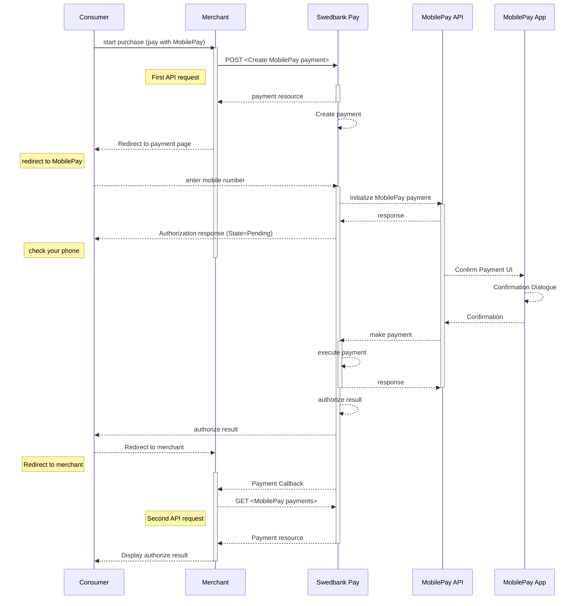



## Introduction

* When you have prepared your merchant/webshop site, you make a `POST` request
  towards Swedbank Pay with your Purchase information.
* You will receive a Redirect URL, leading to a secure Swedbank Pay hosted
  environment, in response.
* You need to redirect the browser of the end-user/consumer to that URL so
  that the user may enter their MobilePay details .
* When the payment is completed, Swedbank Pay will redirect the browser back
  to your merchant/webshop site.
* Finally you need to make a `GET` request towards Swedbank Pay with the
  `paymentID` received in the first step, which will return the purchase result.

![mobilepay enter number][mobilepay-screenshot-1]

![mobilepay approve payment][mobilepay-screenshot-2]

## API Requests

The API requests are displayed in the [purchase flow](#purchase-flow).
The options you can choose from when creating a payment with key operation set
to value `Purchase` are listed below.

### Intent

**`Authorization` (two-phase)**: The intent of a MobilePay purchase is always
`Authorization`. The amount will be reserved but not charged.
You will later (i.e. if a physical product, when you are ready to ship the
purchased products) have to make a [`Capture`][mobilepay-capture] or
[`Cancel`][mobilepay-cancel] request.

#### General



## Purchase flow

The sequence diagram below shows the two requests you have to send to
Swedbank Pay to make a purchase.
The links will take you directly to the API description for the specific
request.
The diagram also shows in high level, the sequence of the process of a
complete purchase.



## Purchase

{:.code-header}
**Request**

```http
POST /psp/mobilepay/payments HTTP/1.1
Authorization: Bearer <AccessToken>
Content-Type: application/json

{
    "payment": {
        "operation": "Purchase",
        "intent": "Authorization",
        "currency": "DKK",
        "prices": [
            {
                "type": "Visa",
                "amount": 1500,
                "vatAmount": 0,
                "FeeAmount": 5
            },
            {
                "type": "MasterCard",
                "amount": 1500,
                "vatAmount": 0,
                "FeeAmount": 10
            }
        ],
        "description": "Test Purchase",
        "payerReference": "AB1234",
        "userAgent": "Mozilla/5.0...",
        "language": "da-DK",
        "urls": {
            "hostUrls": ["https://example.com", "https://example.net"],
            "completeUrl": "http://example.com/payment-completed",
            "cancelUrl": "http://example.com/payment-canceled",
            "callbackUrl": "http://example.com/payment-callback"
        },
        "payeeInfo": {
            "payeeId": "{{ page.merchant_id }}",
            "payeeReference": "CD1234",
            "payeeName": "Merchant1",
            "productCategory": "A123",
            "orderReference": "or-12456",
            "subsite": "MySubsite"
        },
        "prefillInfo": {
            "msisdn": "+4522222222"
        }
    },
    "mobilepay": {
        "shoplogoUrl": "https://example.com/shop-logo.png"
    }
}
```

{:.table .table-striped}
| Required | Property                        | Data type    | Description                                                                                                                                                                                                                                               |
| :------- | :------------------------------ | :----------- | :-------------------------------------------------------------------------------------------------------------------------------------------------------------------------------------------------------------------------------------------------------- |
| ✔︎︎︎︎︎   | `payment`                       | `object`     | The payment object.                                                                                                                                                                                                                                       |
| ✔︎︎︎︎︎   | └➔&nbsp;`operation`             | `string`     | `Purchase`                                                                                                                                                                                                                                                |
| ✔︎︎︎︎︎   | └➔&nbsp;`intent`                | `string`     | `Authorization`                                                                                                                                                                                                                                           |
| ✔︎︎︎︎︎   | └➔&nbsp;`currency`              | `string`     | `NOK`, `SEK`, `DKK`, `USD` or `EUR`.                                                                                                                                                                                                                      |
| ✔︎︎︎︎︎   | └➔&nbsp;`prices`                | `object`     | The prices object.                                                                                                                                                                                                                                        |
| ✔︎︎︎︎︎   | └─➔&nbsp;`type`                 | `string`     | `Visa` (for card type Visa), `MC` (for card type Mastercard)                                                                                                                                                                                              |
| ✔︎︎︎︎︎   | └─➔&nbsp;`amount`               | `integer`    | Amount is entered in the lowest momentary units of the selected currency. E.g. 10000 = 100.00 DKK, 5000 = 50.00 DKK.                                                                                                                                      |
| ✔︎︎︎︎︎   | └─➔&nbsp;`vatAmount`            | `integer`    | If the amount given includes VAT, this may be displayed for the user in the payment page (redirect only). Set to 0 (zero) if this is not relevant.                                                                                                        |
|          | └─➔&nbsp;`feeAmount`            | `integer`    | If the amount given includes Fee, this may be displayed for the user in the payment page (redirect only).                                                                                                                                                 |
| ✔︎︎︎︎︎   | └➔&nbsp;`description`           | `string(40)` | A textual description max 40 characters of the purchase.                                                                                                                                                                                                  |
|          | └➔&nbsp;`payerReference`        | `string`     | The reference to the payer (consumer/end-user) from the merchant system, like mobile number, customer number etc.                                                                                                                                         |
| ✔︎︎︎︎︎   | └➔&nbsp;`userAgent`             | `string`     | The user agent reference of the consumer's browser - [see user agent definition][user-agent]                                                                                                                                                              |
| ✔︎︎︎︎︎   | └➔&nbsp;`language`              | `string`     | `nb-NO`, `sv-SE` or `en-US`.                                                                                                                                                                                                                              |
| ✔︎︎︎︎︎   | └➔&nbsp;`urls`                  | `object`     | The URLs object containing the urls used for this payment.                                                                                                                                                                                                |
| ✔︎︎︎︎︎   | └─➔&nbsp;`completeUrl`          | `string`     | The URI that Swedbank Pay will redirect back to when the payment page is completed. This does not indicate a successful payment, only that it has reached a completion state. A `GET` request needs to be performed on the payment to inspect it further. |
| ✔︎︎︎︎︎   | └─➔&nbsp;`cancelUrl`            | `string`     | The URI that Swedbank Pay will redirect back to when the user presses the cancel button in the payment page.                                                                                                                                              |
|          | └─➔&nbsp;`callbackUrl`          | `string`     | The URI that Swedbank Pay will perform an HTTP `POST` against every time a transaction is created on the payment. See [callback][callback-reference] for details.                                                                                         |
| ✔︎︎︎︎︎   | └➔&nbsp;`payeeInfo`             | `object`     | This object contains the identificators of the payee of this payment.                                                                                                                                                                                     |
| ✔︎︎︎︎︎   | └─➔&nbsp;`payeeId`              | `string`     | This is the unique id that identifies this payee (like merchant) set by Swedbank Pay.                                                                                                                                                                     |
| ✔︎︎︎︎︎   | └─➔&nbsp;`payeeReference`       | `string(50)` | A unique reference from the merchant system. Read more about [`payeeReference`][payee-reference]                                                                                                                                                          |
|          | └─➔&nbsp;`payeeName`            | `string`     | The payee name (like merchant name) that will be displayed to consumer when redirected to Swedbank Pay.                                                                                                                                                   |
|          | └─➔&nbsp;`productCategory`      | `string`     | A product category or number sent in from the payee/merchant. This is not validated by Swedbank Pay, but will be passed through the payment process and may be used in the settlement process.                                                            |
|          | └─➔&nbsp;`orderReference`       | `String(50)` | The order reference should reflect the order reference found in the merchant's systems.                                                                                                                                                                   |
|          | └─➔&nbsp;`subsite`              | `String(40)` | The subsite field can be used to perform split settlement on the payment. The subsites must be resolved with Swedbank Pay reconciliation before being used.                                                                                               |
|          | └➔&nbsp;`prefillInfo.msisdn`    | `string`     | umber will be prefilled on payment page, if valid.                                                                                                                                                                                                        |
|          | └➔&nbsp;`mobilepay.shoplogoUrl` | `string`     | URI to logo that will be visible at MobilePay                                                                                                                                                                                                             |

{:.code-header}
**Response**

```http
HTTP/1.1 200 OK
Content-Type: application/json

{
    "payment": {
        "prices": {
            "id": "/psp/mobilepay/payments/{{ page.payment_id }}/prices"
        },
        "id": "/psp/mobilepay/payments/{{ page.payment_id }}",
        "number": 75100000121,
        "created": "2018-09-11T10:58:27.4236127Z",
        "updated": "2018-09-11T10:58:30.8254419Z",
        "instrument": "MobilePay",
        "operation": "Purchase",
        "intent": "Authorization",
        "state": "Ready",
        "currency": "DKK",
        "amount": 3000,
        "description": "Test Purchase",
        "payerReference": "AB1234",
        "initiatingSystemUserAgent": "PostmanRuntime/7.2.0",
        "userAgent": "Mozilla/5.0",
        "language": "da-DK",
        "transactions": {
            "id": "/psp/mobilepay/payments/{{ page.payment_id }}/transactions"
        },
        "urls": {
            "id": "/psp/mobilepay/payments/{{ page.payment_id }}/urls"
        },
        "payeeInfo": {
            "id": "/psp/mobilepay/payments/{{ page.payment_id }}/payeeinfo"
        }
    },
    "operations": [
        {
            "method": "PATCH",
            "href": "{{ page.api_url }}/psp/mobilepay/payments/{{ page.payment_id }}",
            "rel": "update-payment-abort"
        },
        {
            "method": "GET",
            "href": "{{ page.front_end_url }}/mobilepay/payments/authorize/{{ page.transaction_id }}",
            "rel": "redirect-authorization"
        }
    ]
}
```



[mobilepay-screenshot-1]: /assets/img/mobilepay-screenshot-1.png
[mobilepay-screenshot-2]: /assets/img/mobilepay-screenshot-2.png
[mobilepay-cancel]: /payments/mobile-pay/after-payment#cancellations
[mobilepay-capture]: /payments/mobile-pay/after-payment#capture
[payee-reference]: /payments/mobile-pay/other-features#payee-reference
[technical-reference-callback]: /payments/mobile-pay/other-features#callback
