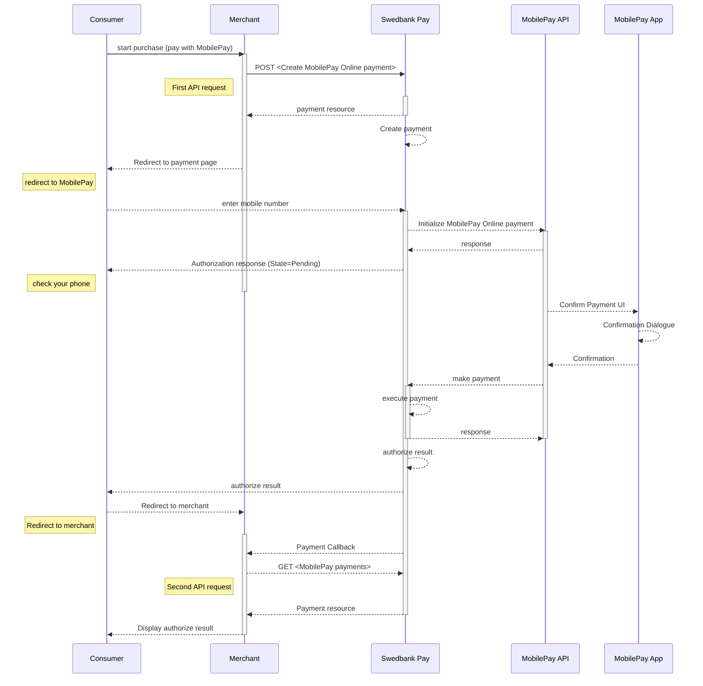



## MobilePay redirect integration flow

*   When you have prepared your merchant/webshop site, you make a `POST` request
    towards Swedbank Pay with your Purchase information.
*   You will receive a Redirect URL, leading to a secure Swedbank Pay hosted
    environment, in response.
*   You need to redirect the browser of the end-user/consumer to that URL so
    that the user may enter their MobilePay details.
*   When the payment is completed, Swedbank Pay will redirect the browser back
    to your merchant/webshop site.
*   Finally you need to make a `GET` request towards Swedbank Pay with the
    `paymentID` received in the first step, which will return the purchase
    result.

![mobilepay enter number][mobilepay-screenshot-1]

![mobilepay approve payment][mobilepay-screenshot-2]



## Step 1: Create a Purchase

When the payer starts the purchase process, you make a `POST` request towards
Swedbank Pay with the collected Purchase information. This will generate a
payment with a unique `id`. See the `POST`request example below.

{:.code-header}
**Request**

```http
POST /psp/mobilepay/payments HTTP/1.1
Authorization: Bearer <AccessToken>
Content-Type: application/json

{
    "payment": {
        "operation": "Purchase",
        "intent": "Authorization",
        "currency": "DKK",
        "prices": [
            {
                "type": "Visa",
                "amount": 1500,
                "vatAmount": 0,
                "FeeAmount": 5
            },
            {
                "type": "MasterCard",
                "amount": 1500,
                "vatAmount": 0,
                "FeeAmount": 10
            },
            {
                "type": "MobilePay",
                "amount": 1500,
                "vatAmount": 0
            }
        ],
        "description": "Test Purchase",
        "payerReference": "AB1234",
        "userAgent": "Mozilla/5.0...",
        "language": "da-DK",
        "urls": {
            "hostUrls": [ "https://example.com", "https://example.net" ],
            "completeUrl": "https://example.com/payment-completed",
            "cancelUrl": "https://example.com/payment-canceled",
            "callbackUrl": "https://example.com/payment-callback",
            "termsOfServiceUrl": "https://example.com/payment-terms.pdf"
        },
        "payeeInfo": {
            "payeeId": "{{ page.merchant_id }}",
            "payeeReference": "CD1234",
            "payeeName": "Merchant1",
            "productCategory": "A123",
            "orderReference": "or-12456",
            "subsite": "MySubsite"
        },
        "prefillInfo": {
            "msisdn": "+4522222222"
        }
    },
    "mobilepay": {
        "shoplogoUrl": "https://example.com/shop-logo.png"
    }
}
```

{:.table .table-striped}
| Required         | Field                           | Data type    | Description                                                                                                                                                                                                                                               |
| :--------------- | :------------------------------ | :----------- | :-------------------------------------------------------------------------------------------------------------------------------------------------------------------------------------------------------------------------------------------------------- |
|  | `payment`                       | `object`     | The payment object.                                                                                                                                                                                                                                       |
|  | └➔&nbsp;`operation`             | `string`     | `Purchase`                                                                                                                                                                                                                                                |
|  | └➔&nbsp;`intent`                | `string`     | `Authorization`                                                                                                                                                                                                                                           |
|  | └➔&nbsp;`currency`              | `string`     | `NOK`, `SEK`, `DKK`, `USD` or `EUR`.                                                                                                                                                                                                                      |
|  | └➔&nbsp;`prices`                | `object`     | The prices object.                                                                                                                                                                                                                                        |
|  | └─➔&nbsp;`type`                 | `string`     | `Visa` (for card type Visa), `MC` (for card type Mastercard), `MobilePay` (for all card types).                                                                                                                                                                                              |
|  | └─➔&nbsp;`amount`               | `integer`    |                                                                                                                                                                                                   |
|  | └─➔&nbsp;`vatAmount`            | `integer`    |                                                                                                                                                                                                |
|                  | └─➔&nbsp;`feeAmount`            | `integer`    | If the amount given includes Fee, this may be displayed for the user in the payment page (redirect only).                                                                                                                                                 |
|  | └➔&nbsp;`description`           | `string(40)` |                                                                                                                                                                          |
|                  | └➔&nbsp;`payerReference`        | `string`     | The reference to the payer (consumer/end-user) from the merchant system, like mobile number, customer number etc.                                                                                                                                         |
|  | └➔&nbsp;`userAgent`             | `string`     | The [`User-Agent` string][user-agent] of the consumer's web browser.                                                                                                                                                                                      |
|  | └➔&nbsp;`language`              | `string`     |                                                                                                                                                                                       |
|  | └➔&nbsp;`urls`                  | `object`     | The URLs object containing the urls used for this payment.                                                                                                                                                                                                |
|  | └─➔&nbsp;`completeUrl`          | `string`     | The URI that Swedbank Pay will redirect back to when the payment page is completed. This does not indicate a successful payment, only that it has reached a completion state. A `GET` request needs to be performed on the payment to inspect it further. |
|  | └─➔&nbsp;`cancelUrl`            | `string`     | The URI that Swedbank Pay will redirect back to when the user presses the cancel button in the payment page.                                                                                                                                              |
|                  | └─➔&nbsp;`callbackUrl`          | `string`     | The URI that Swedbank Pay will perform an HTTP `POST` against every time a transaction is created on the payment. See [callback][callback-reference] for details.                                                                                         |
|  | └─➔&nbsp;`termsOfServiceUrl`    | `string`     |                                                                                                                                                                                                       |
|  | └➔&nbsp;`payeeInfo`             | `object`     | This object contains the identificators of the payee of this payment.                                                                                                                                                                                     |
|  | └─➔&nbsp;`payeeId`              | `string`     | This is the unique id that identifies this payee (like merchant) set by Swedbank Pay.                                                                                                                                                                     |
|  | └─➔&nbsp;`payeeReference`       | `string(50)` |                                                                                                                                                                      |
|                  | └─➔&nbsp;`payeeName`            | `string`     | The payee name (like merchant name) that will be displayed to consumer when redirected to Swedbank Pay.                                                                                                                                                   |
|                  | └─➔&nbsp;`productCategory`      | `string`     | A product category or number sent in from the payee/merchant. This is not validated by Swedbank Pay, but will be passed through the payment process and may be used in the settlement process.                                                            |
|                  | └─➔&nbsp;`orderReference`       | `String(50)` | The order reference should reflect the order reference found in the merchant's systems.                                                                                                                                                                   |
|                  | └─➔&nbsp;`subsite`              | `String(40)` | The subsite field can be used to perform split settlement on the payment. The subsites must be resolved with Swedbank Pay reconciliation before being used.                                                                                               |
|  | └➔&nbsp;`prefillInfo.msisdn`    | `string`     | Number will be prefilled on payment page, if valid.                                                                                                                                                                                                       |
|  | └➔&nbsp;`mobilepay.shoplogoUrl` | `string`     | URI to logo that will be visible at MobilePay                                                                                                                                                                                                             |

{:.code-header}
**Response**

```http
HTTP/1.1 200 OK
Content-Type: application/json

{
    "payment": {
        "prices": {
            "id": "/psp/mobilepay/payments/{{ page.payment_id }}/prices"
        },
        "id": "/psp/mobilepay/payments/{{ page.payment_id }}",
        "number": 75100000121,
        "created": "2018-09-11T10:58:27.4236127Z",
        "updated": "2018-09-11T10:58:30.8254419Z",
        "instrument": "MobilePay",
        "operation": "Purchase",
        "intent": "Authorization",
        "state": "Ready",
        "currency": "DKK",
        "amount": 0,
        "description": "Test Purchase",
        "payerReference": "AB1234",
        "initiatingSystemUserAgent": "PostmanRuntime/7.2.0",
        "userAgent": "Mozilla/5.0",
        "language": "da-DK",
        "transactions": {
            "id": "/psp/mobilepay/payments/{{ page.payment_id }}/transactions"
        },
        "urls": {
            "id": "/psp/mobilepay/payments/{{ page.payment_id }}/urls"
        },
        "payeeInfo": {
            "id": "/psp/mobilepay/payments/{{ page.payment_id }}/payeeinfo"
        }
    },
    "operations": [
        {
            "method": "PATCH",
            "href": "{{ page.api_url }}/psp/mobilepay/payments/{{ page.payment_id }}",
            "rel": "update-payment-abort"
        },
        {
            "method": "GET",
            "href": "{{ page.front_end_url }}/mobilepay/payments/authorize/{{ page.transaction_id }}",
            "rel": "redirect-authorization"
        }
    ]
}
```

## Step 2: Get the transaction status

Finally you need to make a `GET` request towards Swedbank Pay with the
`id` of the payment received in the first step, which will return the purchase result.

{:.code-header}
**Request**

```http
GET /psp/mobilepay/payments/{{ page.payment_id }}/ HTTP/1.1
Host: {{ page.api_host }}
Authorization: Bearer <AccessToken>
Content-Type: application/json
```

{:.code-header}
**Response**

```http
HTTP/1.1 200 OK
Content-Type: application/json

{
    "payment": {
        "id": "/psp/mobilepay/payments/{{ page.payment_id }}",
        "number": 1234567890,
        "created": "2016-09-14T13:21:29.3182115Z",
        "updated": "2016-09-14T13:21:57.6627579Z",
        "state": "Ready",
        "operation": "Purchase",
        "intent": "Authorization",
        "currency": "DKK",
        "amount": 1500,
        "remainingCaptureAmount": 1500,
        "remainingCancellationAmount": 1500,
        "remainingReversalAmount": 0,
        "description": "Test Purchase",
        "payerReference": "AB1234",
        "initiatingSystemUserAgent": "PostmanRuntime/3.0.1",
        "userAgent": "Mozilla/5.0...",
        "language": "da-DK",
        "prices": {
            "id": "/psp/mobilepay/payments/{{ page.payment_id }}/prices"
        },
        "payeeInfo": {
            "id": "/psp/mobilepay/payments/{{ page.payment_id }}/payeeInfo"
        },
        "urls": {
            "id": "/psp/mobilepay/payments/{{ page.payment_id }}/urls"
        },
        "transactions": {
            "id": "/psp/mobilepay/payments/{{ page.payment_id }}/transactions"
        },
        "authorizations": {
            "id": "/psp/mobilepay/payments/{{ page.payment_id }}/authorizations"
        },
        "captures": {
            "id": "/psp/mobilepay/payments/{{ page.payment_id }}/captures"
        },
        "reversals": {
            "id": "/psp/mobilepay/payments/{{ page.payment_id }}/reversals"
        },
        "cancellations": {
            "id": "/psp/mobilepay/payments/{{ page.payment_id }}/cancellations"
        }
    },
    "operations": [
        {
            "method": "PATCH",
            "href": "{{ page.api_url }}/psp/mobilepay/payments/{{ page.payment_id }}",
            "rel": "update-payment-abort",
            "contentType": "application/json"
        },
        {
            "method": "GET",
            "href": "{{ page.front_end_url }}/mobilepay/core/scripts/client/px.mobilepay.client.js?token={{ page.payment_token }}&operation=authorize",
            "rel": "view-authorization",
            "contentType": "application/javascript"
        },
        {
            "method": "GET",
            "href": "{{ page.front_end_url }}/mobilepay/payments/authorize/{{ page.transaction_id }}",
            "rel": "redirect-authorization",
            "contentType": "text/html"
        },
        {
            "method": "POST",
            "href": "{{ page.api_url }}/psp/mobilepay/payments/{{ page.payment_id }}/captures",
            "rel": "create-capture",
            "contentType": "application/json"
        },
        {
            "method": "GET",
            "href": "{{ page.api_url }}/psp/mobilepay/{{ page.payment_id }}/paid",
            "rel": "paid-payment",
            "contentType": "application/json"
        },
        {
            "method": "GET",
            "href": "{{ page.api_url }}/psp/mobilepay/{{ page.payment_id }}/failed",
            "rel": "failed-payment",
            "contentType": "application/problem+json"
        }
    ]
}
```

{:.table .table-striped}
| Field                    | Type         | Description                                                                                                                                                                                                                                                                                                                                                |
| :----------------------- | :----------- | :--------------------------------------------------------------------------------------------------------------------------------------------------------------------------------------------------------------------------------------------------------------------------------------------------------------------------------------------------------- |
| `payment`                | `object`     | The `payment` object contains information about the specific payment.                                                                                                                                                                                                                                                                                      |
| └➔&nbsp;`id`             | `string`     |                                                                                                                                                                                                                                                                                                                       |
| └➔&nbsp;`number`         | `integer`    | The payment  number , useful when there's need to reference the payment in human communication. Not usable for programmatic identification of the payment, for that  id  should be used instead.                                                                                                                                                           |
| └➔&nbsp;`created`        | `string`     | The ISO-8601 date of when the payment was created.                                                                                                                                                                                                                                                                                                         |
| └➔&nbsp;`updated`        | `string`     | The ISO-8601 date of when the payment was updated.                                                                                                                                                                                                                                                                                                         |
| └➔&nbsp;`state`          | `string`     | `Ready`, `Pending`, `Failed` or `Aborted`. Indicates the state of the payment, not the state of any transactions performed on the payment. To find the state of the payment's transactions (such as a successful authorization), see the `transactions` resource or the different specialized type-specific resources such as `authorizations` or `sales`. |
| └➔&nbsp;`prices`         | `object`     | The `prices` resource lists the prices related to a specific payment.                                                                                                                                                                                                                                                                                      |
| └➔&nbsp;`prices.id`      | `string`     |                                                                                                                                                                                                                                                                                                     |
| └➔&nbsp;`description`    | `string(40)` |                                                                                                                                                                                                                                                                           |
| └➔&nbsp;`payerReference` | `string`     | The reference to the payer (consumer/end-user) from the merchant system, like e-mail address, mobile number, customer number etc.                                                                                                                                                                                                                          |
| └➔&nbsp;`userAgent`      | `string`     | The [user agent][user-agent] string of the consumer's browser.                                                                                                                                                                                                                                                                                             |
| └➔&nbsp;`language`       | `string`     |                                                                                                                                                                                                                                                                                       |
| └➔&nbsp;`urls`           | `string`     | The URI to the  urls  resource where all URIs related to the payment can be retrieved.                                                                                                                                                                                                                                                                     |
| └➔&nbsp;`payeeInfo`      | `string`     | The URI to the  payeeinfo  resource where the information about the payee of the payment can be retrieved.                                                                                                                                                                                                                                                 |
| `operations`             | `array`      | The array of possible operations to perform                                                                                                                                                                                                                                                                                                                |
| └─➔&nbsp;`method`        | `string`     | The HTTP method to use when performing the operation.                                                                                                                                                                                                                                                                                                      |
| └─➔&nbsp;`href`          | `string`     | The target URI to perform the operation against.                                                                                                                                                                                                                                                                                                           |
| └─➔&nbsp;`rel`           | `string`     | The name of the relation the operation has to the current resource.                                                                                                                                                                                                                                                                                        |

## Purchase flow

The sequence diagram below shows the two requests you have to send to
Swedbank Pay to make a purchase.
The diagram also shows in high level, the sequence of the process of a
complete purchase.





[callback-reference]: /payments/mobile-pay/other-features#callback
[mobilepay-screenshot-1]: /assets/img/mobilepay-screenshot-1.png
[mobilepay-screenshot-2]: /assets/img/mobilepay-screenshot-2.png
[mobilepay-cancel]: /payments/mobile-pay/after-payment#cancellations
[mobilepay-capture]: /payments/mobile-pay/after-payment#capture
[payee-reference]: /payments/mobile-pay/other-features#payee-reference
[user-agent]:  https://en.wikipedia.org/wiki/User_agent
[technical-reference-callback]: /payments/mobile-pay/other-features#callback
