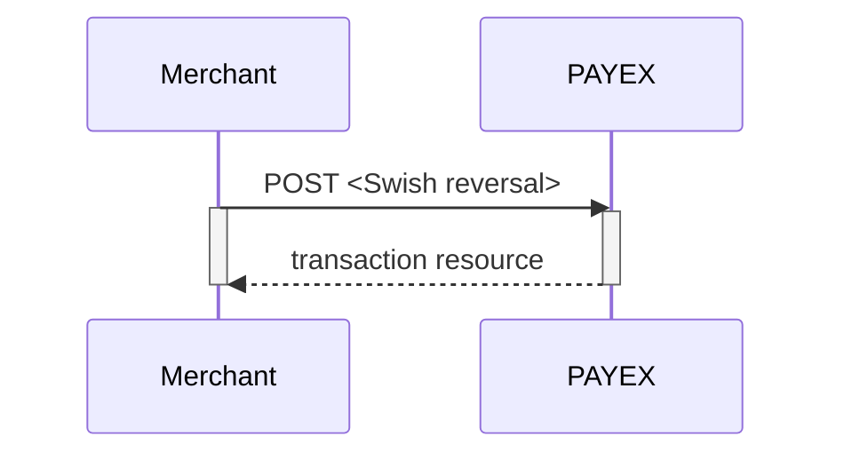



## Payment Resource

The `payment` resource and all general sub-resources can be found in the 
[core payment resources][core-payment-resources] section.

### Create Payment

To create a Swish payment, you perform an HTTP `POST` against the 
`/psp/swish/payments` resource. Please read the 
[general information][general-http-info] on how to compose a valid HTTP request before proceeding.

An example of a payment creation request is provided below. 
Each individual Property of the JSON document is described in the 
following section. 
Use the [expand][technical-reference-expand] request parameter to get a 
response that includes one or more expanded sub-resources inlined.

{:.code-header}
**Request**

```HTTP
POST /psp/swish/payments HTTP/1.1
Host: api.payex.com
Authorization: Bearer <MerchantToken>
Content-Type: application/json

{
    "payment": {
        "operation": "Purchase",
        "intent": "Sale",
        "currency": "SEK",
        "prices": [{
            "type": "Swish",
            "amount": 1500,
            "vatAmount": 0
        }],
        "description": "Test Purchase",
        "payerReference": "AB1234",
        "userAgent": "Mozilla/5.0...",
        "language": "nb-NO",
        "urls": {
            "hostUrls": ["https://example.com", "https://example.net"],
            "completeUrl": "https://example.com/payment-completed",
            "cancelUrl": "https://example.com/payment-canceled",
            "callbackUrl": "https://example.com/payment-callback",
            "logoUrl": "https://example.com/logo.png",
            "termsOfServiceUrl": "https://example.com/terms.pdf"
        },
        "payeeInfo": {
            "payeeId": "bbb33dc5-f44e-4af6-afc0-27fb5fa2f63a",
            "payeeReference": "ref-123456",
            "payeeName": "Merchant1",
            "productCategory": "A123",
            "orderReference": "or-123456",
            "subsite": "MySubsite"
        },
        "prefillInfo": {
            "msisdn": "+46xxxxxxxxx"
        },
        "swish": {
            "ecomOnlyEnabled": false
        }
    }
}
```

{:.table .table-striped}
| Required | Property                      | Data type    | Description                                                                                                                                                                                                 |
| :------- | :---------------------------- | :----------- | :---------------------------------------------------------------------------------------------------------------------------------------------------------------------------------------------------------- |
| ✔︎       | └➔ .operation                 | `string`     | `Purchase`                                                                                                                                                                                                  |
| ✔︎       | └➔ .intent                    | `string`     | `Sale`                                                                                                                                                                                                      |
| ✔︎       | └➔ .currency                  | `string`     | `SEK`                                                                                                                                                                                                       |
| ✔︎       | └➔ .prices.type               | `string`     | `Swish`                                                                                                                                                                                                     |
| ✔︎       | └➔ .prices.amount             | `integer`    | Amount is entered in the lowest momentary units of the selected currency. E.g. `10000` = `100.00 SEK` `5000` = `50.00 SEK`.                                                                                 |
| ✔︎       | └➔ .prices.vatAmount          | `integer`    | If the amount given includes VAT, this may be displayed for the user in the payment page (redirect only). Set to 0 (zero) if this is not relevant.                                                          |
| ✔︎       | └➔ .description               | `string(40)` | A textual description max 40 characters of the purchase.                                                                                                                                                    |
|          | └➔ .payerReference            | `string`     | The reference to the payer (consumer/end-user) from the merchant system, like mobile number, customer number etc.                                                                                           |
| ✔︎       | └➔ .userAgent                 | `string`     | The user agent reference of the consumer's browser - [see user agent definition][user-agent]                                                                                                                |
| ✔︎       | └➔ .language                  | `string`     | nb-NO, sv-SE or en-US.                                                                                                                                                                                      |
| ✔︎       | └➔ .urls.hostUrls             | `array`      | The array of URIs valid for embedding of Swedbank Pay Hosted Views.                                                                                                                                         |
| ✔︎       | └➔ .urls.completeUrl          | `string`     | The URI that Swedbank Pay will redirect back to when the payment page is completed.                                                                                                                         |
| ✔︎       | └➔ .urls.cancelUrl            | `string`     | The URI that Swedbank Pay will redirect back to when the user presses the cancel button in the payment page.                                                                                                |
|          | └➔ .urls.callbackUrl          | `string`     | The URI that Swedbank Pay will perform an HTTP POST against every time a transaction is created on the payment. See [callback][technical-reference-callback] for details.                                   |
|          | └➔ .urls.logoUrl              | `string`     | The URI that will be used for showing the customer logo. Must be a picture with at most 50px height and 400px width. Require https.                                                                         |
|          | └➔ .urls.termsOfServiceUrl    | `string`     | A URI that contains your terms and conditions for the payment, to be linked on the payment page. Require https.                                                                                             |
| ✔︎       | └➔ .payeeInfo.payeeId         | `string`     | This is the unique id that identifies this payee (like merchant) set by PayEx.                                                                                                                              |
| ✔︎       | └➔ .payeeInfo.payeeReference  | `string(35)` | A unique reference from the merchant system. It is set per operation to ensure an exactly-once delivery of a transactional operation. See [payeeReference][technical-reference-payeeReference] for details. |
|          | └➔ .payeeInfo.payeeName       | `string`     | The payee name (like merchant name) that will be displayed to consumer when redirected to PayEx.                                                                                                            |
|          | └➔ .payeeInfo.productCategory | `string`     | A product category or number sent in from the payee/merchant. This is not validated by PayEx, but will be passed through the payment process and may be used in the settlement process.                     |
|          | └➔ .payeeInfo.orderReference  | `string(50)` | The order reference should reflect the order reference found in the merchant's systems.                                                                                                                     |
|          | └➔ .payeeInfo.subsite         | `string(40)` | The subsite field can be used to perform split settlement on the payment. The subsites must be resolved with Swedbank Pay reconciliation before being used.                                                 |
|          | └➔ .prefillInfo.msisdn        | `string`     | Number will be prefilled on payment page, if valid.                                                                                                                                                         |
|          | └➔ .swish.ecomOnlyEnabled     | `boolean`    | If true you trigger the redirect payment scenario by default.                                                                                                                                               |
 
{:.code-header}
**Response**

```HTTP
HTTP/1.1 200 OK
Content-Type: application/json

{
    "payment": {
        "id": "/psp/swish/payments/20dfbcb9-587a-4ce9-e63e-08d519f1802f",
        "number": 992308,
        "created": "2017-10-23T08:38:57.2248733Z",
        "instrument": "Swish",
        "operation": "Purchase",
        "intent": "Sale",
        "state": "Ready",
        "currency": "SEK",
        "amount": 0,
        "description": "Test Purchase",
        "payerReference": "AB1234",
        "initiatingSystemUserAgent": "Mozilla/5.0 (Windows NT 6.1; Win64; x64) AppleWebKit/537.36 (KHTML, like Gecko) Chrome/61.0.3163.100 Safari/537.36",
        "userAgent": "Mozilla/5.0...",
        "language": "nb-NO",
        "urls": {
            "id": "/psp/swish/payments/20dfbcb9-587a-4ce9-e63e-08d519f1802f/urls"
    },
        "payeeInfo": {
            "id": "/psp/swish/payments/20dfbcb9-587a-4ce9-e63e-08d519f1802f/payeeinfo"
        }
    },
    "operations": [
        {
            "method": "PATCH",
            "href": "http://localhost:18496/psp/swish/payments/20dfbcb9-587a-4ce9-e63e-08d519f1802f",
            "rel": "update-payment-abort"
        },
        {
            "method": "POST",
            "href": "http://localhost:18496/psp/swish/payments/20dfbcb9-587a-4ce9-e63e-08d519f1802f/sales",
            "rel": "create-sale"
        }

    ]
}
```

### Operations

A payment resource has a set of operations that can be performed on it, 
from its creation to its completion. 
The operations available at any given time vary between payment methods and 
depends on the current state of the payment resource. 
A list of possible operations for Swish Payments and their explanation 
is given below.

{:.code-header}
**Operations**

```JS
{
    "operations": [
        {
            "method": "PATCH",
            "href": "https://api.externalintegration.payex.com/psp/swish/payments/3648fa94-7fd8-4e32-a14b-08d608f884ff",
            "rel": "update-payment-abort"
        },
        {
            "method": "POST",
            "href": "https://api.externalintegration.payex.com/psp/swish/payments/3648fa94-7fd8-4e32-a14b-08d608f884ff/sales",
            "rel": "create-sale"
        },
        {
            "method": "GET",
            "href": "https://ecom.externalintegration.payex.com/swish/payments/sales/993b479653da83671c074316c7455da05fced9d634431edbb64f3c5f80a863f0",
            "rel": "redirect-sale"
        },
        {
            "method": "GET",
            "href": "https://ecom.externalintegration.payex.com/swish/core/scripts/client/px.swish.client.js?token=cfb9e24832d56fec7ab79709f56accc53d79a699756687d39095b517bc5f011b",
            "rel": "view-payment",
            "contentType": "application/javascript"
        }
    ]
}
```

{:.table .table-striped}
| Property | Description                                                         |
| :------- | :------------------------------------------------------------------ |
| href     | The target URI to perform the operation against.                    |
| rel      | The name of the relation the operation has to the current resource. |
| method   | The HTTP method to use when performing the operation.               |

The operations should be performed as described in each response and not as 
described here in the documentation. 
Always use the `href` and `method` as specified in the response by finding the 
appropriate operation based on its `rel` value. 
The only thing that should be hard coded in the client is the value of 
the `rel` and the request that will be sent in the HTTP body of the 
request for the given operation.

{:.table .table-striped}
| Operation            | Description                                                                                                                                                 |
| :------------------- | :---------------------------------------------------------------------------------------------------------------------------------------------------------- |
| update-payment-abort | [Aborts][technical-reference-abort] the payment before any financial transactions are performed.                                                            |
| create-sale          | Creates a `sales` transaction without redirection to a payment page (**Direct scenario**). `Msisdn` is required in e-commerce scenario.                     |
| redirect-sale        | Contains the redirect-URI that redirects the consumer to a Swedbank Pay hosted payments page prior to creating a sales transaction (**Redirect scenario**). |
| view-payment         | Contains the URI of the JavaScript used to create a Hosted View iframe directly without redirecting the consumer to separate payment page.                  |

### Swish transactions

All card specific transactions are described below. 

### Sales

The `Sales` resource lists the sales transactions (one or more) 
on a specific payment.

{:.code-header}
**Request**

```HTTP
GET /psp/swish/payments/5adc265f-f87f-4313-577e-08d3dca1a26c/sales HTTP/1.1
Host: api.payex.com
Authorization: Bearer <MerchantToken>
Content-Type: application/json
```

{:.code-header}
**Response**

```HTTP
HTTP/1.1 200 OK
Content-Type: application/json

{
  "payment": "/psp/swish/payments/5adc265f-f87f-4313-577e-08d3dca1a26c",
  "sales": {
    "id": "/psp/swish/payments/5adc265f-f87f-4313-577e-08d3dca1a26c/sale",
    "saleList": [
      {
        "date": "8/13/2019 8:58:23 AM +00:00",
        "payerAlias": "4670XXXXXXX",
        "swishPaymentReference": "8D0A30A7804E40479F88FFBA26111F04",
        "swishStatus": "PAID",
        "id": "/psp/swish/payments/5adc265f-f87f-4313-577e-08d3dca1a26c/sales/12345678-1234-1234-1234-123456789012",
        "transaction": {
          "id": "12345678-1234-1234-1234-123456789012",
          "created": "2016-09-14T01:01:01.01Z",
          "updated": "2016-09-14T01:01:01.03Z",
          "type": "Sale",
          "state": "Initialized|Completed|Failed",
          "number": 1234567890,
          "amount": 1000,
          "vatAmount": 250,
          "description": "Test transaction",
          "payeeReference": "AH123456",
          "isOperational": "true|false",
          "reconciliationNumber": 737283,
          "operations": []
        }
      }
    ]
  }
}
```

#### Create Sales transaction

In e-commerce the consumer/end-user's `msisdn`(mobile number) is required. 
This is managed either by sending a `POST` request as seen below, 
or by redirecting the end-user to the hosted payment pages. 
The `msisdn` is only required for e-commerce. In the m-commerce flow, 
the consumer uses the device that hosts the Swish app to manage the purchase, 
making `msisdn` unneccessary.

{:.code-header}
**e-commerce Request**

```HTTP
POST /psp/swish/payments/<paymentId>/sales HTTP/1.1
Host: api.payex.com
Authorization: Bearer <MerchantToken>
Content-Type: application/json

{
    "transaction": {
        "msisdn": "+46xxxxxxxxx"
    }
}
``` 

{:.code-header}
**e-commerce Response**

```HTTP
HTTP/1.1 200 OK
Content-Type: application/json

{
    "payment": "/psp/swish/payments/20dfbcb9-587a-4ce9-e63e-08d519f1802f",
    "sale": {
        "date": "23.10.2017 08:39:37 +00:00",
        "paymentRequestToken": "LhXrK84MSpWU2RO09f8kUP-FHiBo-1pB",
        "id": "/psp/swish/payments/20dfbcb9-587a-4ce9-e63e-08d519f1802f/sales/6bf31479-623f-418a-d69e-08d519f19722",
        "transaction": {
            "id": "6bf31479-623f-418a-d69e-08d519f19722",
            "created": "2017-10-23T08:39:35.6478733Z",
            "updated": "2017-10-23T08:39:37.3788733Z",
            "type": "Sale",
            "state": "AwaitingActivity",
            "number": 992309,
            "amount": 1500,
            "vatAmount": 0,
            "description": "Test Purchase",
            "payeeReference": "Postman1508747933",
            "isOperational": true,
            "operations": []
        }
    }
}
```

{:.code-header}
**m-commerce Request**

```HTTP
POST /psp/swish/payments/<paymentId>/sales HTTP/1.1
Host: api.payex.com
Authorization: Bearer <MerchantToken>
Content-Type: application/json

{
    "transaction": {
    }
}
```

{:.code-header}
**m-commerce Response**

```HTTP
HTTP/1.1 200 OK
Content-Type: application/json

{
    "payment": "/psp/swish/payments/20dfbcb9-587a-4ce9-e63e-08d519f1802f",
    "sale": {
        "date": "23.10.2017 08:39:37 +00:00",
        "paymentRequestToken": "LhXrK84MSpWU2RO09f8kUP-FHiBo-1pB",
        "id": "/psp/swish/payments/20dfbcb9-587a-4ce9-e63e-08d519f1802f/sales/6bf31479-623f-418a-d69e-08d519f19722",
        "transaction": {
            "id": "6bf31479-623f-418a-d69e-08d519f19722",
            "created": "2017-10-23T08:39:35.6478733Z",
            "updated": "2017-10-23T08:39:37.3788733Z",
            "type": "Sale",
            "state": "AwaitingActivity",
            "number": 992309,
            "amount": 1500,
            "vatAmount": 0,
            "description": "Test Purchase",
            "payeeReference": "Postman1508747933",
            "isOperational": true,
            "operations": [
                {                         
                    "href": "swish://paymentrequest?token=<swishtoken>&callbackurl=<completeUrl>",
                    "method": "GET",
                    "rel": "redirect-app-swish"
                }
            ]
        }
    }
}
```

_Operation_ `redirect-app-swish` is only returned in m-commerce.

The payment now contains a sale transaction with the status (state) 
`AwaitingActivity`. 
When the consumer confirms the payment a callback request will follow 
from PayEx. 

### Reversals

The `Reversals` resource list the reversals transactions (one or more) 
on a specific payment.

{:.code-header}
**Request**

```HTTP
GET /psp/swish/payments/5adc265f-f87f-4313-577e-08d3dca1a26c/reversals HTTP/1.1
Host: api.payex.com
Authorization: Bearer <MerchantToken>
Content-Type: application/json
```

{:.code-header}
**Response**

```HTTP
HTTP/1.1 200 OK
Content-Type: application/json

{
    "payment": "/psp/swish/payments/5adc265f-f87f-4313-577e-08d3dca1a26c",
    "reversals": {
        "id": "/psp/swish/payments/5adc265f-f87f-4313-577e-08d3dca1a26c/reversals",
        "reversalList": [
            {
                "id": "/psp/swish/payments/5adc265f-f87f-4313-577e-08d3dca1a26c/reversals/12345678-1234-1234-1234-123456789012",
                "transaction": {
                    "id": "/psp/swish/payments/5adc265f-f87f-4313-577e-08d3dca1a26c/transactions/12345678-1234-1234-1234-123456789012",
                    "created": "2016-09-14T01:01:01.01Z",
                    "updated": "2016-09-14T01:01:01.03Z",
                    "type": "Reversal",
                    "state": "Initialized|Completed|Failed",
                    "number": 1234567890,
                    "amount": 1000,
                    "vatAmount": 250,
                    "description": "Test transaction",
                    "payeeReference": "AH123456",
                    "isOperational": "TRUE|FALSE",
                    "operations": []
                }
            }
        ]
    }
}
```

{:.table .table-striped}
| Property       | Type     | Description                                                                                          |
| :------------- | :------- | :--------------------------------------------------------------------------------------------------- |
| payment        | `string` | The relative URI of the payment that the reversal transactions belong to.                            |
| reversalList   | `array`  | The array of reversal transaction objects.                                                           |
| reversalList[] | `object` | The reversal transaction object representation of the reversal transaction resource described below. |

#### Create Reversal transaction 

You can create a reversal transaction against a completed sales transaction 
by adding that transaction's `payeeReference` in the request body.
A callback request will follow from PayEx. 

{:.code-header}
**Request**

```HTTP
POST /psp/swish/payments/5adc265f-f87f-4313-577e-08d3dca1a26c/reversals HTTP/1.1
Host: api.payex.com
Authorization: Bearer <MerchantToken>
Content-Type: application/json

{
    "transaction": {
        "amount": 1500, 
        "vatAmount": 0, 
        "description" : "Test Reversal", 
        "payeeReference": "ABC123"
    }
}
```

{:.table .table-striped}
| Required | Property                   | Data type  | Description                                                                                                                                                            |
| :------- | :------------------------- | :--------- | :--------------------------------------------------------------------------------------------------------------------------------------------------------------------- |
| ✔︎       | transaction.amount         | `integer`    | Amount Entered in the lowest momentary units of the selected currency. E.g. `10000` = `100.00 SEK`, `5000` = `50.00 SEK`.                                              |
| ✔︎       | transaction.vatAmount      | `integer`    | Amount Entered in the lowest momentary units of the selected currency. E.g. `10000` = `100.00 SEK`, `5000` = `50.00 SEK`.                                              |
| ✔︎       | transaction.description    | `string`     | A textual description of the capture                                                                                                                                   |
| ✔︎       | transaction.payeeReference | `string(35)` | A  reference that must match the  `payeeReference` of the sales transaction you want to reverse. See [payeeReference][technical-reference-payeeReference] for details. |

{:.code-header}
**Response**

```HTTP
HTTP/1.1 200 OK
Content-Type: application/json

{
    "payment": "/psp/swish/payments/5adc265f-f87f-4313-577e-08d3dca1a26c",
    "reversal": {
        "id": "/psp/swish/payments/5adc265f-f87f-4313-577e-08d3dca1a26c/reversals/12345678-1234-1234-1234-123456789012",
        "transaction": {
            "id": "/psp/swish/payments/5adc265f-f87f-4313-577e-08d3dca1a26c/transactions/12345678-1234-1234-1234-123456789012",
            "created": "2016-09-14T01:01:01.01Z",
            "updated": "2016-09-14T01:01:01.03Z",
            "type": "Reversal",
            "state": "Initialized|Completed|Failed",
            "number": 1234567890,
            "amount": 1000,
            "vatAmount": 250,
            "description": "Test transaction",
            "payeeReference": "AH123456",
            "isOperational": "TRUE|FALSE",
            "operations": []
        }
    }
}
```

{:.table .table-striped}
| Property             | Data type | Description                                                                              |
| :------------------- | :-------- | :--------------------------------------------------------------------------------------- |
| payment              | `string`    | The relative URI of the payment this capture transaction belongs to.                     |
| reversal.id          | `string`    | The relative URI of the created capture transaction.                                     |
| reversal.transaction | `object`    | The object representation of the generic [transaction][technical-reference-transaction]. |

## Options after posting a payment

*   **If CallbackURL is set**: Whenever changes to the payment occur a 
    [Callback request][technical-reference-callback] will be posted to the 
    callbackUrl, which was generated when the payment was created.
*   You can create a reversal transactions by implementing the Reversal request.
    You can also access and reverse a payment through your merchant pages 
    in the [Swedbank Pay admin portal][payex-admin-portal].

#### Abort

To abort a payment order, perform the `update-paymentorder-abort` operation 
that is returned in the payment order response. 
You need to include the following `HTTP` body:

{:.code-header}
**Request**

```http
PATCH /psp/paymentorders/5adc265f-f87f-4313-577e-08d3dca1a26c HTTP/1.1
Host: api.externalintegration.payex.com
Authorization: Bearer <MerchantToken>
Content-Type: application/json

{
  "paymentorder": {
    "operation": "Abort",
    "abortReason": "CancelledByConsumer"
  }
}
```

**Response**

The response given when aborting a payment order is equivalent to a `GET` 
request towards the `paymentorders` resource, 
[as displayed above][payment-order], with its `state` set to `Aborted`.

#### Reversal Sequence

A reversal transcation have to match the Payee reference of a 
completed sales transaction.



### Capture

Swish does not support `capture`.

### Cancel

Swish does not support `cancel`.

### Recurring

Swish does not support `recurring` payments.

[core-payment-resources]: /payments
[general-http-info]: /resources/
[payex-admin-portal]: https://admin.payex.com/psp/login/
[payment-order]: #create-payment
[technical-reference-abort]: #abort
[technical-reference-callback]: /payments/swish/other-features#callback
[technical-reference-expand]: /payments/swish/other-features#expansion
[technical-reference-payeeReference]: /payments/swish/other-features#payee-reference
[technical-reference-problemmessages]: /payments/swish/other-features#problem-messages
[technical-reference-transaction]: /payments/swish/other-features#transaction
[user-agent]: https://en.wikipedia.org/wiki/User_agent
