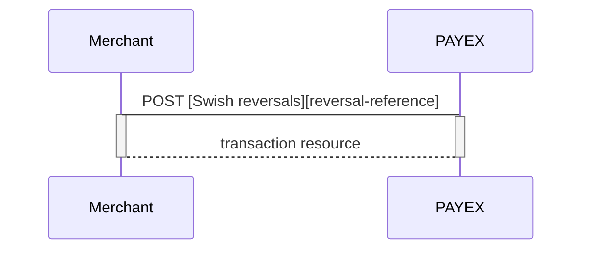



                      
## Options after posting a payment

*   **If CallbackURL is set: **Whenever changes to the payment occur a [Callback request][technical-reference-callback] will be posted to the callbackUrl, which was generated when the payment was created.
*   You can create a reversal transactions by implementing the Reversal request. You can also access and reverse a payment through your merchant pages in the [PayEx admin portal][payex-admin-portal].

#### Reversal Sequence

A reversal transcation have to match the Payee reference of a completed sales transaction.

### Capture

Swish does not support Capture

[technical-reference-callback]: #
[payex-admin-portal]: #
[reversal-reference]: #