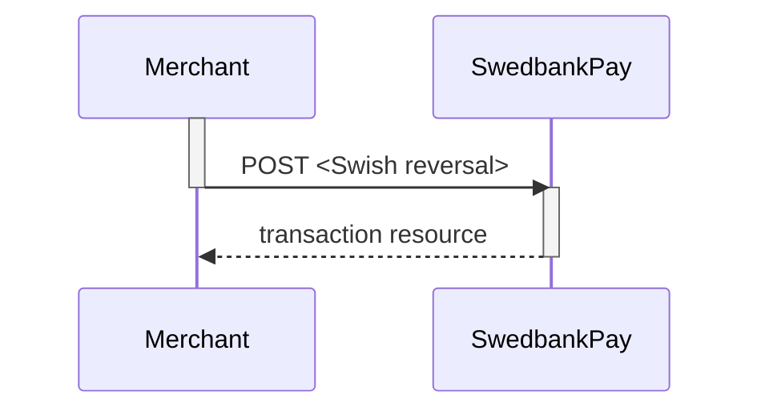



## Operations

When a payment resource is created and during its lifetime, it will have a set
of operations that can be performed on it.
Which operations are available will vary depending on the state of the payment
resource, what the access token is authorized to do, etc.
A list of possible operations for Swish Payments and their explanation
is given below.

{:.code-header}
**Operations**

```js
{
    "operations": [
        {
            "method": "PATCH",
            "href": "https://api.externalintegration.payex.com/psp/swish/payments/3648fa94-7fd8-4e32-a14b-08d608f884ff",
            "rel": "update-payment-abort"
        },
        {
            "method": "POST",
            "href": "https://api.externalintegration.payex.com/psp/swish/payments/3648fa94-7fd8-4e32-a14b-08d608f884ff/sales",
            "rel": "create-sale"
        },
        {
            "method": "GET",
            "href": "https://ecom.externalintegration.payex.com/swish/payments/sales/993b479653da83671c074316c7455da05fced9d634431edbb64f3c5f80a863f0",
            "rel": "redirect-sale"
        },
        {
            "method": "GET",
            "href": "https://ecom.externalintegration.payex.com/swish/core/scripts/client/px.swish.client.js?token=cfb9e24832d56fec7ab79709f56accc53d79a699756687d39095b517bc5f011b",
            "rel": "view-payment",
            "contentType": "application/javascript"
        }
    ]
}
```

{:.table .table-striped}
| Property | Description                                                         |
| :------- | :------------------------------------------------------------------ |
| `href`   | The target URI to perform the operation against.                    |
| `rel`    | The name of the relation the operation has to the current resource. |
| `method` | The HTTP method to use when performing the operation.               |

The operations should be performed as described in each response and not as
described here in the documentation.
Always use the `href` and `method` as specified in the response by finding the
appropriate operation based on its `rel` value.
The only thing that should be hard coded in the client is the value of
the `rel` and the request that will be sent in the HTTP body of the
request for the given operation.

{:.table .table-striped}
| Operation              | Description                                                                                                                                |
| :--------------------- | :----------------------------------------------------------------------------------------------------------------------------------------- |
| `update-payment-abort` | [Aborts][technical-reference-abort] the payment before any financial transactions are performed.                                           |
| `create-sale`          | Creates a `sales` transaction without redirection to a payment page. `Msisdn` is required in browser based scenarioes.                     |
| `redirect-sale`        | Contains the redirect-URI that redirects the consumer to a Swedbank Pay hosted payment page prior to creating a sales transaction.         |
| `view-payment`         | Contains the URI of the JavaScript used to create a Hosted View iframe directly without redirecting the consumer to separate payment page. |

## Swish transactions

All Swish transactions are described below.

## Sales

The `sales` resource lists the sales transactions (one or more)
on a specific payment.

{:.code-header}
**Request**

```http
GET /psp/swish/payments/5adc265f-f87f-4313-577e-08d3dca1a26c/sales HTTP/1.1
Host: api.externalintegration.payex.com
Authorization: Bearer <AccessToken>
Content-Type: application/json
```

{:.code-header}
**Response**

```http
HTTP/1.1 200 OK
Content-Type: application/json

{
  "payment": "/psp/swish/payments/5adc265f-f87f-4313-577e-08d3dca1a26c",
  "sales": {
    "id": "/psp/swish/payments/5adc265f-f87f-4313-577e-08d3dca1a26c/sale",
    "saleList": [
      {
        "date": "8/13/2019 8:58:23 AM +00:00",
        "payerAlias": "46739000001",
        "swishPaymentReference": "8D0A30A7804E40479F88FFBA26111F04",
        "swishStatus": "PAID",
        "id": "/psp/swish/payments/5adc265f-f87f-4313-577e-08d3dca1a26c/sales/12345678-1234-1234-1234-123456789012",
        "transaction": {
          "id": "12345678-1234-1234-1234-123456789012",
          "created": "2016-09-14T01:01:01.01Z",
          "updated": "2016-09-14T01:01:01.03Z",
          "type": "Sale",
          "state": "Initialized",
          "number": 1234567890,
          "amount": 1000,
          "vatAmount": 250,
          "description": "Test transaction",
          "payeeReference": "AH123456",
          "isOperational": true,
          "reconciliationNumber": 737283,
          "operations": []
        }
      }
    ]
  }
}
```

### Create Sales transaction

In browser based solutions the payers `msisdn` (mobile number) is required.
This is managed either by sending a `POST` request as seen below,
or by redirecting the end-user to the hosted payment page.
The `msisdn` is only required for browser based solutions.
With mobile app based solutions, the consumer uses the device that hosts the Swish app
to manage the purchase, making `msisdn` optional.

{:.code-header}
**Browser-based Request**

```http
POST /psp/swish/payments/20dfbcb9-587a-4ce9-e63e-08d519f1802f/sales HTTP/1.1
Host: api.externalintegration.payex.com
Authorization: Bearer <AccessToken>
Content-Type: application/json

{
    "transaction": {
        "msisdn": "+46739000001"
    }
}
```

{:.code-header}
**Browser-based Response**

```http
HTTP/1.1 200 OK
Content-Type: application/json

{
    "payment": "/psp/swish/payments/20dfbcb9-587a-4ce9-e63e-08d519f1802f",
    "sale": {
        "date": "23.10.2017 08:39:37 +00:00",
        "paymentRequestToken": "LhXrK84MSpWU2RO09f8kUP-FHiBo-1pB",
        "id": "/psp/swish/payments/20dfbcb9-587a-4ce9-e63e-08d519f1802f/sales/6bf31479-623f-418a-d69e-08d519f19722",
        "transaction": {
            "id": "6bf31479-623f-418a-d69e-08d519f19722",
            "created": "2017-10-23T08:39:35.6478733Z",
            "updated": "2017-10-23T08:39:37.3788733Z",
            "type": "Sale",
            "state": "AwaitingActivity",
            "number": 992309,
            "amount": 1500,
            "vatAmount": 0,
            "description": "Test Purchase",
            "payeeReference": "Postman1508747933",
            "isOperational": true,
            "operations": []
        }
    }
}
```

{:.code-header}
**In-app Request**

```http
POST /psp/swish/payments/20dfbcb9-587a-4ce9-e63e-08d519f1802f/sales HTTP/1.1
Host: api.externalintegration.payex.com
Authorization: Bearer <AccessToken>
Content-Type: application/json

{
    "transaction": {
    }
}
```

{:.code-header}
**In-app Response**

```http
HTTP/1.1 200 OK
Content-Type: application/json

{
    "payment": "/psp/swish/payments/20dfbcb9-587a-4ce9-e63e-08d519f1802f",
    "sale": {
        "date": "23.10.2017 08:39:37 +00:00",
        "paymentRequestToken": "LhXrK84MSpWU2RO09f8kUP-FHiBo-1pB",
        "id": "/psp/swish/payments/20dfbcb9-587a-4ce9-e63e-08d519f1802f/sales/6bf31479-623f-418a-d69e-08d519f19722",
        "transaction": {
            "id": "6bf31479-623f-418a-d69e-08d519f19722",
            "created": "2017-10-23T08:39:35.6478733Z",
            "updated": "2017-10-23T08:39:37.3788733Z",
            "type": "Sale",
            "state": "AwaitingActivity",
            "number": 992309,
            "amount": 1500,
            "vatAmount": 0,
            "description": "Test Purchase",
            "payeeReference": "Postman1508747933",
            "isOperational": true,
            "operations": [
                {
                    "href": "swish://paymentrequest?token=<swishtoken>&callbackurl=<completeUrl>",
                    "method": "GET",
                    "rel": "redirect-app-swish"
                }
            ]
        }
    }
}
```

The `operation` `redirect-app-swish` is only returned when using in-app flows.

The payment now contains a sale transaction with the status (state)
`AwaitingActivity`
When the consumer confirms the payment a callback request will follow
from Swedbank Pay.

## Reversals

The `Reversals` resource list the reversals transactions (one or more) on a
specific payment.

{:.code-header}
**Request**

```http
GET /psp/swish/payments/5adc265f-f87f-4313-577e-08d3dca1a26c/reversals HTTP/1.1
Host: api.externalintegration.payex.com
Authorization: Bearer <AccessToken>
Content-Type: application/json
```

{:.code-header}
**Response**

```http
HTTP/1.1 200 OK
Content-Type: application/json

{
    "payment": "/psp/swish/payments/5adc265f-f87f-4313-577e-08d3dca1a26c",
    "reversals": {
        "id": "/psp/swish/payments/5adc265f-f87f-4313-577e-08d3dca1a26c/reversals",
        "reversalList": [
            {
                "id": "/psp/swish/payments/5adc265f-f87f-4313-577e-08d3dca1a26c/reversals/12345678-1234-1234-1234-123456789012",
                "transaction": {
                    "id": "/psp/swish/payments/5adc265f-f87f-4313-577e-08d3dca1a26c/transactions/12345678-1234-1234-1234-123456789012",
                    "created": "2016-09-14T01:01:01.01Z",
                    "updated": "2016-09-14T01:01:01.03Z",
                    "type": "Reversal",
                    "state": "Completed",
                    "number": 1234567890,
                    "amount": 1000,
                    "vatAmount": 250,
                    "description": "Test transaction",
                    "payeeReference": "AH123456",
                    "isOperational": "TRUE",
                    "operations": []
                }
            }
        ]
    }
}
```

{:.table .table-striped}
| Property                 | Type     | Description                                                                                          |
| :----------------------- | :------- | :--------------------------------------------------------------------------------------------------- |
| `payment`                | `string` | The relative URI of the payment that the reversal transactions belong to.                            |
| `reversals`              | `object` | The reversal object.                                                                                 |
| └➔&nbsp;`reversalList[]` | `array`  | The array of reversal transaction objects.                                                           |
| └─➔&nbsp;`transaction`   | `object` | The reversal transaction object representation of the reversal transaction resource described below. |

### Create Reversal transaction

A reversal transaction can be created after a completed authorization by sending
a request to `/psp/swish/payments/<payment-id>/reversals`.
A [callback][technical-reference-callback] request will follow from
Swedbank Pay.

{:.code-header}
**Request**

```http
POST /psp/swish/payments/5adc265f-f87f-4313-577e-08d3dca1a26c/reversals HTTP/1.1
Host: api.externalintegration.payex.com
Authorization: Bearer <AccessToken>
Content-Type: application/json

{
    "transaction": {
        "amount": 1500,
        "vatAmount": 0,
        "description" : "Test Reversal",
        "payeeReference": "ABC123"
    }
}
```

{:.table .table-striped}
| Required | Property                 | Type         | Description                                                                                                                                                            |
| :------: | :----------------------- | :----------- | :--------------------------------------------------------------------------------------------------------------------------------------------------------------------- |
|    ✔︎    | `transaction`            | `object`     | The `transaction` object, containing information about this `reversal`.                                                                                                |
|    ✔︎    | └➔&nbsp;`amount`         | `integer`    | Amount Entered in the lowest momentary units of the selected currency. E.g. `10000` = `100.00 SEK`, `5000` = `50.00 SEK`                                               |
|    ✔︎    | └➔&nbsp;`vatAmount`      | `integer`    | Amount Entered in the lowest momentary units of the selected currency. E.g. `10000` = `100.00 SEK`, `5000` = `50.00 SEK`                                               |
|    ✔︎    | └➔&nbsp;`description`    | `string`     | A textual description of the capture                                                                                                                                   |
|    ✔︎    | └➔&nbsp;`payeeReference` | `string(35)` | A  reference that must match the  `payeeReference` of the sales transaction you want to reverse. See [payeeReference][technical-reference-payeeReference] for details. |

{:.code-header}
**Response**

```http
HTTP/1.1 200 OK
Content-Type: application/json

{
    "payment": "/psp/swish/payments/5adc265f-f87f-4313-577e-08d3dca1a26c",
    "reversal": {
        "id": "/psp/swish/payments/5adc265f-f87f-4313-577e-08d3dca1a26c/reversals/12345678-1234-1234-1234-123456789012",
        "transaction": {
            "id": "/psp/swish/payments/5adc265f-f87f-4313-577e-08d3dca1a26c/transactions/12345678-1234-1234-1234-123456789012",
            "created": "2016-09-14T01:01:01.01Z",
            "updated": "2016-09-14T01:01:01.03Z",
            "type": "Reversal",
            "state": "Completed",
            "number": 1234567890,
            "amount": 1000,
            "vatAmount": 250,
            "description": "Test transaction",
            "payeeReference": "AH123456",
            "isOperational": false,
            "operations": []
        }
    }
}
```

{:.table .table-striped}
| Property              | Type     | Description                                                                              |
| :-------------------- | :------- | :--------------------------------------------------------------------------------------- |
| `payment`             | `string` | The relative URI of the payment this capture transaction belongs to.                     |
| `reversal`            | `object` | The `reversal` object contains information about this `reversal`.                        |
| └➔&nbsp;`id`          | `string` | The relative URI of the created capture transaction.                                     |
| └➔&nbsp;`transaction` | `object` | The object representation of the generic [transaction][technical-reference-transaction]. |

## Abort

To abort a payment order, send a request to `/psp/swish/payments/{{paymentId}}`.
You need to include the following `HTTP` body:

{:.code-header}
**Request**

```http
PATCH /psp/payments/5adc265f-f87f-4313-577e-08d3dca1a26c HTTP/1.1
Host: api.externalintegration.payex.com
Authorization: Bearer <AccessToken>
Content-Type: application/json

{
  "payment": {
    "operation": "Abort",
    "abortReason": "CancelledByConsumer"
  }
}
```

{:.table .table-striped}
| Property              | Type     | Description                                                                              |
| :-------------------- | :------- | :--------------------------------------------------------------------------------------- |
| `payment`             | `string` | The `payment` object holds the reason and operation for this request.                    |
| └➔&nbsp;`operation`   | `string` | `abort` to abort this payment.                                                           |
| └➔&nbsp;`abortReason` | `object` | A textual reason for this abort. Examples: "CancelledByConsumer", "CancelledByCustomer". |

### Response from abort

The response given when aborting a payment order is equivalent to a `GET`
request towards the `paymentorders` resource,
[as displayed above][payment-order], with its `state` set to `Aborted`.

### Reversal Sequence

A reversal transcation have to match the Payee reference of a
completed sales transaction.



## Capture

Swish does not support `capture` as it is a one-phase payment method all
completed payments are captured.

## Cancel

Swish does not support `cancel` as `cancel` can only be used on two-phase
payments before they are captured or reversed.

## Recurring

Swish does not support `recurring` payments.

[core-payment-resources]: /payments
[general-http-info]: /resources/
[payex-admin-portal]: https://admin.payex.com/psp/login/
[payment-order]: #create-payment
[technical-reference-abort]: #abort
[technical-reference-callback]: /payments/swish/other-features#callback
[technical-reference-expand]: /payments/swish/other-features#expansion
[technical-reference-payeeReference]: /payments/swish/other-features#payee-reference
[technical-reference-problemmessages]: /payments/swish/other-features#problem-messages
[technical-reference-transaction]: /payments/swish/other-features#transaction
[user-agent]: https://en.wikipedia.org/wiki/User_agent
