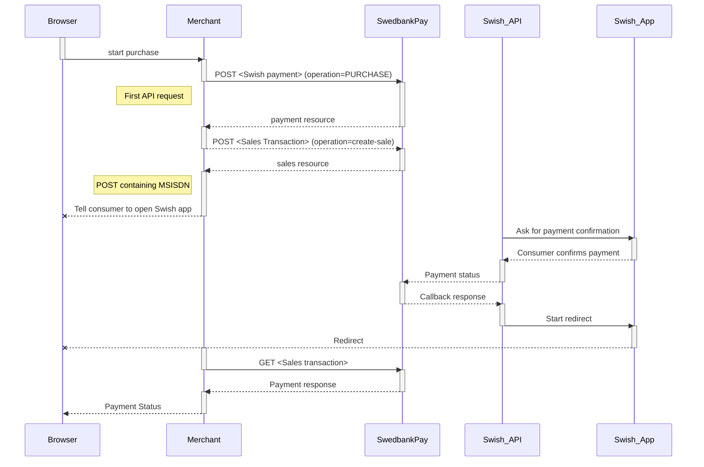
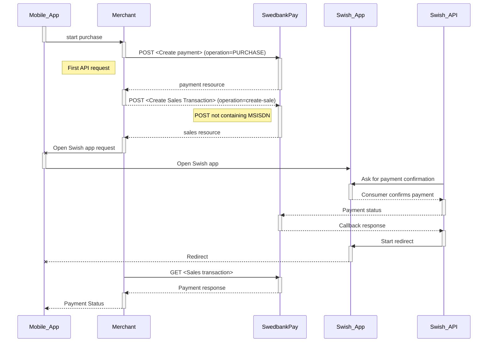



## Introduction

* When the payer starts the purchase process, you make a `POST` request towards
  Swedbank Pay with the collected Purchase information.
* The next step is to collect the consumer's Swish registered mobile number
  and make a `POST` request towards Swedbank Pay to create a sales transaction.
* Swedbank Pay will handle the dialogue with Swish and the consumer will have to
  confirm the purchase in the Swish app.
* If `CallbackURL` is set, you will receive a payment callback when the Swish
  dialogue is completed.
* Make a `GET` request to check the payment status.

## Purchase flow

The sequence diagram below shows the three requests you have to send to
Swedbank Pay to make a purchase.



## Operations

The API requests are displayed in the [purchase flow][purchase-flow)].
Swish is a one-phase payment instrument that is based on sales transactions not
involving `capture` or `cancellation` operations.
The options you can choose from when creating a payment with key operation
set to value `Purchase` are listed below.

#### General

* **Defining CallbackURL**: When implementing a scenario, it is strongly
  recommended to set a [CallbackURL][callback-url] in the `POST` request.
  If `callbackURL` is set, Swedbank Pay will send a postback request to this
  URL when the consumer has fulfilled the payment.



{:.code-header}
**Request**

```http
POST /psp/swish/payments HTTP/1.1
Authorization: Bearer <AccessToken>
Content-Type: application/json

{
    "payment": {
        "operation": "Purchase",
        "intent": "Sale",
        "currency": "SEK",
        "prices": [
            {
                "type": "Swish",
                "amount": 1500,
                "vatAmount": 0
            }
        ],
        "description": "Test Purchase",
        "payerReference": "AB1234",
        "userAgent": "Mozilla/5.0...",
        "language": "sv-SE",
        "urls": {
            "hostUrls": "https://example.com",
            "paymentUrl": "http://example.com/perform-payment",
            "completeUrl": "https://example.com/payment-completed",
            "cancelUrl": "https://example.com/payment-canceled",
            "callbackUrl": "https://example.com/payment-callback",
            "logoUrl": "https://example.com/logo.png",
            "termsOfServiceUrl": "https://example.com/terms.pdf"
        },
        "payeeInfo": {
            "payeeId": "bbb33dc5-f44e-4af6-afc0-27fb5fa2f63a",
            "payeeReference": "ref-123456",
            "payeeName": "Merchant1",
            "productCategory": "A123",
            "orderReference": "or-123456",
            "subsite": "MySubsite"
        },
        "prefillInfo": {
            "msisdn": "+46xxxxxxxxx"
        },
        "swish": {
            "ecomOnlyEnabled": false
        }
    }
}
```

{:.table .table-striped}
| Required | Property                              | Type          | Description                                                                                                                                                                                                                                                                                                                                                                                                                                                                                                                                                               |
| :------: | :------------------------------------ | :------------ | :------------------------------------------------------------------------------------------------------------------------------------------------------------------------------------------------------------------------------------------------------------------------------------------------------------------------------------------------------------------------------------------------------------------------------------------------------------------------------------------------------------------------------------------------------------------------ |
|  ✔︎︎︎︎︎  | `payment`                             | `object`      | The `payment` object contains information about the specific payment.                                                                                                                                                                                                                                                                                                                                                                                                                                                                                                     |
|  ✔︎︎︎︎︎  | └➔&nbsp;`operation`                   | `string`      | The operation that the `payment` is supposed to perform. The [`purchase`][purchase] operation is used in our example.                                                                                                                                                                                                                                                |
|  ✔︎︎︎︎︎  | └➔&nbsp;`intent`                      | `string`      | `Authorization`.                                                                                                                                                                                                                                                                                                                                               |
|  ✔︎︎︎︎︎  | └➔&nbsp;`currency`                    | `string`      | NOK, SEK, DKK, USD or EUR.                                                                                                                                                                                                                                                                                                                                                                                                                                                                                                                                                |
|  ✔︎︎︎︎︎  | └➔&nbsp;`prices`                      | `object`      | The `prices` resource lists the prices related to a specific payment.                                                                                                                                                                                                                                                                                                                                                                                                                                                                                                     |
|  ✔︎︎︎︎︎  | └─➔&nbsp;`type`                       | `string`      | Swish |
|  ✔︎︎︎︎︎  | └─➔&nbsp;`amount`                     | `integer`     | Amount is entered in the lowest momentary units of the selected currency. E.g. 10000 = 100.00 SEK 5000 = 50.00 SEK.                                                                                                                                                                                                                                                                                                                                                                                                                                                       |
|  ✔︎︎︎︎︎  | └─➔&nbsp;`vatAmount`                  | `integer`     | If the amount given includes VAT, this may be displayed for the user in the payment page (redirect only). Set to 0 (zero) if this is not relevant.                                                                                                                                                                                                                                                                                                                                                                                                                        |
|  ✔︎︎︎︎︎  | └➔&nbsp;`description`                 | `string(40)`  | A textual description max 40 characters of the purchase.                                                                                                                                                                                                                                                                                                                                                                                                                                                                                                                  |
|          | └➔&nbsp;`payerReference`              | `string`      | The reference to the payer (consumer/end user) from the merchant system. E.g mobile number, customer number etc.                                                                                                                                                                                                                                                                                                                                                                                                                                                          |
|          | └➔&nbsp;`payeeName`        | `string`     | The payee name will be displayed to consumer when redirected to Swedbank Pay.                                                                                                                                                                                                                                                                                                                                                                                                                                                                   |
|  ✔︎︎︎︎︎  | └➔&nbsp;`userAgent`                   | `string`      | The user agent reference of the consumer's browser - [see user agent definition][user-agent-definition]                                                                                                                                                                                                                                                                                                                                                                                                                                                                   |
|  ✔︎︎︎︎︎  | └➔&nbsp;`language`                    | `string`      | nb-NO, sv-SE or en-US.                                                                                                                                                                                                                                                                                                                                                                                                                                                                                                                                                    |
|  ✔︎︎︎︎︎  | └➔&nbsp;`urls`                        | `object`      | The `urls` resource lists urls that redirects users to relevant sites.                                                                                                                                                                                                                                                                                                                                                                                                                                                                                                    |
|  ✔︎︎︎︎︎  | └─➔&nbsp;`completeUrl`                | `string`      | The URL that Swedbank Pay will redirect back to when the payment page is completed.                                                                                                                                                                                                                                                                                                                                                                                                                                                                                       |
|          | └─➔&nbsp;`cancelUrl`                  | `string`      | The URI to redirect the payer to if the payment is canceled. Only used in redirect scenarios. Can not be used simultaneously with `paymentUrl`; only cancelUrl or `paymentUrl` can be used, not both.                                                                                                                                                                                                                                                                                                                                                                     |
|          | └─➔&nbsp;`callbackUrl`                | `string`      | The URL that Swedbank Pay will perform an HTTP POST against every time a transaction is created on the payment. See [callback][callback] for details.                                                                                                                                                                                                                                                                                                                                                                                                                     |
|          | └─➔&nbsp;`logoUrl`                    | `string`      | The URL that will be used for showing the customer logo. Must be a picture with maximum 50px height and 400px width. Require https.                                                                                                                                                                                                                                                                                                                                                                                                                                       |
|          | └─➔&nbsp;`termsOfServiceUrl`          | `string`      | A URL that contains your terms and conditions for the payment, to be linked on the payment page. Require https.                                                                                                                                                                                                                                                                                                                                                                                                                                                           |
|  ✔︎︎︎︎︎  | └➔&nbsp;`payeenfo`                    | `object`      | The `payeeInfo` contains information about the payee.                                                                                                                                                                                                                                                                                                                                                                                                                                                                                                                     |
|  ✔︎︎︎︎︎  | └─➔&nbsp;`payeeId`                    | `string`      | This is the unique id that identifies this payee (like merchant) set by Swedbank Pay.                                                                                                                                                                                                                                                                                                                                                                                                                                                                                     |
|  ✔︎︎︎︎︎  | └─➔&nbsp;`payeeReference`             | `string(50*)` | A unique reference from the merchant system. It is set per operation to ensure an exactly-once delivery of a transactional operation. See [payeeReference][payee-reference] for details.                                                                                                                                                                                                                                                                                                                                                                                  |
|          | └─➔&nbsp;`payeeName`                  | `string`      | The payee name (like merchant name) that will be displayed to consumer when redirected to Swedbank Pay.                                                                                                                                                                                                                                                                                                                                                                                                                                                                   |
|          | └─➔&nbsp;`productCategory`            | `string`      | A product category or number sent in from the payee/merchant. This is not validated by Swedbank Pay, but will be passed through the payment process and may be used in the settlement process.                                                                                                                                                                                                                                                                                                                                                                            |
|          | └─➔&nbsp;`orderReference`             | `String(50)`  | The order reference should reflect the order reference found in the merchant's systems.                                                                                                                                                                                                                                                                                                                                                                                                                                                                                   |
|          | └─➔&nbsp;`subsite`                    | `String(40)`  | The subsite field can be used to perform split settlement on the payment. The subsites must be resolved with Swedbank Pay reconciliation before being used.                                                                                                                                                                                                                                                                                                                                                                                                               |
|         | └─➔&nbsp;`msisdn`             | `String`  | Number will be prefilled on payment page, if valid.                                                                                                                                                                                                                                                                                                                                                                                                                                                                                    |
|             | └─➔&nbsp;`ecomOnlyEnabled`             | `boolean`  | `true` if to only enable Swish on e-commerce transactions.; otherwise `false` to also enable Swish transactions via mobile app.                                                                                                                                                                                                                                                                                                                                                                                                                                                                                    |

{:.code-header}
**Response**

```http
POST /psp/swish/payments HTTP/1.1
Authorization: Bearer <AccessToken>
Content-Type: application/json

{
    "payment": {
        "id": "/psp/swish/payments/20dfbcb9-587a-4ce9-e63e-08d519f1802f",
        "number": 992308,
        "created": "2017-10-23T08:38:57.2248733Z",
        "instrument": "Swish",
        "operation": "Purchase",
        "intent": "Sale",
        "state": "Ready",
        "currency": "SEK",
        "amount": 0,
        "description": "Test Purchase",
        "payerReference": "AB1234",
        "initiatingSystemUserAgent": "Mozilla/5.0",
        "userAgent": "Mozilla/5.0...",
        "language": "sv-SE",
        "urls": {
            "id": "/psp/swish/payments/20dfbcb9-587a-4ce9-e63e-08d519f1802f/urls"
        },
        "payeeInfo": {
            "id": "/psp/swish/payments/20dfbcb9-587a-4ce9-e63e-08d519f1802f/payeeinfo"
        }
    },
    "operations": [
        {
            "method": "PATCH",
            "href": "http://localhost:18496/psp/swish/payments/20dfbcb9-587a-4ce9-e63e-08d519f1802f",
            "rel": "update-payment-abort"
        },
        {
            "method": "POST",
            "href": "http://localhost:18496/psp/swish/payments/20dfbcb9-587a-4ce9-e63e-08d519f1802f/sales",
            "rel": "create-sale"
        }
    ]
}
```

## Sales

The Sales resource lists the sales transactions (one or more) on a specific payment.

{:.code-header}
**Request**

```http
POST /psp/swish/payments HTTP/1.1
Authorization: Bearer <AccessToken>
Content-Type: application/json

```

{:.code-header}
**Response**

```http
POST /psp/swish/payments HTTP/1.1
Authorization: Bearer <AccessToken>
Content-Type: application/json

{
    "payment": "/psp/swish/payments/5adc265f-f87f-4313-577e-08d3dca1a26c",
    "sales": {
        "id": "/psp/swish/payments/5adc265f-f87f-4313-577e-08d3dca1a26c/sale",
        "saleList": [
            {
                "date": "8/13/2019 8:58:23 AM +00:00",
                "payerAlias": "4670XXXXXXX",
                "swishPaymentReference": "8D0A30A7804E40479F88FFBA26111F04",
                "swishStatus": "PAID",
                "id": "/psp/swish/payments/5adc265f-f87f-4313-577e-08d3dca1a26c/sales/12345678-1234-1234-1234-123456789012",
                "transaction": {
                    "id": "12345678-1234-1234-1234-123456789012",
                    "created": "2016-09-14T01:01:01.01Z",
                    "updated": "2016-09-14T01:01:01.03Z",
                    "type": "Sale",
                    "state": "Initialized|Completed|Failed",
                    "number": 1234567890,
                    "amount": 1000,
                    "vatAmount": 250,
                    "description": "Test transaction",
                    "payeeReference": "AH123456",
                    "isOperational": "true|false",
                    "reconciliationNumber": 737283,
                    "operations": []
                }
            }
        ]
    }
}
```

[swish-redirect-view]: /assets/screenshots/swish/redirect-view/view/windows-small-window.png
[swish-hosted-view]: /assets/screenshots/swish/hosted-view/windows.png
[callback-url]: /payments/swish/other-fetures#callback
[create-payment]: /payments/swish/
[payex-admin-portal]: https://admin.payex.com/psp/login/
[payex-mailto]: mailto:sales@payex.com
[redirect]: /payments/swish/redirect
[sales-transaction]: /payments/swish/other-features#sales
[SEB-swish]: https://seb.se/foretag/digitala-tjanster/swish-handel
[support-mailto]: mailto:support.ecom@payex.com
[swedbank-swish]: https://www.swedbank.se/foretag/betala-och-ta-betalt/ta-betalt/swish/swish-handel/index.htm
[swish-certificate-management-system]: https://comcert.getswish.net/cert-mgmt-web/authentication.html
[technical-reference-callback]: /payments/swish/other-features#callback
