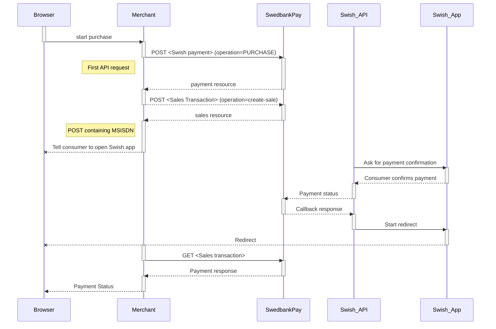
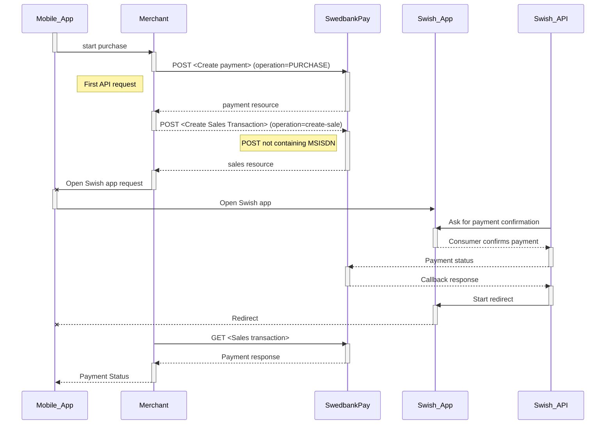

## E-commerce Direct API



## Introduction

* When the payer starts the purchase process, you make a `POST` request towards
  Swedbank Pay with the collected Purchase information.
* The next step is to collect the consumer's Swish registered mobile number
  and make a `POST` request towards Swedbank Pay to create a sales transaction.
* Swedbank Pay will handle the dialogue with Swish and the consumer will have to
  confirm the purchase in the Swish app.
* If `CallbackURL` is set, you will receive a payment callback when the Swish
  dialogue is completed.
* Make a `GET` request to check the payment status.

This flow is explained in the sequence diagram below.

## API Requests

The API requests are displayed in the [purchase flow](#purchase-flow).
Swish is a one-phase payment instrument that is based on sales transactions not
involving `capture` or `cancellation` operations.
The options you can choose from when creating a payment with key operation
set to value `Purchase` are listed below.

### Options before posting a payment

All valid options when posting in a payment with operation equal to `Purchase`.

#### General

* **Defining CallbackURL**: When implementing a scenario, it is optional to set
  a [CallbackURL][callback-url] in the `POST` request. If `callbackURL` is set,
  Swedbank Pay will send a postback request to this URL when the consumer has
  fulfilled the payment.

## Purchase flow

The sequence diagram below shows the three requests you have to send to
Swedbank Pay to make a purchase.

{
  "payment": {
    "id": "/psp/swish/payments/5adc265f-f87f-4313-577e-08d3dca1a26c",
    "number": 1234567890,
    "created": "2016-09-14T13:21:29.3182115Z",
    "updated": "2016-09-14T13:21:57.6627579Z",
    "instrument": "swish",
    "operation": "Purchase",
    "intent": "Sale",
    "state": "Ready",
    "currency": "NOK",
    "amount": 1500,
    "remainingReversalAmount": 1500,
    "description": "Test Purchase",
    "payerReference": "AB1234",
    "initiatingSystemUserAgent": "PostmanRuntime/3.0.1",
    "userAgent": "Mozilla/5.0...",
    "language": "nb-NO",
    "prices": { "id": "/psp/swish/payments/5adc265f-f87f-4313-577e-08d3dca1a26c/prices" },
    "transactions": { "id": "/psp/swish/payments/5adc265f-f87f-4313-577e-08d3dca1a26c/transactions" },
    "reversals": { "id": "/psp/swish/payments/5adc265f-f87f-4313-577e-08d3dca1a26c/reversals" },
    "sales": { "id": "/psp/swish/payments/5adc265f-f87f-4313-577e-08d3dca1a26c/sales" },
    "urls" : { "id": "/psp/swish/payments/5adc265f-f87f-4313-577e-08d3dca1a26c/urls" },
    "payeeInfo" : { "id": "/psp/swish/payments/5adc265f-f87f-4313-577e-08d3dca1a26c/payeeInfo" },
    "settings": { "id": "/psp/swish/payments/5adc265f-f87f-4313-577e-08d3dca1a26c/settings" }
  },
  "operations": [
    {
      "href": "http://localhost:5001/psp/swish/payments/5adc265f-f87f-4313-577e-08d3dca1a26c",
      "rel": "update-payment-abort",
      "method": "PATCH"
    }
  ]
}

{
    "href": "https://api.payex.com/psp/swish/payments/<paymentId>/aborted",
    "rel": "aborted-payment",
    "method": "GET",
    "contentType": "application/json"
}
{
   "href": "https://api.payex.com/psp/swish/payments/<paymentId>/paid",
   "rel": "paid-payment",
   "method": "GET",
   "contentType": "application/json"
}
{
   "href": "https://api.payex.com/psp/swish/payments/<paymentId>/failed",
   "rel": "failed-payment",
   "method": "GET",
   "contentType": "application/json+problem"
}

**Redirect and Payment Status**  
After the payment is confirmed, the consumer will be redirected from the Swish
app to the completeUrl set in the first API request `POST` [Create
payment][create-payment] and you need to retrieve payment status with `GET`
[Sales transaction][sales-transaction] before presenting a confirmation page to
the consumer.

## M-commerce Direct API



## Introduction

* When the consumer/end-user starts the purchase process, you make a `POST`
  request towards Swedbank Pay with the collected Purchase information.
* You need to make a `POST`  request towards Swedbank Pay to create a sales
  transaction. The payment flow is identified as m-commerce, as the purchase is
  initiated from the device that hosts the Swish app.
* Swedbank Pay will handle the dialogue with Swish and the consumer will have to
  confirm the purchase in the Swish app.
* If `CallbackURL` is set you will receive a payment callback when the Swish
  dialogue is completed, and you will have to make a `GET` request to check the
  payment status.

The flow is explained in the sequence diagram below.

## API Requests

The API requests are displayed in the [purchase flow](#purchase-flow-2). Swish
is a one-phase payment instrument that is based on sales transactions not
involving capture or cancellation operations. The options you can choose from
when creating a payment with key operation set to value `Purchase` are listed below.

### Options before posting a payment

All valid options when posting in a payment with operation equal to `Purchase`.

#### General

* **Defining CallbackURL**: When implementing a scenario, it is optional to set
  a [CallbackURL][callback-url] in the `POST` request. If `callbackURL` is set,
  Swedbank Pay will send a postback request to this URL when the consumer has
  fulfilled the payment.

## Purchase flow

The sequence diagram below shows the three requests you have to send to Swedbank
Pay to make a purchase. The links will take you directly to the API description
for the specific request.

[swish-redirect-view]: /assets/screenshots/swish/redirect-view/view/windows-small-window.png
[swish-hosted-view]: /assets/screenshots/swish/hosted-view/windows.png
[callback-url]: /payments/swish/other-fetures#callback
[create-payment]: /payments/swish/
[payex-admin-portal]: https://admin.payex.com/psp/login/
[payex-mailto]: mailto:sales@payex.com
[redirect]: /payments/swish/redirect
[sales-transaction]: /payments/swish/other-features#sales
[SEB-swish]: https://seb.se/foretag/digitala-tjanster/swish-handel
[support-mailto]: mailto:support.ecom@payex.com
[swedbank-swish]: https://www.swedbank.se/foretag/betala-och-ta-betalt/ta-betalt/swish/swish-handel/index.htm
[swish-certificate-management-system]: https://comcert.getswish.net/cert-mgmt-web/authentication.html
[technical-reference-callback]: /payments/swish/other-features#callback
