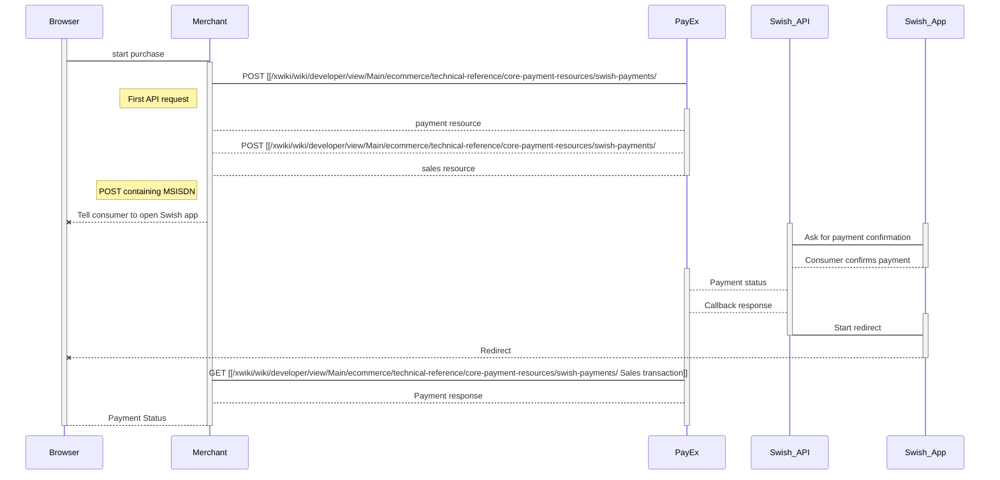
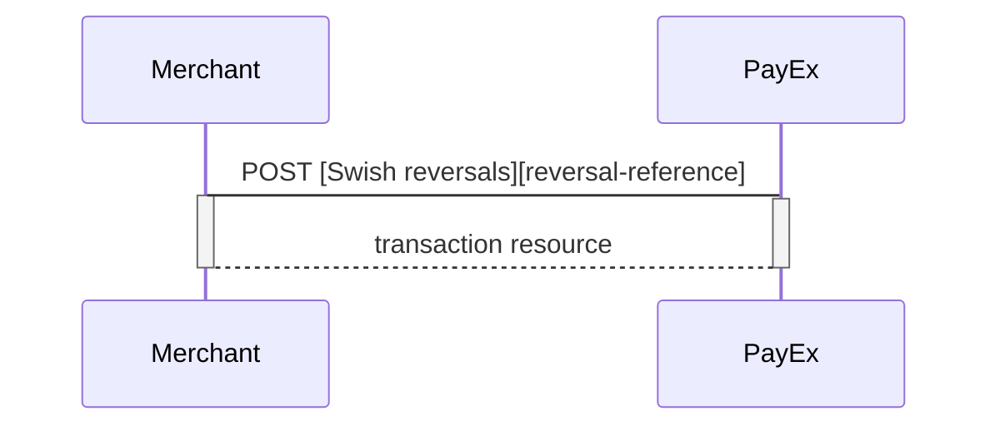
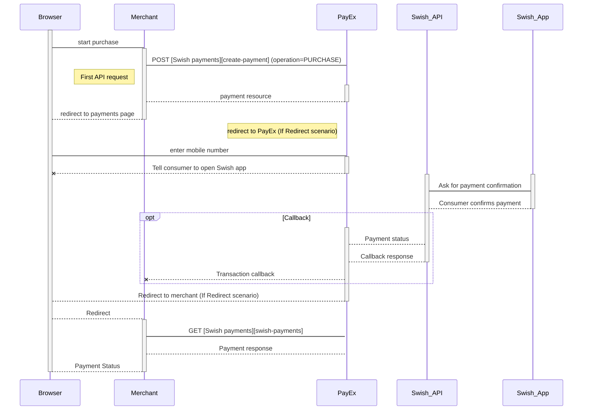
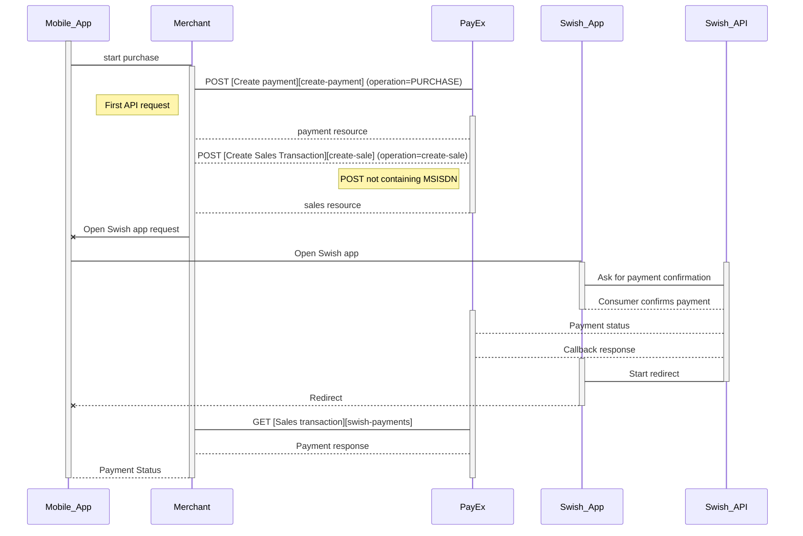
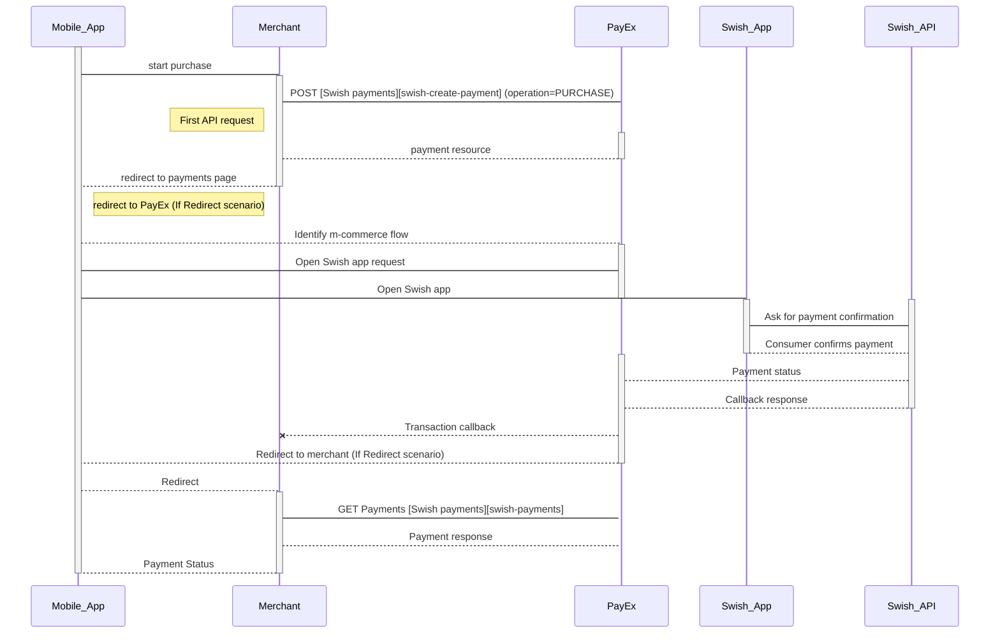



# Swish Payments

>Add Swish to your PayEx payment methodsand take advantage of **[PayEx Settlement Service][settlement-service] **to get consolidated payments and reporting, for all your payment methods.

## How do you get started with Swish through PayEx?

We recommend that you apply for Swish as part of  [PayEx Settlement Service][settlement-service]) and utilize the PayEx Technical Supplier Certificate. A [PayEx sales representative][payex-mailto] can assist you getting started with that. Otherwise, you can contact one of the following banks offering Swish Handel: [Danske Bank][danske-bank], [Swedbank][swedbank-swish], [SEB][SEB-swish], [Länsförsäkringar], [Sparbanken Syd][sparbanken-syd], [Sparbanken Öresund][sparbanken-oresund], [Nordea][nordea], [Handelsbanken][handelsbanken], in order to get an acquiring agreement, a merchant number/payee and access to [Swish Certificate Management system][swish-certificate-management-system].

## Implementation models and commerce flows:

PayEx supports both e-commerce and m-commerce flows (as a Merchant you should implement both) - through PayEx Payment Pages or PayEx Direct API integration.
![swish logo][swish-image]

### Swish m-commerce, Redirect to payment pages
_Available in ![swedish flag][se-image]_

Swish payments from a mobile device made either through an app or via a mobile browser on the mobile device that hosts the Swish app. The flow redirects the payment dialogue to PayEx Payment Pages, that will handle the required user dialogue.

### Swish e-commerce, Redirect to payment pages

_Available in ![swedish flag][se-image]_

Swish payments initiated by the consumer in a browser in equipment other than the mobile device that hosts the Swish app. The flow redirects the payment dialogue to PayEx Payment Pages, that will handle the required user dialogue / mobile number input.

### Swish m-commerce, Direct API integration

_Available in ![swedish flag][se-image]_
Swish payments from a mobile device made either through an app or via a mobile browser on the same mobile device.

### Swish e-commerce, Direct API integration
_Available in ![swedish flag][se-image]_

Swish payments initiated by the consumer in a browser in equipment other than the mobile device that hosts the Swish app.

### Payment Link
_Available in ![swedish flag][se-image]_

Generate a Payment Link that can be sent to the consumer via e-mail or SMS, so the consumer may pay at a later moment. Payment links can be implemented for all payment methods supporting Redirect to hosted payment pages

### Technical Reference

_Available in ![swedish flag][se-image]_

Technical reference for Swish API resources and their properties.

[If you are missing a scenario, please let us know what you need! ][support-mailto]

## Merchant Swish Simulator (MSS)

[MSS] is a test server application that simulates the commerce interaction with Swish API. It can answer the calls to Swish API and returns correct formatted return messages and also the error messages.

Click on the following [link][testverktyg-pdf] to know more about the error codes that are used in Merchant Swish Simulator.

# Swish e-commerce Direct API

>Swish is a one-phase payment method supported by the major Swedish banks. In the direct e-commerce scenario, PayEx receives the Swish registered mobile number directly from the merchant UI. PayEx performs a payment that the payer confirms using her Swish mobile app.

## Introduction

*   When the payer starts the purchase process, you make a `POST` request towards PayEx with the collected Purchase information.
*   After that you need to collect the consumer's Swish registered mobile number and make a POST request towards PayEx, to create a sales transaction.
*   PayEx will handle the dialogue with Swish and the consumer will have to confirm the purchase in the Swish app.
*   If CallbackURL is set you will receive a payment callback when the Swish dialogue is completed, and you will have to make a `GET` request to check the payment status.
*   The flow is explained in the sequence diagram below.

## API Requests

The API requests are displayed in the [purchase flow](#purchase-flow).  Swish is a one-phase payment method that is based on sales transactions not involving capture or cancellation operations.  The options you can choose from when creating a payment with key operation set to Value Purchase are listed below. The general REST based API model is described in the [technical reference][technical-reference].

### Options before posting a payment

All valid options when posting in a payment with operation equal to Purchase, are described in [the technical reference][swish-payments].

#### General

*   **Defining CallbackURL**: When implementing a scenario, it is optional to set a [CallbackURL][callback-url] in the `POST` request. If callbackURL is set PayEx will send a postback request to this URL when the consumer has fulfilled the payment. [See the Callback API description here][technical-reference-callback].

## Purchase flow

The sequence diagram below shows the three requests you have to send to PayEx to make a purchase. The links will take you directly to the API description for the specific request. 

**Redirect and Payment Status**  
After the payment is confirmed, the consumer will be redirected from the Swish app to the completeUrl set in the first API request `POST` [Create payment][create-payment] and you need to retrieve payment status with `GET` [Sales transaction][sales-transaction] before presenting a confirmation page to the consumer.

## Options after posting a payment

*   **If CallbackURL is set: **Whenever changes to the payment occur a [Callback request][technical-reference-callback] will be posted to the callbackUrl, which was generated when the payment was created.
*   You can create a reversal transactions by implementing the Reversal request. You can also access and reverse a payment through your merchant pages in the [PayEx admin portal][payex-admin-portal].

### Reversal Sequence

A reversal transcation need to match the Payee reference of a completed sales transaction.

# Swish e-commerce Redirect

>Swish is an one-phase payment method supported by the major Swedish banks. In the redirect e-commerce scenario, PayEx performs a payment that the payer confirms using her Swish mobile app. The consumer initiates the payment by supplying the Swish registered mobile number (MSISDN), connected to the Swish app.

## Introduction

*   When the payer starts the purchase process, you make a `POST` request towards PayEx with the collected Purchase information. This will generate a payment object with a unique paymentID. You either receive a Redirect URL to a hosted page or a JavaScript source in response.
*   You need to [redirect][redirect] the payer to the Redirect payment page or embed the script source on you site to create a [Hosted View][hosted-view] in an iFrame;  where she is prompted to enter the Swish registered mobile number. This triggers the initiation of a sales transaction.
*   PayEx handles the dialogue with Swish and the consumer confirms the purchase in the Swish app.
*   PayEx will redirect the payer's browser to - or display directly in the iFrame - one of two specified URLs, depending on whether the payment session is followed through completely or cancelled beforehand. Please note that both a successful and rejected payment reach completion, in contrast to a cancelled payment.
*   If CallbackURL is set you will receive a payment callback when the Swish dialogue is completed. You need to do a `GET` request, containing the paymentID generated in the first step, to receive the state of the transaction.

## Screenshots

The consumer/end-user is redirected to PayEx hosted pages and prompted to insert her phone number to initiate the sales transaction.

![Consumer paying with Swish using PayEx][1551695199059-994.png]

## API Requests

The API requests are displayed in the [purchase flow](#purchase-flow-1).  Swish is a one-phase payment method that is based on sales transactions not involving capture or cancellation operations.  The options you can choose from when creating a payment with key operation set to Value Purchase are listed below. The general REST based API model is described in the [technical reference][technical-reference].

### Options before posting a payment

All valid options when posting in a payment with operation equal to Purchase, are described in [the technical reference][swish-payments].

#### General

*   **Defining CallbackURL**: When implementing a scenario, it is optional to set a [CallbackURL][callback-url] in the `POST` request. If callbackURL is set PayEx will send a postback request to this URL when the consumer has fulfilled the payment. [See the Callback API description here][technical-reference-callback].

## Purchase flow

The sequence diagram below shows the requests you have to send to PayEx to make a purchase. The links will take you directly to the API description for the specific request. 

## Options after posting a payment

*   **If CallbackURL is set: **Whenever changes to the payment occur a [Callback request][technical-reference-callback] will be posted to the callbackUrl, which was generated when the payment was created.
*   You can create a reversal transactions by implementing the Reversal request. You can also access and reverse a payment through your merchant pages in the [PayEx admin portal][payex-admin-portal].

### Reversal Sequence

A reversal transcation need to match the Payee reference of a completed sales transaction.

# Swish m-commerce Direct API

>Swish is an one-phase payment method supported by the major Swedish banks.  When implementing the direct m-commerce scenario, PayEx performs a payment that the consumer/end-user confirms directly through the Swish mobile app.

## Introduction

*   When the consumer/end-user starts the purchase process, you make a `POST` request towards PayEx with the collected Purchase information.
*   You need to make a  POST  request towards PayEx to create a sales transaction. The payment flow is identified as m-commerce, as the purchase is initiated from the device that hosts the Swish app.
*   PayEx will handle the dialogue with Swish and the consumer will have to confirm the purchase in the Swish app.
*   If CallbackURL is set you will receive a payment callback when the Swish dialogue is completed, and you will have to make a `GET` request to check the payment status.
*   The flow is explained in the sequence diagram below.

## API Requests

The API requests are displayed in the [purchase flow](#purchase-flow-2).  Swish is a one-phase payment method that is based on sales transactions not involving capture or cancellation operations.  The options you can choose from when creating a payment with key operation set to Value Purchase are listed below. The general REST based API model is described in the [technical reference][technical-reference].

### Options before posting a payment

All valid options when posting in a payment with operation equal to Purchase, are described in [the technical reference][swish-payments].

#### General

*   **Defining CallbackURL**: When implementing a scenario, it is optional to set a [CallbackURL][callback-url] in the `POST` request. If callbackURL is set PayEx will send a postback request to this URL when the consumer has fulfilled the payment. [See the Callback API description here][technical-reference-callback].

## Purchase flow

The sequence diagram below shows the three requests you have to send to PayEx to make a purchase. The links will take you directly to the API description for the specific request. 

**Redirect and Payment Status**  
After the payment is confirmed, the consumer will be redirected from the Swish app to the completeUrl set in the first API request `POST` [Create payment][create-payment] and you need to retrieve payment status with `GET` [Sales transaction][sales-transaction] before presenting a confirmation page to the consumer.

## Options after posting a payment

*   **If CallbackURL is set: **Whenever changes to the payment occur a [Callback request][technical-reference-callback] will be posted to the callbackUrl, which was generated when the payment was created.
*   You can create a reversal transactions by implementing the Reversal request. You can also access and reverse a payment through your merchant pages in the [PayEx admin portal][admin-portal].

### Reversal Sequence

A reversal transcation need to match the Payee reference of a completed sales transaction.

# Swish m-commerce Redirect

>Swish is an one-phase payment method supported by the major Swedish banks. In the redirect m-commerce scenario, PayEx performs a payment that the payer confirms directly through the Swish mobile app.

## Introduction

*   When the payer starts the purchase process, through a mobile device that hosts the her Swish app, you make a `POST` request towards PayEx with the collected Purchase information. This will generate a payment object with a unique paymentID. You either receive a Redirect URL to a hosted page or a JavaScript source in response.
*   You need to [redirect][redirect] the payer to the Redirect payment page or embed the script source on you site to create a [Hosted View][hosted-view] in an iFrame. The payment flow is identified as m-commerce, as the purchase is initiated from the device that hosts the Swish app.
*   PayEx handles the dialogue with Swish and the consumer confirms the purchase in the Swish app directly.
*   PayEx will redirect the payer's browser to - or display directly in the iFrame - one of two specified URLs, depending on whether the payment session is followed through completely or cancelled beforehand. Please note that both a successful and rejected payment reach completion, in contrast to a cancelled payment.
*   If CallbackURL is set you will receive a payment callback when the Swish dialogue is completed. You need to do a `GET` request, containing the paymentID generated in the first step, to receive the state of the transaction.

## Screenshots

The payer is redirected to PayEx hosted pages and prompted to initiate the sales transaction.

![User being promted to initiate a sales transaction][1551695460586-802.png]

## API Requests

The API requests are displayed in the [purchase flow](#purchase-flow-3).  Swish is a one-phase payment method that is based on sales transactions not involving capture or cancellation operations.  The options you can choose from when creating a payment with key operation set to Value Purchase are listed below. The general REST based API model is described in the [technical reference][technical-reference].

### Options before posting a payment

All valid options when posting in a payment with operation equal to Purchase, are described in [the technical reference][swish-payments].

#### General

*   **Defining CallbackURL**: When implementing a scenario, it is optional to set a [CallbackURL][callback-url] in the `POST` request. If callbackURL is set PayEx will send a postback request to this URL when the consumer has fulfilled the payment. [See the Callback API description here][technical-reference-callback].

## Purchase flow

The sequence diagram below shows the requests you have to send to PayEx to make a purchase. The links will take you directly to the API description for the specific request.

[se-image]: /assets/img/se.svg
{:height="15px" width="15px"}
[swish-image]: /assets/img/swish.svg
{:height="50px" width="50px"}
[1551695199059-994.png]: /assets/img/1551695199059-994.png
{:width="467px" height="364px"}
[1551695460586-802.png]: /assets/img/1551695460586-802.png
{:width="400px" height="711px"}
[admin-portal]: #
[callback-url]: #
[create-payment]: #
[create-sale]: #
[danske-bank]: https://danskebank.se/sv-se/foretag/medelstora-foretag/onlinetjanster/pages/swish-handel.aspx
[handelsbanken]: https://www.handelsbanken.se/sv/foretag/konton-betalningar/ta-betalt/swish-for-foretag
[hosted-view]: #
[Länsförsäkringar]: https://www.lansforsakringar.se/stockholm/foretag/bank/lopande-ekonomi/betalningstjanster/swish-handel/
[MSS]: https://developer.getswish.se/faq/which-test-tools-are-available/
[nordea]: https://www.nordea.se/foretag/produkter/betala/swish-handel.html
[payex-admin-portal]: #
[payex-mailto]: mailto:sales@payex.com
[redirect]: #
[reversal-reference]: #
[sales-transaction]: #
[SEB-swish]: https://seb.se/foretag/digitala-tjanster/swish-handel
[settlement-service]: #
[sparbanken-oresund]: https://www.sparbankenskane.se/foretag/digitala-tjanster/swish/swish-for-handel/index.htm
[sparbanken-syd]: https://www.sparbankensyd.se/vardagstjanster/betala/swish-foretag/
[support-mailto]: mailto:support.ecom@payex.com
[swedbank-swish]: https://www.swedbank.se/foretag/betala-och-ta-betalt/ta-betalt/swish/swish-handel/index.htm
[swish-certificate-management-system]: https://comcert.getswish.net/cert-mgmt-web/authentication.html
[swish-create-payment]: #
[swish-payments]: #
[technical-reference-callback]: #
[technical-reference]: #
[testverktyg-pdf]: https://www.getswish.se/dokument/Guide_Testverktyg_20151210.pdf
