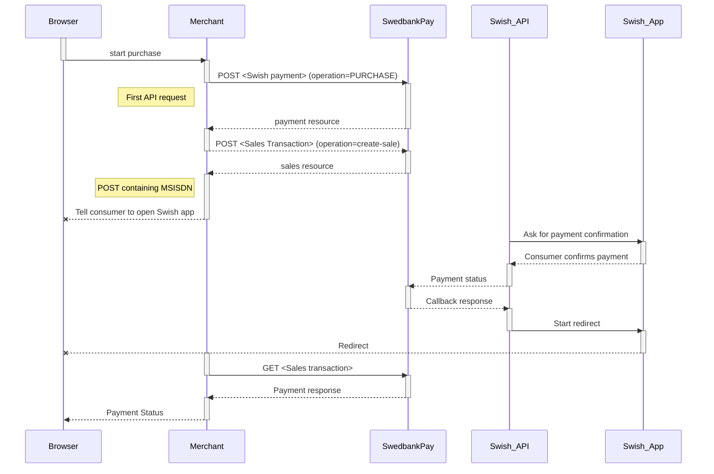
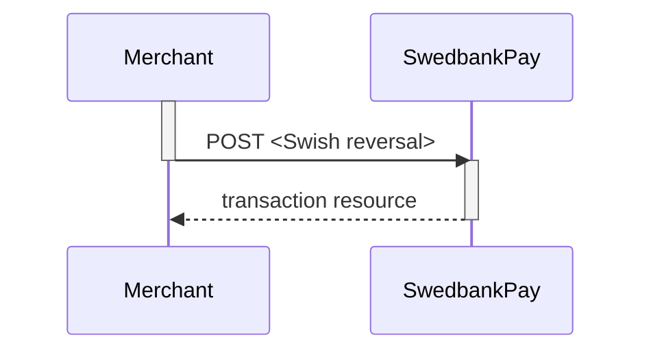
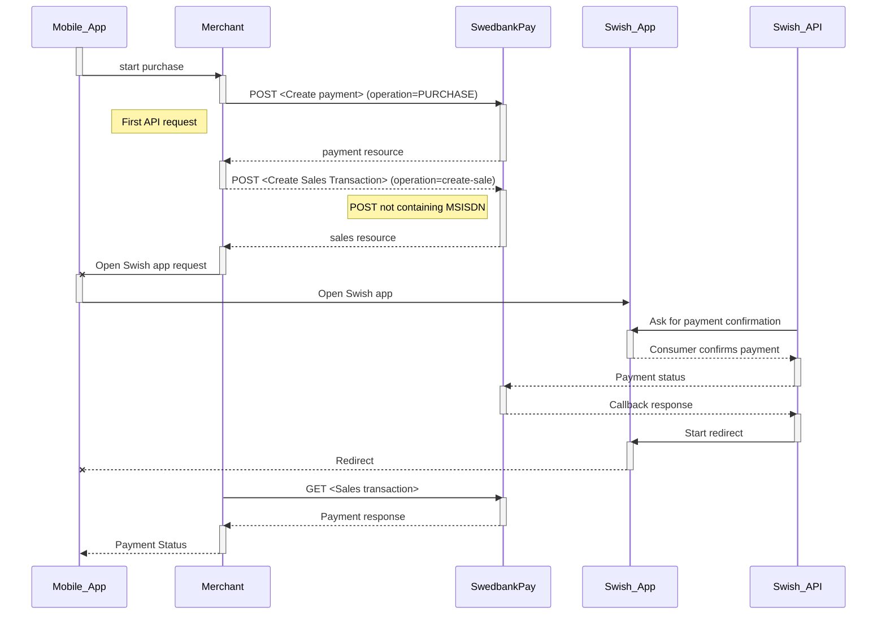



## Swish Payments



## How do you get started with Swish through  Swedbank Pay

We recommend that you apply for Swish as part of [Swedbank Pay Settlement
Service][settlement-service]) and utilize the Swedbank Pay Technical Supplier
Certificate. A [Swedbank Pay sales representative][payex-mailto] can assist you
getting started with that. Otherwise, you can contact one of the following banks
offering Swish Handel: [Danske Bank][danske-bank], [Swedbank][swedbank-swish],
[SEB][SEB-swish], [Länsförsäkringar], [Sparbanken Syd][sparbanken-syd],
[Sparbanken Öresund][sparbanken-oresund], [Nordea][nordea],
[Handelsbanken][handelsbanken], in order to get an acquiring agreement, a
merchant number/payee and access to [Swish Certificate Management
system][swish-certificate-management-system].

## Implementation models and commerce flows

Swedbank Pay supports both e-commerce and m-commerce flows
(as a Merchant you should implement both) - through Swedbank Pay Payments
or Swedbank Pay Direct API integration.

![swish logo][swish-image]{:height="50px" width="50px"}

### Swish m-commerce, Redirect to Payments

_Available in ![swedish flag][se-image]{:height="15px" width="15px"}_

Swish payments from a mobile device made either through an app or via a
mobile browser on the mobile device that hosts the Swish app.
The flow redirects the payment dialogue to Swedbank Pay Payments,
that will handle the required user dialogue.

### Swish e-commerce, Redirect to Payments

_Available in ![swedish flag][se-image]{:height="15px" width="15px"}_

Swish payments initiated by the consumer in a browser in equipment other than
the mobile device that hosts the Swish app.
The flow redirects the payment dialogue to Swedbank Pay Payments,
that will handle the required user dialogue / mobile number input.

### Swish m-commerce, Direct API integration

_Available in ![swedish flag][se-image]{:height="15px" width="15px"}_

Swish payments from a mobile device made either through an app or via a
mobile browser on the same mobile device.

### Swish e-commerce, Direct API integration

_Available in ![swedish flag][se-image]{:height="15px" width="15px"}_

Swish payments initiated by the consumer in a browser in equipment other
than the mobile device that hosts the Swish app.

### Payment Link

_Available in ![swedish flag][se-image]{:height="15px" width="15px"}_

Generate a Payment Link that can be sent to the consumer via e-mail or SMS,
so the consumer may pay at a later moment.
Payment links can be implemented for all payment methods supporting Redirect
to hosted payment page

### Technical Reference

_Available in ![swedish flag][se-image]{:height="15px" width="15px"}_

Technical reference for Swish API resources and their properties.

[If you are missing a scenario, please let us know what you need!]
[support-mailto]

# Swish e-commerce Direct API



## Introduction

* When the payer starts the purchase process, you make a `POST` request towards
  Swedbank Pay with the collected Purchase information.
* After that you need to collect the consumer's Swish registered mobile number
  and make a POST request towards  Swedbank Pay, to create a sales transaction.
* Swedbank Pay will handle the dialogue with Swish and the consumer will have to
  confirm the purchase in the Swish app.
* If CallbackURL is set you will receive a payment callback when the Swish
  dialogue is completed, and you will have to make a `GET` request to check the
  payment status.
* The flow is explained in the sequence diagram below.

## API Requests

The API requests are displayed in the [purchase flow](#purchase-flow).
Swish is a one-phase payment method that is based on sales transactions not
involving capture or cancellation operations.
The options you can choose from when creating a payment with key operation
set to Value Purchase are listed below.

### Options before posting a payment

All valid options when posting in a payment with operation equal to Purchase.

#### General

* **Defining CallbackURL**: When implementing a scenario, it is optional to set
  a [CallbackURL][callback-url] in the `POST` request. If callbackURL is set
  Swedbank Pay will send a postback request to this URL when the consumer has
  fulfilled the payment.

## Purchase flow

The sequence diagram below shows the three requests you have to send to
Swedbank Pay to make a purchase.

**Redirect and Payment Status**  
After the payment is confirmed, the consumer will be redirected from the Swish
app to the completeUrl set in the first API request `POST` [Create
payment][create-payment] and you need to retrieve payment status with `GET`
[Sales transaction][sales-transaction] before presenting a confirmation page to
the consumer.

## Options after posting a payment

* **If CallbackURL is set**: Whenever changes to the payment occur a [Callback
  request][technical-reference-callback] will be posted to the callbackUrl,
  which was generated when the payment was created.
* You can create a reversal transactions by implementing the Reversal request.
  You can also access and reverse a payment through your merchant pages in the
  [Swedbank Pay admin portal][payex-admin-portal].

### Reversal Sequence

A reversal transcation need to match the Payee reference of a
completed sales transaction.

# Swish m-commerce Direct API



## Introduction

* When the consumer/end-user starts the purchase process, you make a `POST`
  request towards Swedbank Pay with the collected Purchase information.
* You need to make a  POST  request towards Swedbank Pay to create a sales
  transaction. The payment flow is identified as m-commerce, as the purchase is
  initiated from the device that hosts the Swish app.
* Swedbank Pay will handle the dialogue with Swish and the consumer will have to
  confirm the purchase in the Swish app.
* If CallbackURL is set you will receive a payment callback when the Swish
  dialogue is completed, and you will have to make a `GET` request to check the
  payment status.
* The flow is explained in the sequence diagram below.

## API Requests

The API requests are displayed in the [purchase flow](#purchase-flow-2). Swish
is a one-phase payment method that is based on sales transactions not involving
capture or cancellation operations. The options you can choose from when
creating a payment with key operation set to Value Purchase are listed below.

### Options before posting a payment

All valid options when posting in a payment with operation equal to Purchase.

#### General

* **Defining CallbackURL**: When implementing a scenario, it is optional to set
  a [CallbackURL][callback-url] in the `POST` request. If callbackURL is set
  Swedbank Pay will send a postback request to this URL when the consumer has
  fulfilled the payment.

## Purchase flow

The sequence diagram below shows the three requests you have to send to Swedbank
Pay to make a purchase. The links will take you directly to the API description
for the specific request.

**Redirect and Payment Status**  
After the payment is confirmed, the consumer will be redirected from the Swish
app to the completeUrl set in the first API request `POST` [Create
payment][create-payment] and you need to retrieve payment status with `GET`
[Sales transaction][sales-transaction] before presenting a confirmation page to
the consumer.

## Options after posting a payment

* **If CallbackURL is set**: Whenever changes to the payment occur a [Callback
  request][technical-reference-callback] will be posted to the callbackUrl,
  which was generated when the payment was created.
* You can create a reversal transactions by implementing the Reversal request.
  You can also access and reverse a payment through your merchant pages in the
  [Swedbank Pay admin portal][payex-admin-portal].

### Reversal Sequence

A reversal transcation need to match the Payee reference of a completed
sales transaction.

[se-image]: /assets/img/se.svg
[swish-image]: /assets/img/swish.svg
[swish-redirect-view]: /assets/screenshots/swish/redirect-view/view/windows-small-window.png
[swish-hosted-view]: /assets/screenshots/swish/hosted-view/windows.png
[callback-url]: /payments/swish/other-fetures#callback
[create-payment]: /payments/swish/
[danske-bank]: https://danskebank.se/sv-se/foretag/medelstora-foretag/onlinetjanster/pages/swish-handel.aspx
[handelsbanken]: https://www.handelsbanken.se/sv/foretag/konton-betalningar/ta-betalt/swish-for-foretag
[hosted-view]: /payments/swish/seamless-view
[Länsförsäkringar]: https://www.lansforsakringar.se/stockholm/foretag/bank/lopande-ekonomi/betalningstjanster/swish-handel/
[MSS]: https://developer.getswish.se/faq/which-test-tools-are-available/
[nordea]: https://www.nordea.se/foretag/produkter/betala/swish-handel.html
[payex-admin-portal]: https://admin.payex.com/psp/login/
[payex-mailto]: mailto:sales@payex.com
[redirect]: /payments/swish/redirect
[reversal-reference]: /payments/swish/after-payment#reversals
[sales-transaction]: /payments/swish/other-features#sales
[SEB-swish]: https://seb.se/foretag/digitala-tjanster/swish-handel
[sparbanken-oresund]: https://www.sparbankenskane.se/foretag/digitala-tjanster/swish/swish-for-handel/index.htm
[sparbanken-syd]: https://www.sparbankensyd.se/vardagstjanster/betala/swish-foretag/
[support-mailto]: mailto:support.ecom@payex.com
[swedbank-swish]: https://www.swedbank.se/foretag/betala-och-ta-betalt/ta-betalt/swish/swish-handel/index.htm
[swish-certificate-management-system]: https://comcert.getswish.net/cert-mgmt-web/authentication.html
[technical-reference-callback]: /payments/swish/other-features#callback
