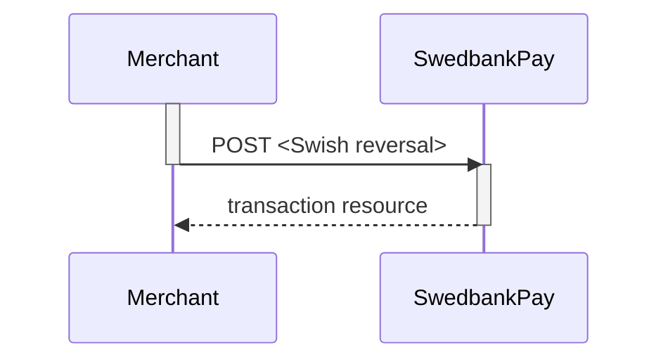



>Swish is an one-phase payment instrument supported by the major Swedish banks.
 In the redirect e-commerce scenario, Swedbank Pay performs a payment that the
 payer confirms using her Swish mobile app.
 The consumer initiates the payment by supplying the Swish registered mobile
 number (MSISDN), connected to the Swish app.

## Introduction

* When the payer starts the purchase process, you make a `POST` request towards
  Swedbank Pay with the collected Purchase information. This will generate a
  payment object with a unique `paymentID`. You either receive a Redirect URL to
  a hosted page or a JavaScript source in response.
* You need to [redirect][redirect] the payer to the Redirect payment page or
  embed the script source on you site to create a [Hosted View][hosted-view] in
  an iFrame; where she is prompted to enter the Swish registered mobile number.
  This triggers the initiation of a sales transaction.
* Swedbank Pay handles the dialogue with Swish and the consumer confirms the
  purchase in the Swish app.
* Swedbank Pay will redirect the payer's browser to - or display directly in the
  iFrame - one of two specified URLs, depending on whether the payment session
  is followed through completely or cancelled beforehand. Please note that both
  a successful and rejected payment reach completion, in contrast to a cancelled
  payment.
* If CallbackURL is set you will receive a payment callback when the Swish
  dialogue is completed. You need to do a `GET` request, containing the
  `paymentID` generated in the first step, to receive the state of the
  transaction.

## Screenshots

The consumer/end-user is redirected to Swedbank Pay hosted pages and prompted
to insert her phone number to initiate the sales transaction.

![Consumer paying with Swish using Swedbank Pay]
[swish-redirect-image]{:width="467px" height="364px"}

## API Requests

The API requests are displayed in the [purchase flow](#purchase-flow).
Swish is a one-phase payment instrument that is based on sales transactions not
involving capture or cancellation operations.
The options you can choose from when creating a payment with key operation set
to Value Purchase are listed below.

### Options before posting a payment

All valid options when posting in a payment with operation equal to Purchase.

#### General

* **Defining CallbackURL**: When implementing a scenario, it is optional to set
  a [CallbackURL][callback-url] in the `POST` request. If callbackURL is set
  Swedbank Pay will send a postback request to this URL when the consumer has
  fulfilled the payment.

## Purchase flow

The sequence diagram below shows the requests you have to send to Swedbank Pay
to make a purchase.
The links will take you directly to the API description for the specific
request.

```mermaid
sequenceDiagram
  activate Browser
  Browser->>-Merchant: start purchase
  activate Merchant
  Merchant->>-SwedbankPay: POST <Swish create payment> (operation=PURCHASE)
  activate SwedbankPay
  note left of Merchant: First API request
  SwedbankPay-->>-Merchant: payment resource
  activate Merchant
  Merchant-->>-Browser: redirect to payments page
  activate Browser
  note left of SwedbankPay: redirect to Swedbank Pay (If Redirect scenario)
  Browser->>-SwedbankPay: enter mobile number
  activate SwedbankPay
  SwedbankPay--x-Browser: Tell consumer to open Swish app
  Swish_API->>Swish_App: Ask for payment confirmation
  activate Swish_App
  Swish_App-->>-Swish_API: Consumer confirms payment
  activate Swish_API
  opt Callback
  Swish_API-->>-SwedbankPay: Payment status
  activate SwedbankPay
  SwedbankPay-->>-Swish_API: Callback response
  activate Swish_API
  SwedbankPay--x-Merchant: Transaction callback
  end
  SwedbankPay-->>Browser: Redirect to merchant (If Redirect scenario)
  activate Browser
  
  Browser-->>-Merchant: Redirect
  activate Merchant
  Merchant->>-SwedbankPay: GET <Swish payment>
  activate SwedbankPay
  SwedbankPay-->>-Merchant: Payment response
  activate Merchant
  Merchant-->>-Browser: Payment Status  
```

## Options after posting a payment

* **If CallbackURL is set**: Whenever changes to the payment occur a [Callback
  request][technical-reference-callback] will be posted to the callbackUrl,
  which was generated when the payment was created.
* You can create a reversal transactions by implementing the Reversal request.
  You can also access and reverse a payment through your merchant pages in the
  [Swedbank Pay admin portal][payex-admin-portal].

### Reversal Sequence

A reversal transcation need to match the Payee reference of a completed
sales transaction.



## Swish m-commerce Redirect

> Swish is an one-phase payment method supported by the major Swedish banks. In
  the redirect m-commerce scenario, Swedbank Pay performs a payment that the
  payer confirms directly through the Swish mobile app.

## Introduction

* When the payer starts the purchase process, through a mobile device that hosts
  the her Swish app, you make a `POST` request towards Swedbank Pay with the
  collected Purchase information. This will generate a payment object with a
  unique paymentID. You either receive a Redirect URL to a hosted page or a
  JavaScript source in response.
* You need to [redirect][redirect] the payer to the Redirect payment page or
  embed the script source on you site to create a [Hosted View][hosted-view] in
  an iFrame. The payment flow is identified as m-commerce, as the purchase is
  initiated from the device that hosts the Swish app.
* Swedbank Pay handles the dialogue with Swish and the consumer confirms the
  purchase in the Swish app directly.
* Swedbank Pay will redirect the payer's browser to - or display directly in the
  iFrame - one of two specified URLs, depending on whether the payment session
  is followed through completely or cancelled beforehand. Please note that both
  a successful and rejected payment reach completion, in contrast to a cancelled
  payment.
* If CallbackURL is set you will receive a payment callback when the Swish
  dialogue is completed. You need to do a `GET` request, containing the
  paymentID generated in the first step, to receive the state of the
  transaction.

## Screenshots

The payer is redirected to Swedbank Pay hosted pages and prompted to
initiate the sales transaction.

![User being promted to initiate a sales transaction]
[swish-hosted-view]{:width="657.625px" height="357.391px"}

## API Requests

The API requests are displayed in the [purchase flow](#purchase-flow-3). Swish
is a one-phase payment method that is based on sales transactions not involving
capture or cancellation operations. The options you can choose from when
creating a payment with key operation set to Value Purchase are listed below.

### Options before posting a payment

All valid options when posting in a payment with operation equal to Purchase.

#### General

* **Defining CallbackURL**: When implementing a scenario, it is optional to set
  a [CallbackURL][callback-url] in the `POST` request. If callbackURL is set
  Swedbank Pay will send a postback request to this URL when the consumer has
  fulfilled the payment.

## Purchase flow

The sequence diagram below shows the requests you have to send to Swedbank Pay
to make a purchase.
The links will take you directly to the API description for the specific
request.

```mermaid
sequenceDiagram
  activate Mobile_App
  Mobile_App->>-Merchant: start purchase
  activate Merchant
  Merchant->>- SwedbankPay: POST <Swish payment> (operation=PURCHASE)
  activate  SwedbankPay
  note left of Merchant: First API request
  SwedbankPay-->>-Merchant: payment resource
  activate Merchant
  Merchant-->>-Mobile_App: redirect to payments page
  activate Mobile_App
  
  note left of Merchant: redirect to Swedbank Pay (If Redirect scenario)
  Mobile_App-->>-SwedbankPay: Identify m-commerce flow
  activate  SwedbankPay
  
  SwedbankPay->>-Mobile_App: Open Swish app request
  activate Mobile_App
  Mobile_App->>-Swish_App: Open Swish app
  activate Swish_App
  Swish_API->>Swish_App: Ask for payment confirmation
  activate Swish_App
  Swish_App-->>-Swish_API: Consumer confirms payment
  activate Swish_API
  
  Swish_API-->>- SwedbankPay: Payment status
  activate  SwedbankPay
  SwedbankPay-->>-Swish_API: Callback response
  activate Swish_API
   SwedbankPay--xMerchant: Transaction callback
  
  SwedbankPay-->>-Mobile_App: Redirect to merchant (If Redirect scenario)
  activate Mobile_App
  
  Mobile_App-->>-Merchant: Redirect
  activate Merchant
  Merchant->>-SwedbankPay: GET <Swish payment>
  activate  SwedbankPay
   SwedbankPay-->>-Merchant: Payment response
  activate Merchant
  Merchant-->>-Mobile_App: Payment Status
```



[swish-redirect-image]: /assets/screenshots/swish/redirect-view/view/windows-small-window.png
[callback-url]: /payments/swish/other-fetures#callback
[hosted-view]: /payments/swish/seamless-view
[payex-admin-portal]: https://admin.payex.com/psp/login/
[redirect]: /payments/swish/redirect
[technical-reference-callback]: /payments/swish/other-fetures#callback
