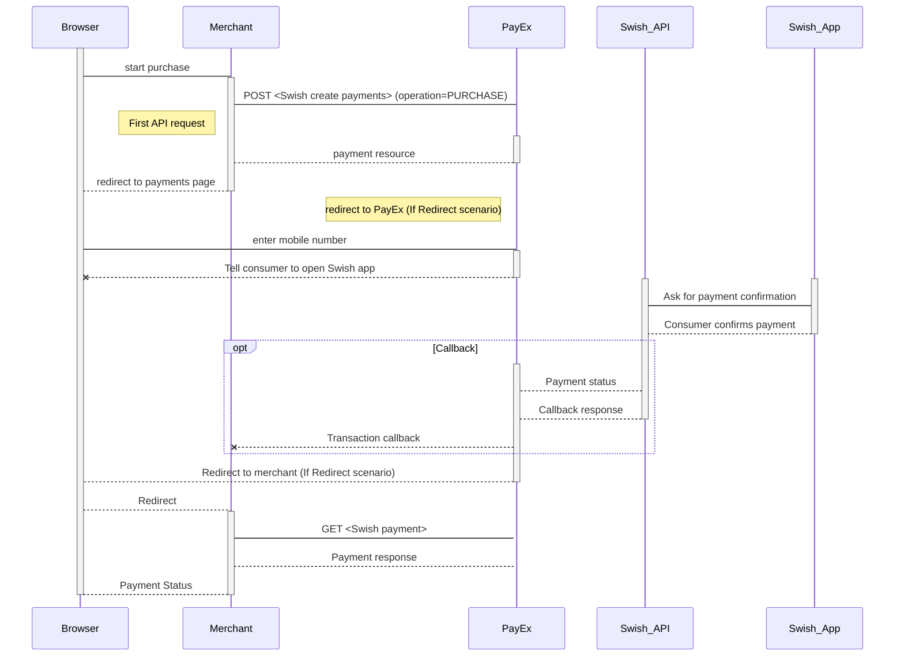
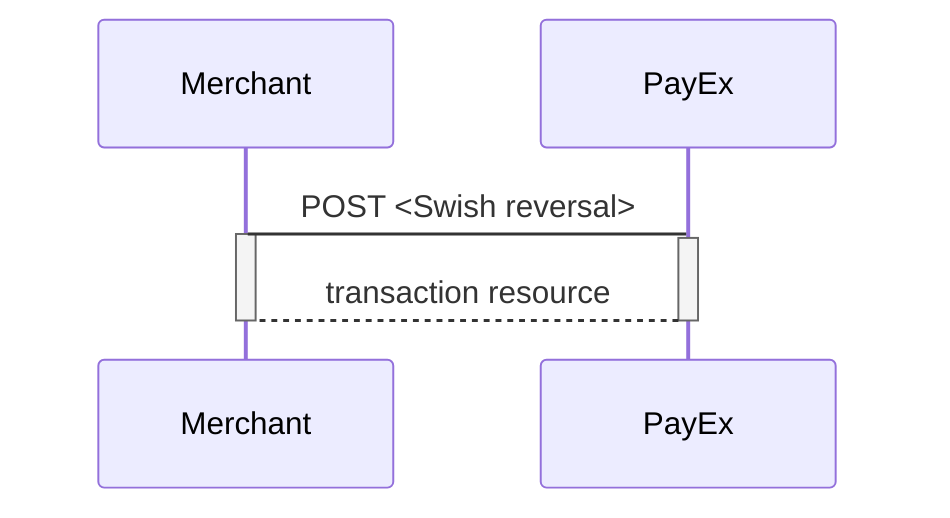



>Swish is an one-phase payment method supported by the major Swedish banks. In the redirect e-commerce scenario, PayEx performs a payment that the payer confirms using her Swish mobile app. The consumer initiates the payment by supplying the Swish registered mobile number (MSISDN), connected to the Swish app.

## Introduction

*   When the payer starts the purchase process, you make a `POST` request towards PayEx with the collected Purchase information. This will generate a payment object with a unique paymentID. You either receive a Redirect URL to a hosted page or a JavaScript source in response.
*   You need to [redirect][redirect] the payer to the Redirect payment page or embed the script source on you site to create a [Hosted View][hosted-view] in an iFrame;  where she is prompted to enter the Swish registered mobile number. This triggers the initiation of a sales transaction.
*   PayEx handles the dialogue with Swish and the consumer confirms the purchase in the Swish app.
*   PayEx will redirect the payer's browser to - or display directly in the iFrame - one of two specified URLs, depending on whether the payment session is followed through completely or cancelled beforehand. Please note that both a successful and rejected payment reach completion, in contrast to a cancelled payment.
*   If CallbackURL is set you will receive a payment callback when the Swish dialogue is completed. You need to do a `GET` request, containing the paymentID generated in the first step, to receive the state of the transaction.

## Screenshots

The consumer/end-user is redirected to PayEx hosted pages and prompted to insert her phone number to initiate the sales transaction.

![Consumer paying with Swish using PayEx][1551695199059-994.png]

## API Requests

The API requests are displayed in the [purchase flow](#purchase-flow).  Swish is a one-phase payment method that is based on sales transactions not involving capture or cancellation operations.  The options you can choose from when creating a payment with key operation set to Value Purchase are listed below. The general REST based API model is described in the [technical reference][technical-reference].

### Options before posting a payment

All valid options when posting in a payment with operation equal to Purchase, are described in [the technical reference][swish-payments].

#### General

*   **Defining CallbackURL**: When implementing a scenario, it is optional to set a [CallbackURL][callback-url] in the `POST` request. If callbackURL is set PayEx will send a postback request to this URL when the consumer has fulfilled the payment. [See the Callback API description here][technical-reference-callback].

## Purchase flow

The sequence diagram below shows the requests you have to send to PayEx to make a purchase. The links will take you directly to the API description for the specific request. 

## Options after posting a payment

*   **If CallbackURL is set: **Whenever changes to the payment occur a [Callback request][technical-reference-callback] will be posted to the callbackUrl, which was generated when the payment was created.
*   You can create a reversal transactions by implementing the Reversal request. You can also access and reverse a payment through your merchant pages in the [PayEx admin portal][payex-admin-portal].

### Reversal Sequence

A reversal transcation need to match the Payee reference of a completed sales transaction.

[1551695199059-994.png]: /assets/img/1551695199059-994.png
{:width="467px" height="364px"}
[callback-url]: #
[hosted-view]: #
[payex-admin-portal]: #
[redirect]: #
[swish-payments]: #
[technical-reference-callback]: #
[technical-reference]: #
