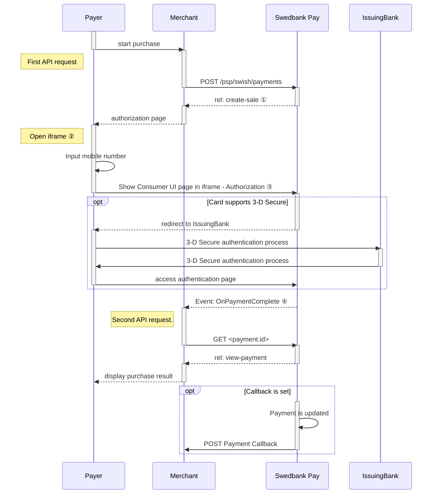
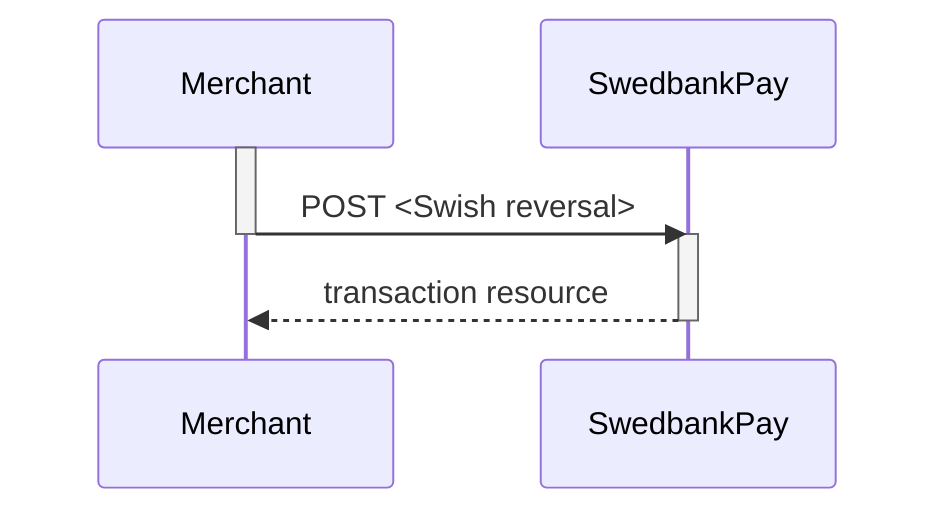





## Introduction

The Seamless View integration provide you with the Swish payment solution directly on your website. This gives the consumer a frictionless experience as we are handling the payment in the implemented `iframe` on your page (see example below).

* When the payer starts the purchase process, you make a `POST` request towards
  Swedbank Pay with the collected Purchase information.
* After that you need to collect the consumer's Swish registered mobile number
  and make a POST request towards Swedbank Pay, to create a sales transaction.
* Swedbank Pay will handle the dialogue with Swish and the consumer will have to
  confirm the purchase in the Swish app.
* If CallbackURL is set you will receive a payment callback when the Swish
  dialogue is completed, and you will have to make a `GET` request to check the
  payment status.
* The flow is explained in the sequence diagram below.

![screenshot of the seamless view swish payment page][seamless-view-img]{:height="250px" width="660px"}

## Purchase flow

### Explainations

* ① `rel: create-sale` is a value in one of the operations, sent as a
  response from Swedbank Pay to the Merchant.
* ② `Open iframe` creates the Swedbank Pay hosted iframe.
* ③ `Show Consumer UI page in iframe` displays the payment window as content
  inside of the iframe. The consumer can insert card information for
  authorization.
* ④ `Event: OnPaymentComplete` is when er payment is complete. Please note that
  both a successful and rejected payment reach completion, in contrast to a
  cancelled payment.

### 3-D Secure

Swedbank Pay will handle 3-D Secure authentication when this is required. When
dealing with card payments, 3-D Secure authentication of the cardholder
is an essential topic. There are two alternative outcome of a card payment:

1. 3-D Secure enabled - by default, 3-D Secure should be enabled, and Swedbank
   Pay will check if the card is enrolled with 3-D Secure. This depends on the
   issuer of the card. If the card is not enrolled with 3-D Secure, no
   authentication of the cardholder is done.
2. Card supports 3-D Secure - if the card is enrolled with 3-D Secure, Swedbank
   Pay will redirect the cardholder to the autentication mechanism that is
   decided by the issuing bank. Normally this will be done using BankID or
   Mobile BankID.

### Payment Url



## Seamless View Back End

When properly set up in your merchant/webshop site and the payer starts the
purchase process, you need to make a POST request towards Swedbank Pay with your
Sales information. This will generate a payment object with a unique
`paymentID`. You will receive a **JavaScript source** in response.

### Intent



## API Requests

The API requests are displayed in the [purchase flow](#purchase-flow). Swish is
a one-phase payment instrument that is based on sales transactions not involving
capture or cancellation operations. The options you can choose from when
creating a payment with key operation set to Value Purchase are listed below.

### Options before posting a payment

All valid options when posting in a payment with operation equal to Purchase,
are described in [Other Features][swish-payments].

#### General

* **Defining CallbackURL**: When implementing a scenario, it is optional to set
  a [CallbackURL][callback-url] in the `POST` request. If callbackURL is set
  Swedbank Pay will send a postback request to this URL when the consumer has
  fulfilled the payment.

**Redirect and Payment Status**
After the payment is confirmed, the consumer will be redirected from the Swish
app to the completeUrl set in the first API request `POST` [Create
payment][create-payment] and you need to retrieve payment status with `GET`
[Sales transaction][sales-transaction] before presenting a confirmation page to
the consumer.

## Options after posting a payment

* **If CallbackURL is set**: Whenever changes to the payment occur a [Callback
  request][technical-reference-callback] will be posted to the callbackUrl,
  which was generated when the payment was created.
* You can create a reversal transactions by implementing the Reversal request.
  You can also access and reverse a payment through your merchant pages in the
  [Swedbank Pay admin portal][payex-admin-portal].

### Reversal Sequence

A reversal transcation need to match the Payee reference of a completed
sales transaction.

[create-payment]: /payments/swish/after-payment#create-payment
[payex-admin-portal]: https://admin.payex.com/psp/login/
[sales-transaction]: /payments/swish/after-payment#sales
[swish-payments]: /payments/swish/after-payment#payment-resource
[technical-reference-callback]: /payments/swish/other-features#callback
[callback-url]: /payments/swish/other-features#callback
[seamless-view-img]: /assets/img/checkout/swish-seamless-view.png
