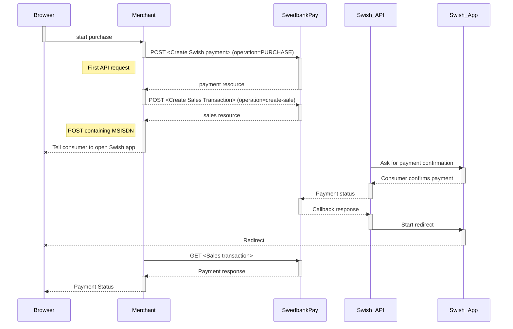
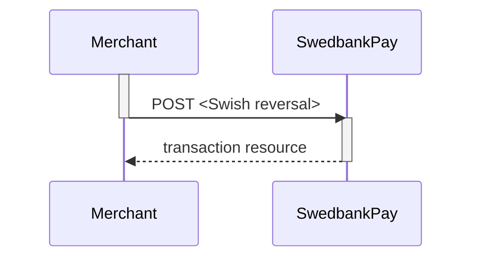



> Swish is a one-phase payment method supported by the major Swedish banks. In
  the direct e-commerce scenario, Swedbank Pay receives the Swish registered
  mobile number directly from the merchant UI. Swedbank Pay performs a payment
  that the payer confirms using her Swish mobile app.

## Introduction

* When the payer starts the purchase process, you make a `POST` request towards
  Swedbank Pay with the collected Purchase information.
* After that you need to collect the consumer's Swish registered mobile number
  and make a POST request towards Swedbank Pay, to create a sales transaction.
* Swedbank Pay will handle the dialogue with Swish and the consumer will have to
  confirm the purchase in the Swish app.
* If CallbackURL is set you will receive a payment callback when the Swish
  dialogue is completed, and you will have to make a `GET` request to check the
  payment status.
* The flow is explained in the sequence diagram below.

## API Requests

The API requests are displayed in the [purchase flow](#purchase-flow). Swish is
a one-phase payment method that is based on sales transactions not involving
capture or cancellation operations. The options you can choose from when
creating a payment with key operation set to Value Purchase are listed below.

### Options before posting a payment

All valid options when posting in a payment with operation equal to Purchase,
are described in [the technical reference][swish-payments].

#### General

* **Defining CallbackURL**: When implementing a scenario, it is optional to set
  a [CallbackURL][callback-url] in the `POST` request. If callbackURL is set
  Swedbank Pay will send a postback request to this URL when the consumer has
  fulfilled the payment.

## Purchase flow

The sequence diagram below shows the three requests you have to send to Swedbank
Pay to make a purchase. The links will take you directly to the API description
for the specific request.

**Redirect and Payment Status**
After the payment is confirmed, the consumer will be redirected from the Swish
app to the completeUrl set in the first API request `POST` [Create
payment][create-payment] and you need to retrieve payment status with `GET`
[Sales transaction][sales-transaction] before presenting a confirmation page to
the consumer.

## Options after posting a payment

* **If CallbackURL is set**: Whenever changes to the payment occur a [Callback
  request][technical-reference-callback] will be posted to the callbackUrl,
  which was generated when the payment was created.
* You can create a reversal transactions by implementing the Reversal request.
  You can also access and reverse a payment through your merchant pages in the
  [Swedbank Pay admin portal][payex-admin-portal].

### Reversal Sequence

A reversal transcation need to match the Payee reference of a completed
sales transaction.

[create-payment]: /payments/swish/after-payment#create-payment
[payex-admin-portal]: https://admin.payex.com/psp/login/
[sales-transaction]: /payments/swish/after-payment#sales
[swish-payments]: /payments/swish/after-payment#payment-resource
[technical-reference-callback]: /payments/swish/other-features#callback
[callback-url]: /payments/swish/other-features#callback
