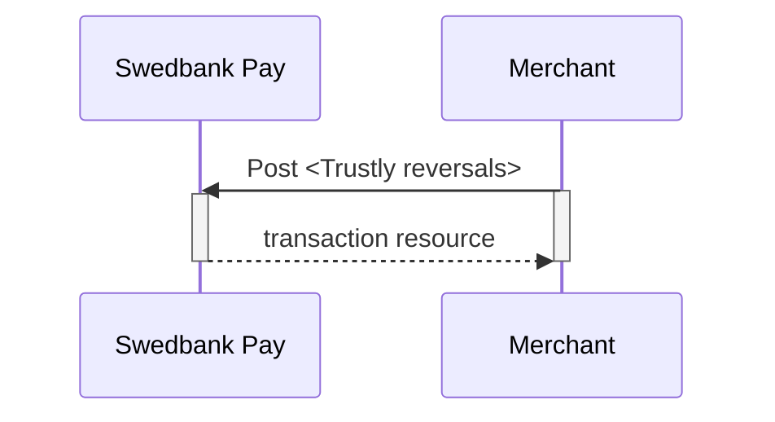

## Options after posting a payment

When you detect that the payer has reached your `completeUrl`, you need to do a
`GET` request on the payment resource, which contains the `id` of the `payment`
generated in the first step, to receive the state of the transaction. You will
also be able to see the available `operations` after posting a payment.

*   **Abort:** It is possible to abort the process if the payment has no
    successful transactions. [See the `abort`
    description][abort-description].
*   For reversals, you will need to implement the `reversal` request.
*   **If CallbackURL is set:** Whenever changes to the payment occur a
    [Callback request][callback-request] will be posted to the `callbackUrl`,
    which was set when the payment was created.



## Reversals

### Create reversal transaction

The `create-reversal` operation will reverse a payment and
refund the amount to the consumer. To reverse a payment, perform the
`create-reversal` operation. The HTTP body of the request should look as
follows:

{:.code-header}
**Request**

```http
POST /psp/trustly/payments/{{ page.payment_id }}/reversals HTTP/1.1
Host: {{ page.api_host }}
Authorization: Bearer <AccessToken>
Content-Type: application/json

{
    "transaction": {
        "activity": "Sale",
        "amount": 1500,
        "vatAmount": 0,
        "payeeReference": "ABC856",
        "receiptReference": "ABC855",
        "description": "description for transaction"
    }
}
```

{:.table .table-striped}
|     Required     | Field                      | Type         | Description                                                                                                                                                                                                                                                                |
| :--------------: | :------------------------- | :----------- | :------------------------------------------------------------------------------------------------------------------------------------------------------------------------------------------------------------------------------------------------------------------------- |
| ︎ | `transaction`              | `object`     | The transaction object containing details about the reversal transaction.                                                                                                                                                                                                  |
| ︎ | └➔&nbsp;`activity`         | `string`     | `FinancingConsumer`.                                                                                                                                                                                                                                                       |
| ︎ | └➔&nbsp;`amount`           | `integer`    |                                                                                                                                                                                                                                   |
| ︎ | └➔&nbsp;`vatAmount`        | `integer`    |                                                                                                                                                                                                                                |
| ︎ | └➔&nbsp;`payeeReference`   | `string(50)` | The `payeeReference` is the receipt/invoice number if `receiptReference` is not defined, which is a **unique** reference with max 50 characters set by the merchant system. This must be unique for each operation and must follow the regex pattern `[\w]* (a-zA-Z0-9_)`. |
|                  | └➔&nbsp;`receiptReference` | `string(50)` | The `receiptReference` is a reference from the merchant system. This reference is used as an invoice/receipt number.                                                                                                                                                       |
| ︎ | └➔&nbsp;`description`      | `string`     | A textual description of the reversal.                                                                                                                                                                                                                                     |

The `reversal` resource will be returned, containing information about the newly created reversal transaction.



### Inspecting the Reversal

The `reversals` resource will list the reversal transactions
(one or more) on a specific payment. The URI will be found on a `payment` that has a
succesful `sale` operation.

{:.code-header}
***Request***

```http
GET /psp/trustly/payments/{{ page.payment_id }}/reversals HTTP/1.1
Host: {{ page.api_host }}
Authorization: Bearer <AccessToken>
Content-Type: application/json
```



### Reversal Sequence

`Reversal` can only be done on completed Sales transactions.



## Cancellations

The `cancellations` resource lists the cancellation transactions on a
specific payment.

{:.code-header}
**Request**

```http
GET /psp/trustly/payments/{{ page.payment_id }}/cancellations HTTP/1.1
Host: {{ page.api_host }}
Authorization: Bearer <AccessToken>
Content-Type: application/json
```



## Create cancellation transaction

A payment may be cancelled if the operation `create-cancellation` is available.

{:.code-header}
**Request**

```http
POST /psp/trustly/payments/{{ page.payment_id }}/cancellations HTTP/1.1
Host: {{ page.api_host }}
Authorization: Bearer <AccessToken>
Content-Type: application/json

{
    "transaction": {
        "payeeReference": "testabc",
        "description" : "description for transaction"
    }
}
```





----------------------------------------------------------
[abort-description]: #abort
[callback-request]: /payments/trustly/other-features#callback
[trustly-cancellations]: /payments/trustly/after-payment#cancellations
[trustly-reversals]: /payments/trustly/after-payment##reversals
[other-features-transaction]: /payments/trustly/other-features#transactions
