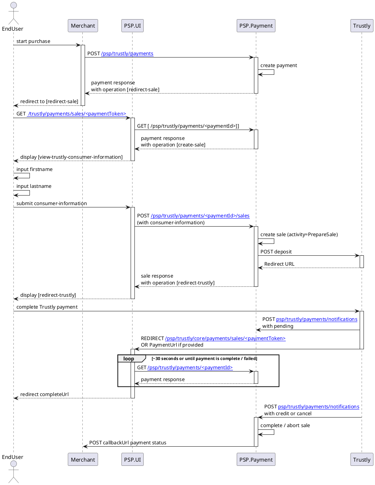







### Important steps before you launch Swedbank Pay Invoice Payments at your website

Prior to launching Trustly Payments at your site, make sure that
you have done the following:

1. Make sure that the payment option is displayed with a Trustly logo.

## API Requests

The API requests are displayed in the sales flow below.

## Languages

The displayed languages that we currently support is English (`en-us`), Norwegian (`nb-no`), Swedish (`sv-se`), and Finish (`fi-fi`).

## Trustly flow

This is an example of the Redirect scenario. For other integrations, take a
look at the respective sections. The sequence diagram below shows the two
requests you have to send to Swedbank Pay to make a purchase. The diagram also
shows the steps in a [sale][sale] process.

The Trustly integration uses the Deposit call by performing a payment. After
SwedbankPay perform a `Deposit` call https://trustly.com/en/developer/api#/deposit, the end-user will be presented with the returned IFrame URL in order to perform
the payment with their prefered bank. Once the user has completed the payment,
SwedbankPay will receive a notification asynchronously from Trustly, hence why
the UI will initiate polling toward our back-end. The payment status after being
redirect to `completeUrl` will then indicate if the payment was successful or
not, or if the payment is still in progress.



[after-payment]: /payments/trustly/after-payment
[callback-api]: /payments/trustly/other-features#callback
[financing-consumer]: /payments/trustly/other-features#financing-consumer
[no-png]: /assets/img/flag-norway.png
[optional-features]: /payments/trustly/optional-features
[recur]: /payments/trustly/other-features#recur
[redirect]: /payments/trustly/redirect
[purchase]: /payments/trustly/other-features#create-payment
[se-png]: /assets/img/flag-sweden.png
[setup-mail-finland]: mailto:verkkokauppa.setup@swedbankpay.fi
[setup-mail-norway]: mailto:ehandelsetup@swedbankpay.no
[setup-mail-sweden]: mailto:ehandelsetup@swedbankpay.se
[verify]: /payments/trustly/other-features#verify
