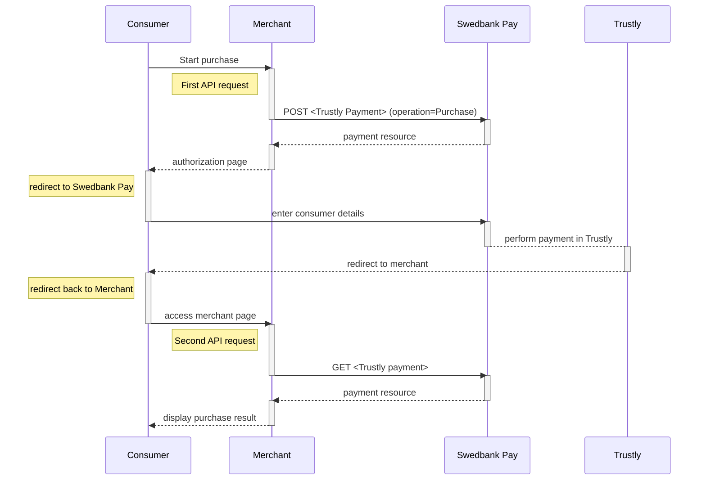

## Introduction

* When properly set up in your merchant/webshop site and the payer starts the
  purchase process, you need to make a `POST` request towards Swedbank Pay with
  your Purchase information. This will generate a payment object with a unique
  `paymentID`. You will receive a **redirect URL** to a Swedbank Pay payment
  page (`redirect-sale` operation).
* You need to redirect the payer's browser to that specified URL so that the
  payer can enter the payment details in a secure Swedbank Pay environment.
* Swedbank Pay will redirect the payer's browser to - one of two specified URLs,
  depending on whether the payment session is followed through completely or
  cancelled beforehand. Please note that both a successful and rejected payment
  reach completion, in contrast to a cancelled payment.
* When you detect that the payer reach your `completeUrl` , you need to do a
  `GET` request to receive the state of the transaction, containing the
  `paymentID` generated in the first step, to receive the state of the
  transaction.

## Step 1: Create a payment

* An Trustly payment is always one-phased based - you create an
  `Authorize` transaction, that is followed by a `Capture` or `Cancel` request.



To initiate the payment process, you need to make a `POST` request to Swedbank Pay.

{:.code-header}
**Request**

```http
POST /psp/trustly/payments HTTP/1.1
Authorization: Bearer <AccessToken>
Content-Type: application/json

{
    "payment": {
        "operation": "Purchase",
        "intent": "Sale",
        "currency": "SEK",
        "prices": [
            {
                "type": "Trustly",
                "amount": 1500,
                "vatAmount": 0
            }
        ],
        "description": "Test Purchase",
        "payerReference": "SomeReference",
        "userAgent": "Mozilla/5.0...",
        "language": "sv-SE",
        "urls": {
            "completeUrl": "https://example.com/payment-completed",
            "cancelUrl": "https://example.com/payment-canceled",
            "callbackUrl": "https://example.com/payment-callback",
            "logoUrl": "https://example.com/logo.png",
            "termsOfServiceUrl": "https://example.com/terms.pdf"
        },
        "payeeInfo": {
            "payeeId": "{{ page.merchant_id }}",
            "payeeReference": "PR123",
            "payeeName": "Merchant1",
            "productCategory": "PC1234",
            "subsite": "MySubsite"
        },
        "prefillInfo": {
            "firstName": "Ola",
            "lastName": "Nordmann"
        }
    }
}
```

{:.table .table-striped}
|     Required     | Field                             | Type          | Description                                                                                                                                                                                                                                                                                                           |
| :--------------: | :-------------------------------- | :------------ | :-------------------------------------------------------------------------------------------------------------------------------------------------------------------------------------------------------------------------------------------------------------------------------------------------------------------- |
|  | `payment`                         | `object`      | The `payment` object contains information about the specific payment.                                                                                                                                                                                                                                                 |
|  | └➔&nbsp;`operation`               | `string`      | The operation that the `payment` is supposed to perform. For Trustly, this will always be `Purchase` as it is currently the only available operation. |
|  | └➔&nbsp;`intent`                  | `string`      | `Sale` is the only intent option for Trustly. Performs the payment when the end-user gets redirected and completes the payment, and is followed by a [cancellation][cancel] or [reversal][reversal] of funds.                                                                                                                                                               |
|  | └➔&nbsp;`currency`                | `string`      | NOK, SEK, DKK, USD or EUR.                                                                                                                                                                                                                                                                                            |
|  | └➔&nbsp;`prices`                  | `object`      | The `prices` resource lists the prices related to a specific payment.                                                                                                                                                                                                                                                 |
|  | └─➔&nbsp;`type`                   | `string`      | Use the `Trustly` type here                                                                                                                                                                                                                                                                                           |
|  | └─➔&nbsp;`amount`                 | `integer`     |                                                                                                                                                                                                                                                                              |
|  | └─➔&nbsp;`vatAmount`              | `integer`     |                                                                                                                                                                                                                                                                           |
|  | └➔&nbsp;`description`             | `string(40)`  |                                                                                                                                                                                                                                            |
|                  | └➔&nbsp;`payerReference`          | `string`      | The reference to the payer (consumer/end user) from the merchant system. E.g mobile number, customer number etc.                                                                                                                                                                                                      |
|  | └➔&nbsp;`userAgent`               | `string`      | The user agent reference of the consumer's browser - [see user agent definition][user-agent-definition]                                                                                                                                                                                                               |
|  | └➔&nbsp;`language`                | `string`      |                                                                                                                                                                                                                                                                                           |
|  | └➔&nbsp;`urls`                    | `object`      | The `urls` resource lists urls that redirects users to relevant sites.                                                                                                                                                                                                                                                |
|                  | └─➔&nbsp;`hostUrl`                | `array`       | The array of URLs valid for embedding of Swedbank Pay Hosted Views. If not supplied, view-operation will not be available.                                                                                                                                                                                            |
|  | └─➔&nbsp;`completeUrl`            | `string`      | The URL that Swedbank Pay will redirect back to when the payer has completed his or her interactions with the payment. This does not indicate a successful payment, only that it has reached a final (complete) state. A `GET` request needs to be performed on the payment to inspect it further.                    |
|                  | └─➔&nbsp;`cancelUrl`              | `string`      | The URI to redirect the payer to if the payment is canceled. Only used in redirect scenarios. Can not be used simultaneously with `paymentUrl`; only `cancelUrl` or `paymentUrl` can be used, not both.                                                                                                               |
|                  | └─➔&nbsp;`callbackUrl`            | `string`      | The URL that Swedbank Pay will perform an HTTP `POST` against every time a transaction is created on the payment. See [callback][callback] for details.                                                                                                                                                               |
|                  | └─➔&nbsp;`logoUrl`                | `string`      | The URL that will be used for showing the customer logo. Must be a picture with maximum 50px height and 400px width. Require https.                                                                                                                                                                                   |
|                  | └─➔&nbsp;`termsOfServiceUrl`      | `string`      |                                                                                                                                                                                                                                                                   |
|  | └➔&nbsp;`payeeInfo`               | `object`      | The `payeeInfo` contains information about the payee.                                                                                                                                                                                                                                                                 |
|  | └─➔&nbsp;`payeeId`                | `string`      | This is the unique id that identifies this payee (like merchant) set by Swedbank Pay.                                                                                                                                                                                                                                 |
|  | └─➔&nbsp;`payeeReference`         | `string(30*)` | A unique reference from the merchant system, which is used as a receipt/invoice number in Trustly Payments. It is set per operation to ensure an exactly-once delivery of a transactional operation. See [`payeeReference`][payee-reference] for details.                                                             |
|                  | └─➔&nbsp;`payeeName`              | `string`      | The payee name (like merchant name) that will be displayed to consumer when redirected to Swedbank Pay.                                                                                                                                                                                                               |
|                  | └─➔&nbsp;`productCategory`        | `string`      | A product category or number sent in from the payee/merchant. This is not validated by Swedbank Pay, but will be passed through the payment process and may be used in the settlement process.                                                                                                                        |
|                  | └─➔&nbsp;`orderReference`         | `String(50)`  | The order reference should reflect the order reference found in the merchant's systems.                                                                                                                                                                                                                               |
|                  | └─➔&nbsp;`subsite`                | `String(40)`  | The subsite field can be used to perform split settlement on the payment. The subsites must be resolved with Swedbank Pay reconciliation before being used.                                                                                                                                                           |
|                  | └─➔&nbsp;`prefillInfo`            | `object`      | Object representing information of what the UI text fields should be populated with                                                                                                                                                                                                                                   |
|                  | └─➔&nbsp;`firstName`              | `string`      | Prefilled value to put in the first name text box.                                                                                                                                                                                                                                                                    |
|                  | └─➔&nbsp;`lastName`               | `string`      | Prefilled value to put in the last name text box.                                                                                                                                                                                                                                                                     |

{:.code-header}
**Response**

```http
HTTP/1.1 200 OK
Content-Type: application/json

{
    "payment": {
        "id": "/psp/trustly/payments/{{ page.payment_id }}",
        "number": 99590008046,
        "created": "2020-05-26T12:31:19.3106483Z",
        "updated": "2020-05-26T12:31:19.4513673Z",
        "instrument": "Trustly",
        "operation": "Purchase",
        "intent": "Sale",
        "state": "Ready",
        "currency": "SEK",
        "prices": {
            "id": "/psp/trustly/payments/{{ page.payment_id }}/prices"
        },
        "amount": 0,
        "description": "Test Purchase",
        "payerReference": "SomeReference",
        "initiatingSystemUserAgent": "PostmanRuntime/7.25.0",
        "userAgent": "Mozilla/5.0...",
        "language": "sv-SE",
        "urls": {
            "id": "/psp/trustly/payments/{{ page.payment_id }}/urls"
        },
        "payeeInfo": {
            "id": "/psp/trustly/payments/{{ page.payment_id }}/payeeinfo"
        },
        "metadata": {
            "id": "/psp/trustly/payments/{{ page.payment_id }}/metadata"
        }
    },
    "operations": [
        {
            "method": "PATCH",
            "href": "{{ page.api_url }}/psp/trustly/payments/{{ page.payment_id }}",
            "rel": "update-payment-abort"
        },
        {
            "method": "POST",
            "href": "{{ page.api_url }}/psp/trustly/payments/{{ page.payment_id }}/sales",
            "rel": "create-sale"
        },
        {
            "method": "GET",
            "href": "https://ecom.externalintegration.payex.com/trustly/payments/sales/8f3ba6c8f4e3f6125ae6c18bec15c612747cf2c35dc5cac35d4bebc10cf7317e",
            "rel": "redirect-sale"
        }
    ]
}
```

## Trustly flow

The sequence diagram below shows the two requests you have to send to Swedbank
Pay to make a purchase.
The diagram also shows the process of a complete purchase in high level.



## Options after posting a payment

Head over to [after payment][after-payment]
to see what you can do when a payment is completed.
Here you will also find info on `Cancel`, and `Reversal`.



[abort]: /payments/trustly/after-payment#abort
[after-payment]: /payments/trustly/after-payment
[callback]: /payments/trustly/other-features#callback
[cancel]: /payments/trustly/after-payment#cancellations
[reversal]: /payments/trustly/reversals
[fi-png]: /assets/img/flag-finland.png
[financing-consumer]: /payments/trustly/other-features#financing-consumer
[no-png]: /assets/img/flag-norway.png
[payee-reference]: /payments/trustly/other-features#payeeinfo
[recur]: /payments/trustly/other-features#recur
[se-png]: /assets/img/flag-sweden.png
[user-agent-definition]: https://en.wikipedia.org/wiki/User_agent
[verify]: /payments/trustly/other-features#verify
