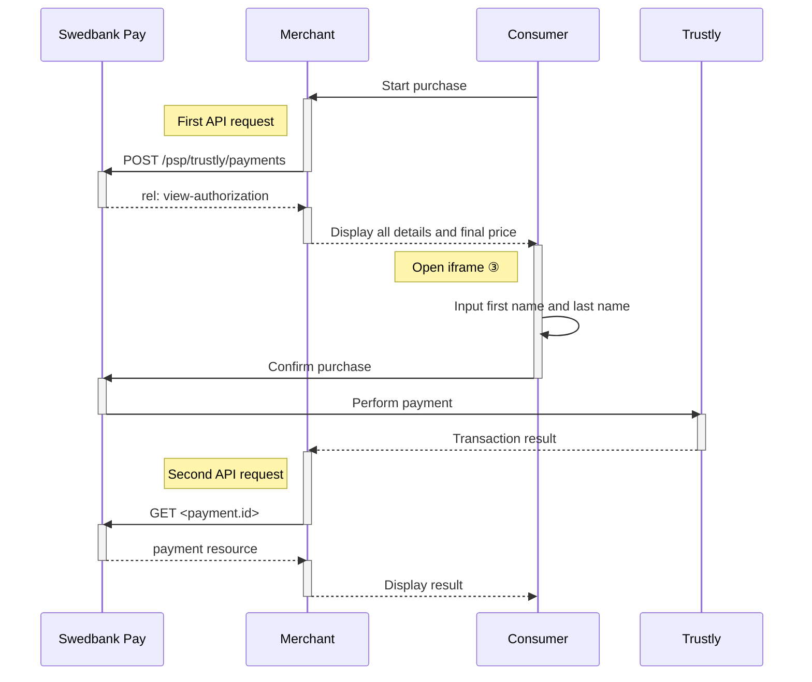



## Introduction

Seamless View provides an integration of the payment process directly on your
website. This solution offers a smooth shopping experience with Swedbank Pay
Payments seamlessly integrated in an `iframe` on your website. The payer
does not need to leave your webpage, since we are handling the payment in the
`iframe` on your website.

![screenshot of the Trustly payment window][trustly-payment-embedded-view]{:height="425px" width="700px"}



## Step 1: Create the payment

A Trustly payment is a straightforward way to perform a direct-bank payment. It can be followed up by posting a cancellation or reversal
transaction.

An example of an abbreviated `POST` request is provided below.
Each individual field of the JSON document is described in the following section.
An example of an expanded `POST` request is available in [Payment resource]
[payment-resource].

When properly set up in your merchant/webshop site and the payer starts the
payment process, you need to make a `POST` request towards Swedbank Pay with your
payment information. This will generate a `payment` resource with a unique
`id` URI. You will receive a **JavaScript source** in response.

{:.code-header}
**Request**

```http
POST /psp/trustly/payments HTTP/1.1
Authorization: Bearer <AccessToken>
Content-Type: application/json

{
    "payment": {
        "operation": "Purchase",
        "intent": "Sale",
        "currency": "SEK",
        "prices": [
            {
                "type": "Trustly",
                "amount": 1500,
                "vatAmount": 0
            }
        ],
        "description": "Test Purchase",
        "payerReference": "SomeReference",
        "userAgent": "Mozilla/5.0...",
        "language": "sv-SE",
        "urls": {
            "completeUrl": "https://example.com/payment-completed",
            "cancelUrl": "https://example.com/payment-canceled",
            "callbackUrl": "https://example.com/payment-callback",
            "logoUrl": "https://example.com/logo.png",
            "termsOfServiceUrl": "https://example.com/terms.pdf"
        },
        "payeeInfo": {
            "payeeId": "{{ page.merchant_id }}",
            "payeeReference": "PR123",
            "payeeName": "Merchant1",
            "productCategory": "PC1234",
            "subsite": "MySubsite"
        },
        "prefillInfo": {
            "firstName": "Ola",
            "lastName": "Nordmann"
        }
    }
}
```

{:.table .table-striped}
|     Required     | Field                        | Type          | Description                                                                                                                                                                                                                                                                                        |
| :--------------: | :--------------------------- | :------------ | :------------------------------------------------------------------------------------------------------------------------------------------------------------------------------------------------------------------------------------------------------------------------------------------------- |
|  | `payment`                    | `object`      | The `payment` object contains information about the specific payment.                                                                                                                                                                                                                              |
|  | └➔&nbsp;`operation`          | `string`      | The operation that the `payment` is supposed to perform. For Trustly, this will always be `Purchase` as it is currently the only available operation.                                                                                                                                              |
|  | └➔&nbsp;`intent`             | `string`      | `Sale` is the only intent option for Trustly. Performs the payment when the end-user gets redirected and completes the payment.                                                                                                                                                                    |
|  | └➔&nbsp;`currency`                | `string`      | `SEK`, `EUR`. The currency of the provided `amount`.                                                                                                                                                                                                                                                                                            |
|  | └➔&nbsp;`prices`             | `object`      | The `prices` resource lists the prices related to a specific payment.                                                                                                                                                                                                                              |
|  | └─➔&nbsp;`type`              | `string`      | Use the `Trustly` type here                                                                                                                                                                                                                                                                        |
|  | └─➔&nbsp;`amount`            | `integer`     |                                                                                                                                                                                                                                                           |
|  | └─➔&nbsp;`vatAmount`         | `integer`     |                                                                                                                                                                                                                                                        |
|  | └➔&nbsp;`description`        | `string(40)`  |                                                                                                                                                                                                                      |
|                  | └➔&nbsp;`payerReference`     | `string`      | The reference to the payer (consumer/end user) from the merchant system. E.g mobile number, customer number etc.                                                                                                                                                                                   |
|  | └➔&nbsp;`userAgent`          | `string`      | The user agent reference of the consumer's browser - [see user agent definition][user-agent-definition]                                                                                                                                                                                            |
|  | └➔&nbsp;`language`           | `string`      |                                                                                                                                                                                                                                  |
|  | └➔&nbsp;`urls`               | `object`      | The `urls` resource lists urls that redirects users to relevant sites.                                                                                                                                                                                                                             |
|                  | └─➔&nbsp;`hostUrl`           | `array`       | The array of URLs valid for embedding of Swedbank Pay Seamless View. If not supplied, view-operation will not be available.                                                                                                                                                                        |
|  | └─➔&nbsp;`completeUrl`       | `string`      | The URL that Swedbank Pay will redirect back to when the payer has completed his or her interactions with the payment. This does not indicate a successful payment, only that it has reached a final (complete) state. A `GET` request needs to be performed on the payment to inspect it further. |
|                  | └─➔&nbsp;`cancelUrl`         | `string`      | The URI to redirect the payer to if the payment is canceled. Only used in redirect scenarios. Can not be used simultaneously with `paymentUrl`; only `cancelUrl` or `paymentUrl` can be used, not both.                                                                                            |
|                  | └─➔&nbsp;`callbackUrl`       | `string`      | The URL that Swedbank Pay will perform an HTTP `POST` against every time a transaction is created on the payment. See [callback][callback] for details.                                                                                                                                            |
|                  | └─➔&nbsp;`logoUrl`           | `string`      | The URL that will be used for showing the customer logo. Must be a picture with maximum 50px height and 400px width. Require https.                                                                                                                                                                |
|                  | └─➔&nbsp;`termsOfServiceUrl` | `string`      |                                                                                                                                                                                                                                                |
|  | └➔&nbsp;`payeeInfo`          | `object`      | The `payeeInfo` contains information about the payee.                                                                                                                                                                                                                                              |
|  | └─➔&nbsp;`payeeId`           | `string`      | This is the unique id that identifies this payee (like merchant) set by Swedbank Pay.                                                                                                                                                                                                              |
|  | └─➔&nbsp;`payeeReference`    | `string(30*)` | A unique reference from the merchant system, which is used as a receipt/invoice number in Trustly Payments. It is set per operation to ensure an exactly-once delivery of a transactional operation. See [`payeeReference`][payee-reference] for details.                                          |
|                  | └─➔&nbsp;`payeeName`         | `string`      | The payee name (like merchant name) that will be displayed to consumer when redirected to Swedbank Pay.                                                                                                                                                                                            |
|                  | └─➔&nbsp;`productCategory`   | `string`      | A product category or number sent in from the payee/merchant. This is not validated by Swedbank Pay, but will be passed through the payment process and may be used in the settlement process.                                                                                                     |
|                  | └─➔&nbsp;`orderReference`    | `String(50)`  | The order reference should reflect the order reference found in the merchant's systems.                                                                                                                                                                                                            |
|                  | └─➔&nbsp;`subsite`           | `String(40)`  | The subsite field can be used to perform split settlement on the payment. The subsites must be resolved with Swedbank Pay reconciliation before being used.                                                                                                                                        |
|                  | └─➔&nbsp;`prefillInfo`       | `object`      | Object representing information of what the UI text fields should be populated with                                                                                                                                                                                                                |
|                  | └─➔&nbsp;`firstName`         | `string`      | Prefilled value to put in the first name text box.                                                                                                                                                                                                                                                 |
|                  | └─➔&nbsp;`lastName`          | `string`      | Prefilled value to put in the last name text box.                                                                                                                                                                                                                                                  |

{:.code-header}
**Response**

```http
HTTP/1.1 200 OK
Content-Type: application/json

{
    "payment": {
        "id": "/psp/trustly/payments/{{ page.payment_id }}",
        "number": 99590008046,
        "created": "2020-05-26T12:31:19.3106483Z",
        "updated": "2020-05-26T12:31:19.4513673Z",
        "instrument": "Trustly",
        "operation": "Purchase",
        "intent": "Sale",
        "state": "Ready",
        "currency": "SEK",
        "prices": {
            "id": "/psp/trustly/payments/{{ page.payment_id }}/prices"
        },
        "amount": 0,
        "description": "Test Purchase",
        "payerReference": "SomeReference",
        "initiatingSystemUserAgent": "PostmanRuntime/7.25.0",
        "userAgent": "Mozilla/5.0...",
        "language": "sv-SE",
        "urls": {
            "id": "/psp/trustly/payments/{{ page.payment_id }}/urls"
        },
        "payeeInfo": {
            "id": "/psp/trustly/payments/{{ page.payment_id }}/payeeinfo"
        },
        "metadata": {
            "id": "/psp/trustly/payments/{{ page.payment_id }}/metadata"
        }
    },
    "operations": [
        {
            "method": "PATCH",
            "href": "{{ page.api_url }}/psp/trustly/payments/{{ page.payment_id }}",
            "rel": "update-payment-abort"
        },
        {
            "method": "POST",
            "href": "{{ page.api_url }}/psp/trustly/payments/{{ page.payment_id }}/sales",
            "rel": "create-sale"
        },
        {
            "method": "GET",
            "href": "https://ecom.externalintegration.payex.com/trustly/payments/sales/8f3ba6c8f4e3f6125ae6c18bec15c612747cf2c35dc5cac35d4bebc10cf7317e",
            "rel": "redirect-sale"
        },
        {
            "method": "GET",
            "href": "https://ecom.externalintegration.payex.com/trustly/core/scripts/client/px.trustly.client.js?token=8f3ba6c8f4e3f6125ae6c18bec15c612747cf2c35dc5cac35d4bebc10cf7317e&operation=sale",
            "rel": "view-sales",
            "contentType": "application/javascript"
        }
    ]
}
```

The key information in the response is the `view-sales` operation. You
will need to embed its `href` in a `<script>` element. The script will enable
loading the payment page in an `iframe` in our next step.

## Step 2: Display the Payment

You need to embed the script source on your site to create a Seamless View in an
`iframe`; so that the payer can enter the payment details in a secure Swedbank Pay
hosted environment. A simplified integration has these following steps:

1.  Create a container that will contain the Seamless View iframe: `<div
    id="swedbank-pay-seamless-view-page">`.
2.  Create a `<script>` source within the container. Embed the `href` value
    obtained in the `POST` request in the `<script>` element. Example:

```html
    <script id="payment-page-script" src="https://ecom.externalintegration.payex.com/trustly/core/ scripts/client/px.trustly.client.js"></script>
```

The previous two steps gives this HTML:

{:.code-header}
**HTML**

```html
<!DOCTYPE html>
<html>
    <head>
        <title>Swedbank Pay Seamless View is Awesome!</title>
        <!-- Here you can specify your own javascript file -->
        <script src=<YourJavaScriptFileHere>></script>
    </head>
    <body>
        <div id="swedbank-pay-seamless-view-page">
          <script id="payment-page-script" src="https://ecom.externalintegration.payex.com/trustly/core/scripts/client/px.trustly.client.js"></script>
        </div>
    </body>
</html>
```

Lastly, initiate the Seamless View with a JavaScript call to open the `iframe`
embedded on your website.

{:.code-header}
**JavaScript**

```js
<script language="javascript">
    payex.hostedView.trustly({
        // The container specifies which id the script will look for to host the
        // iframe component.
        container: "swedbank-pay-seamless-view-page"
    }).open();
</script>
```

## Purchase Flow

The sequence diagram below shows a high level description of the
Trustly payment process.





[after-payment]: /payments/trustly/after-payment
[authorize]: /payments/trustly/other-features#authorizations
[callback]: /payments/trustly/other-features#callback
[cancel]: /payments/trustly/after-payment#cancellations
[create-payment]: /payments/trustly/other-features#create-payment
[financing-consumer]: /payments/trustly/other-features#financing-consumer
[trustly-payment-embedded-view]: /assets/screenshots/trustly/consumer-information-input.png
[payee-reference]: /payments/trustly/other-features#payee-reference
[payment-resource]: /payments/trustly/other-features#payment-resource
[price-resource]: /payments/trustly/other-features#prices
[recur]: /payments/trustly/other-features#recur
[setup-mail]: mailto:setup.ecom@PayEx.com
[user-agent-definition]: https://en.wikipedia.org/wiki/User_agent
[verify]: /payments/trustly/other-features#verify
