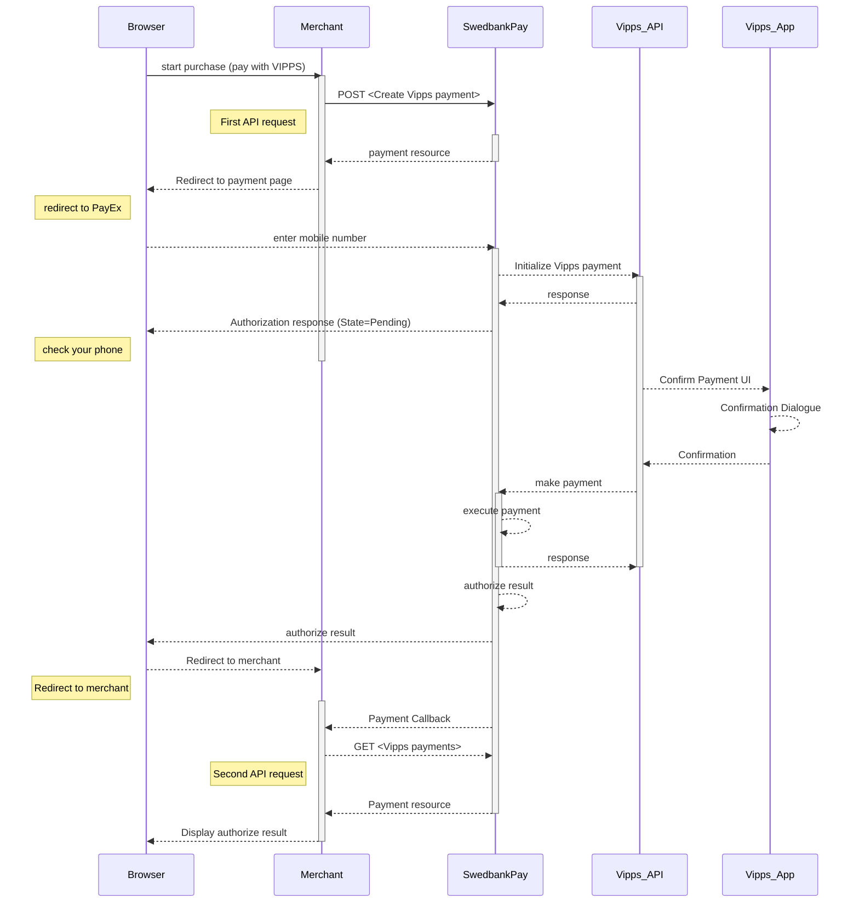





## Introduction

* When the payer starts the purchase process, you make a `POST` request towards
  Swedbank Pay with the collected `Purchase` information.
  This will generate a payment object with a unique `paymentID`.
  You either receive a Redirect URL to a hosted page or a JavaScript source
  in response.
* You need to [redirect][reference-redirect] the payer to the Redirect payment
  where the user is prompted to enter the registered mobile number.
  This triggers a request towards Swedbank Pay.
* Swedbank Pay handles the dialogue with Vipps and the consumer confirms the
  purchase in the Vipps app.
* If CallbackURL is set, the user will receive a payment callback when the Vipps
  dialogue is completed.
* Lastly, the user needs to do a `GET` request, containing the `paymentID`
* generated in the first step, to receive the state of the transaction.

You redirect the payer to Swedbank Pay hosted payment page to collect the
consumers mobile number.

![Vipps mobile Payments]
[Vipps-screenshot-1]{:width="426px" :height="632px"}
![Vipps Payments][Vipps-screenshot-2]{:width="427px" :height="694px"}

## Operations

The API requests are displayed in the [purchase flow](#purchase-flow).
You can create a Vipps payment with the `operation` value set to `purchase`. See
the `purchase` example below.

### Intent

**`Authorization` (two-phase)**: The intent of the payment identifies how and
when the charge will be effectuated. This determines the type of transaction
used during the payment process. The intent of a Vipps purchase is always
`Authorization`. The amount will be reserved but not charged.
You will later (i.e. if a physical product, when you are ready to ship the
purchased products) have to make a [Capture][capture] or
[Cancel][cancel] request.



## Purchase flow

The sequence diagram below shows the two requests you have to send to
Swedbank Pay to make a purchase.
The links will take you directly to the API description for the specific
request.



{:.code-header}
**Request**

```http
POST /psp/vipps/payments HTTP/1.1
Authorization: Bearer <AccessToken>
Content-Type: application/json

{
    "payment": {
        "operation": "Purchase",
        "intent": "Authorization",
        "currency": "NOK",
        "prices": [
            {
                "type": "Vipps",
                "amount": 1500,
                "vatAmount": 0
            }
        ],
        "description": "Test Purchase",
        "payerReference": "AB1234",
        "userAgent": "Mozilla/5.0...",
        "pageStripdown": true,
        "language": "nb-NO",
        "urls": {
            "hostUrls": "https://example.net",
            "completeUrl": "https://example.net/payment-completed",
            "cancelUrl": "https://example.net/payment-canceled",
            "callbackUrl": "https://example.net/payment-callback",
            "logoUrl": "https://example.net/payment-logo.png",
            "termsOfServiceUrl": "https://example.net/payment-terms.pdf",
            "paymentUrl": "https://example.net/payment-cart"
        },
        "payeeInfo": {
            "payeeId": "12345678-1234-1234-1234-123456789012",
            "payeeReference": "CD1234",
            "payeeName": "Merchant1",
            "productCategory": "A123"
        },
        "prefillInfo": {
            "msisdn": "+4792345678"
        }
    }
}
```

{:.code-header}
**Response**

```http
HTTP/1.1 200 OK
Content-Type: application/json

{
    "payment": {
        "id": "/psp/vipps/payments/5adc265f-f87f-4313-577e-08d3dca1a26c",
        "number": 1234567890,
        "created": "2016-09-14T13:21:29.3182115Z",
        "updated": "2016-09-14T13:21:57.6627579Z",
        "instrument": "Vipps",
        "operation": "Purchase",
        "intent": "Authorization",
        "state": "Ready",
        "currency": "NOK",
        "amount": 1500,
        "remainingCaptureAmount": 1500,
        "remainingCancellationAmount": 1500,
        "remainingReversalAmount": 0,
        "description": "Test Purchase",
        "payerReference": "AB1234",
        "initiatingSystemUserAgent": "PostmanRuntime/3.0.1",
        "userAgent": "Mozilla/5.0...",
        "language": "nb-NO",
        "prices": {
            "id": "/psp/vipps/payments/5adc265f-f87f-4313-577e-08d3dca1a26c/prices"
        },
        "transactions": {
            "id": "/psp/vipps/payments/5adc265f-f87f-4313-577e-08d3dca1a26c/transactions"
        },
        "authorizations": {
            "id": "/psp/vipps/payments/5adc265f-f87f-4313-577e-08d3dca1a26c/authorizations"
        },
        "reversals": {
            "id": "/psp/vipps/payments/5adc265f-f87f-4313-577e-08d3dca1a26c/reversals"
        },
        "cancellations": {
            "id": "/psp/vipps/payments/5adc265f-f87f-4313-577e-08d3dca1a26c/cancellations"
        },
        "urls": {
            "id": "/psp/vipps/payments/5adc265f-f87f-4313-577e-08d3dca1a26c/urls"
        },
        "payeeInfo": {
            "id": "/psp/vipps/payments/5adc265f-f87f-4313-577e-08d3dca1a26c/payeeInfo"
        },
        "settings": {
            "id": "/psp/vipps/payments/5adc265f-f87f-4313-577e-08d3dca1a26c/settings"
        }
    },
    "operations": [
        {
            "method": "POST",
            "href": "http://localhost:15486/psp/vipps/payments/c50eef6d-a788-4ec6-64ff-08d4b16740a4/authorizations",
            "rel": "create-authorization"
        },
        {
            "method": "PATCH",
            "href": "http://localhost:15486/psp/vipps/payments/c50eef6d-a788-4ec6-64ff-08d4b16740a4",
            "rel": "update-payment-abort"
        },
        {
            "method": "GET",
            "href": "http://localhost:15487/vipps/payments/authorize/8fb05a835f2fc227dc7bca9abaf649b919ba8a572deb448bff543dd5806dacb7",
            "rel": "redirect-authorization"
        }
    ]
}
```

{:.table .table-striped}
| Required | Property                              | Type          | Description                                                                                                                                                                                                                                                                                                                                                                                                                                                                                                                                                               |
| :------: | :------------------------------------ | :------------ | :------------------------------------------------------------------------------------------------------------------------------------------------------------------------------------------------------------------------------------------------------------------------------------------------------------------------------------------------------------------------------------------------------------------------------------------------------------------------------------------------------------------------------------------------------------------------ |
|  ✔︎︎︎︎︎  | `payment`                             | `object`      | The `payment` object contains information about the specific payment.                                                                                                                                                                                                                                                                                                                                                                                                                                                                                                     |
|  ✔︎︎︎︎︎  | └➔&nbsp;`operation`                           | `string`      | The operation that the `payment` is supposed to perform. The [`purchase`][purchase] operation is used in our example.                                                                                                                                                                                                                                             |
|  ✔︎︎︎︎︎  | └➔&nbsp;`intent`                              | `string`      |  `Authorization`. Reserves the amount, and is followed by a [cancellation][cancel] or [capture][capture] of funds.<br> <br>                                                                                                                                                          |
|  ✔︎︎︎︎︎  | └➔&nbsp;`currency`                            | `string`      | NOK                                                                                                                                                                                                                                                                                                                                                                                                                                                                                                                                               |
|  ✔︎︎︎︎︎  | └➔&nbsp;`prices`                      | `object`      | The `prices` resource lists the prices related to a specific payment.                                                                                                                                                                                                                                                                                                                                                                                                                                                                                                     |
|  ✔︎︎︎︎︎  | └─➔&nbsp;`type`                       | `string`      |                                                                     |
|  ✔︎︎︎︎︎  | └─➔&nbsp;`amount`                     | `integer`     | Amount is entered in the lowest momentary units of the selected currency. E.g. 10000 = 100.00 NOK 5000 = 50.00 NOK.                                                                                                                                                                                                                                                                                                                                                                                                                                                       |
|  ✔︎︎︎︎︎  | └─➔&nbsp;`vatAmount`                  | `integer`     | If the amount given includes VAT, this may be displayed for the user in the payment page (redirect only). Set to 0 (zero) if this is not relevant.                                                                                                                                                                                                                                                                                                                                                                                                                        |
|  ✔︎︎︎︎︎  | └➔&nbsp;`description`                 | `string(40)`  | A textual description max 40 characters of the purchase.                                                                                                                                                                                                                                                                                                                                                                                                                                                                                                                  |
|          | └➔&nbsp;`payerReference`              | `string`      | The reference to the payer (consumer/end user) from the merchant system. E.g mobile number, customer number etc.                                                                                                                                                                                                                                                                                                                                                                                                                                                                                                                                          |
|  ✔︎︎︎︎︎  | └➔&nbsp;`userAgent`                   | `string`      | The user agent reference of the consumer's browser - [see user agent definition][user-agent-definition]                                                                                                                                                                                                                                                                                                                                                                                                                                                                   |
|  ✔︎︎︎︎︎  | └➔&nbsp;`language`                    | `string`      | `nb-NO`                                                                                                                                                                                                                                                                                                                                                                                                                                                                                                                                        |
|  ✔︎︎︎︎︎  | └➔&nbsp;`urls`                        | `object`      | The `urls` resource lists urls that redirects users to relevant sites.                                                                                                                                                                                                                                                                                                                                                                                                                                                                                                    |
|  ✔︎︎︎︎︎  | └─➔&nbsp;`completeUrl`                | `string`      | The URL that Swedbank Pay will redirect back to when the payment page is completed.                                                                                                                                                                                                                                                                                                                                                                                                                                                                                       |
|          | └─➔&nbsp;`cancelUrl`                  | `string`      | The URI to redirect the payer to if the payment is canceled. Only used in redirect scenarios. Can not be used simultaneously with `paymentUrl`; only cancelUrl or `paymentUrl` can be used, not both.                                                                                                                                                                                                                                                                                                                                                                     |
|          | └─➔&nbsp;`callbackUrl`                | `string`      | The URL that Swedbank Pay will perform an HTTP POST against every time a transaction is created on the payment. See [callback][callback] for details.                                                                                                                                                                                                                                                                                                                                                                                                                     |
|  ✔︎︎︎︎︎  | └➔&nbsp;`payeeInfo`                    | `object`      | The `payeeInfo` contains information about the payee.                                                                                                                                                                                                                                                                                                                                                                                                                                                                                                                     |
|  ✔︎︎︎︎︎  | └─➔&nbsp;`payeeId`                    | `string`      | This is the unique id that identifies this payee (like merchant) set by Swedbank Pay.                                                                                                                                                                                                                                                                                                                                                                                                                                                                                     |
|  ✔︎︎︎︎︎  | └─➔&nbsp;`payeeReference`             | `string(50*)` | A unique reference from the merchant system. It is set per operation to ensure an exactly-once delivery of a transactional operation. See [payeeReference][payee-reference] for details.                                                                                                                                                                                                                                                                                                                                                                                  |
|          | └─➔&nbsp;`payeeName`                  | `string`      | The payee name (like merchant name) that will be displayed to consumer when redirected to Swedbank Pay.                                                                                                                                                                                                                                                                                                                                                                                                                                                                   |
|          | └─➔&nbsp;`productCategory`            | `string`      | A product category or number sent in from the payee/merchant. This is not validated by Swedbank Pay, but will be passed through the payment process and may be used in the settlement process.                                                                                                                                                                                                                                                                                                                                                                            |
|          | └─➔&nbsp;`orderReference`             | `String(50)`  | The order reference should reflect the order reference found in the merchant's systems.                                                                                                                                                                                                                                                                                                                                                                                                                                                                                   |
|          | └─➔&nbsp;`subsite`                    | `String(40)`  | The subsite field can be used to perform split settlement on the payment. The subsites must be resolved with Swedbank Pay reconciliation before being used.                                                                                                                                                                                                                                                                                                                                                                                                               |

## Authorizations

The `authorizations` resource contains information about the authorization
transactions made on a specific payment.

{:.code-header}
**Request**

```http

HTTP/1.1 200 OK
Content-Type: application/json
GET /psp/vipps/payments/84b9e6aa-b8f5-4e7f-fa2f-08d612f7dd5d/authorizations/<transactionId> HTTP/1.1
Host: api.payex.com
Authorization: Bearer <MerchantToken>


```

{:.code-header}
**Response**

```http

HTTP/1.1 200 OK
Content-Type: application/json

{
    "payment": "/psp/vipps/payments/{{ page.paymentId }}",
    "authorization": {
        "vippsTransactionId": "5619328800",
        "msisdn": "+4793000001",
        "id": "/psp/vipps/payments/84b9e6aa-b8f5-4e7f-fa2f-08d612f7dd5d/authorizations/3bfb8c66-33be-4871-465b-08d612f01a53",
        "transaction": {
            "id": "/psp/vipps/payments/84b9e6aa-b8f5-4e7f-fa2f-08d612f7dd5d/transactions/3bfb8c66-33be-4871-465b-08d612f01a53",
            "created": "2018-09-05T15:01:39.8658084Z",
            "updated": "2018-09-05T15:01:42.2119509Z",
            "type": "Authorization",
            "state": "Completed",
            "number": 72100003090,
            "amount": 1500,
            "vatAmount": 0,
            "description": "Vipps Test",
            "payeeReference": "Postman1536157124",
            "isOperational": false,
            "operations": []
        }
    }
}
```

{:.table .table-striped}
| Property                              | Type          | Description                                                                                                                                                                                                                                                                                                                                                                                                                                                                                                                                                               |
| :------: | :------------------------------------ | :------------ | :------------------------------------------------------------------------------------------------------------------------------------------------------------------------------------------------------------------------------------------------------------------------------------------------------------------------------------------------------------------------------------------------------------------------------------------------------------------------------------------------------------------------------------------------------------------------ |
|  ✔︎︎︎︎︎  | `payment`                             | `string`      | The relative URI of the payment this authorization transactions resource belongs to.                                                                                                                                                                                                                                                                                                                                                                                                                                                                                                     |
|  ✔︎︎︎︎︎  | └➔&nbsp;`authorizations.id`                           | `string`      | The relative URI of the current authorization transactions resource.                                                                                                                                                                                                                                             |
|  ✔︎︎︎︎︎  | └➔&nbsp;`authorizations.authorizationList`                              | `array`      |  The array of authorization transaction objects.                                                                                                                                                          |
|  ✔︎︎︎︎︎  | └➔&nbsp;`authorizations.authorizationList[]`                            | `object`      | The `authorization` transaction object described in the authorization resource below.
  |

### Options before posting a payment

All valid options when posting a payment with operation equal to Purchase,
are described in [the technical reference][vipps-payments].



[Vipps_flow_PaymentPages.png]: /assets/img/vipps-flow-paymentpages.png
[Vipps-screenshot-1]: /assets/img/checkout/vipps-hosted-payment.png
[Vipps-screenshot-2]: /assets/img/checkout/vipps-hosted-payment-no-paymenturl.png
[callbackurl]: /payments/vipps/other-features#callback
[cancel]: /payments/vipps/other-features#cancel-sequence
[capture]: /payments/vipps/other-features#capture-sequence
[seamless-view]: /payments/vipps/seamless-view
[reference-redirect]: /payments/vipps/redirect
[vipps-payments]: /payments/vipps/other-features
