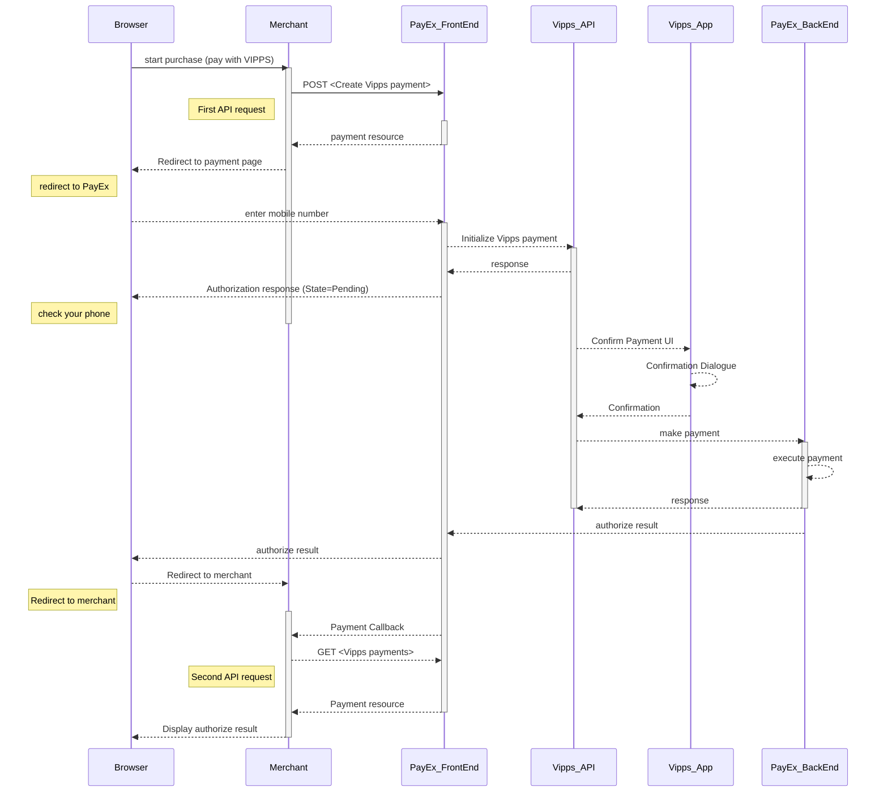



>Vipps is a two-phase payment instrument supported by the major norwegian banks.
 In the redirect to Swedbank Pay Payments scenario,  Swedbank Pay
 receives a mobile number (MSISDN) from the payer through Payex Payments.
 Swedbank Pay performs a payment that the payer must confirm through the
 Vipps mobile app.

## Introduction

* When the payer starts the purchase process, you make a `POST` request towards
  Swedbank Pay with the collected `Purchase` information.
  This will generate a payment object with a unique `paymentID`.
  You either receive a Redirect URL to a hosted page or a JavaScript source
  in response.
* You need to [redirect][reference-redirect] the payer to the Redirect payment
  page or embed the script source on you site to create a
  [Hosted View][hosted-view] in an `iFrame`; where she is prompted to enter the
  registered mobile number.
  This triggers a `POST` towards PayEx.
* Swedbank Pay handles the dialogue with Vipps and the consumer confirms the
  purchase in the Vipps app.
* If CallbackURL is set you will receive a payment callback when the Vipps
  dialogue is completed.
  You need to do a `GET` request, containing the `paymentID` generated in the
  first step, to receive the state of the transaction.

![Vipps_flow_PaymentPages.png]

### Payment Url



## Screenshots

You redirect the payer to Swedbank Pay hosted payment page to collect the
consumers mobile number.

![Vipps mobile Payments]
[Vipps-screenshot-1]{:width="426px" :height="632px"}
![Vipps Payments][Vipps-screenshot-2]{:width="427px" :height="694px"}

### API Requests

The API requests are displayed in the [purchase flow](#purchase-flow).
The options you can choose from when creating a payment with key `operation`
set to Value `Purchase` are listed below.

### Options before posting a payment

All valid options when posting a payment with operation equal to Purchase,
are described in [the technical reference][vipps-payments].

#### Type of authorization (Intent)

**Authorization (two-phase)**: The intent of a Vipps purchase is always
`Authorization`.
The amount will be reserved but not charged.
You will later (i.e. if a physical product, when you are ready to ship the
purchased products) have to make a [Capture][captures] or
[Cancel][cancellations] request.

#### General

**Defining CallbackURL**: When implementing a scenario, it is optional to set
a [`CallbackURL`][callbackurl] in the `POST` request.
If callbackURL is set Swedbank Pay will send a postback request to this URL
when the consumer has fulfilled the payment.

## Purchase flow

The sequence diagram below shows the two requests you have to send to
Swedbank Pay to make a purchase.
The links will take you directly to the API description for the specific
request.



[Vipps_flow_PaymentPages.png]: /assets/img/vipps-flow-paymentpages.png
[Vipps-screenshot-1]: /assets/img/checkout/vipps-hosted-payment.png
[Vipps-screenshot-2]: /assets/img/checkout/vipps-hosted-payment-no-paymenturl.png
[callbackurl]: /payments/vipps/other-features#callback
[cancellations]: /payments/vipps/other-features#cancel-sequence
[captures]: /payments/vipps/other-features#capture-sequence
[hosted-view]: /payments/vipps/seamless-view
[reference-redirect]: /payments/vipps/redirect
[vipps-payments]: /payments/vipps/other-features
