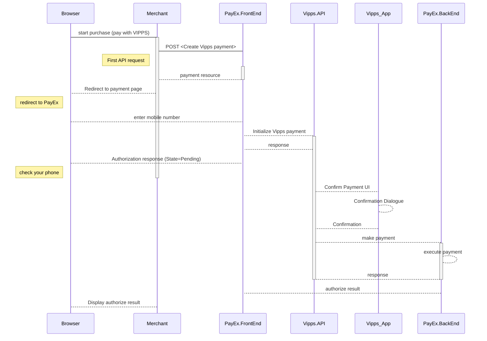

>Vipps is a two-phase payment method supported by the major norwegian banks. In the redirect to PayEx payment pages scenario,  PayEx receives a mobile number (MSISDN) from the payer through Payex payment pages. PayEx performs a payment that the payer must confirm through the Vipps mobile app.

## Introduction

* When the payer starts the purchase process, you make a `POST` request towards PayEx with the collected `Purchase` information. This will generate a payment object with a unique `paymentID`. You either receive a Redirect URL to a hosted page or a JavaScript source in response.
* You need to [redirect][reference-redirect] the payer to the Redirect payment page or embed the script source on you site to create a [Hosted View][hosted-view] in an `iFrame`; where she is prompted to enter the registered mobile number. This triggers a `POST` towards PayEx.
* PayEx handles the dialogue with Vipps and the consumer confirms the purchase in the Vipps app.
* If CallbackURL is set you will receive a payment callback when the Vipps dialogue is completed. You need to do a `GET` request, containing the `paymentID` generated in the first step, to receive the state of the transaction.

![Vipps_flow_PaymentPages.png]

### Payment Url

For our hosted view, the URL property called `paymentUrl` will be used when the consumer is redirected out of the hosted view frame through our [Vipps API][vipps-payments]. The consumer is redirected out of frame when selecting Vipps as payment method. The URL should represent the page of where the payment hosted view was hosted originally, such as the checkout page, shopping cart page, or similar. Basically, `paymentUrl` should be set to the same URL as that of the page where the JavaScript for the hosted payment view was added to in order to initiate the payment. Please note that the `paymentUrl` must be able to invoke the same JavaScript URL from the same Payment as the one that initiated the payment originally, so it should include some sort of state identifier in the URL. The state identifier is the ID of the order, shopping cart or similar that has the URL of the Payment stored.

With paymentUrl in place, the retry process becomes much more convenient for both the integration and the payer.

## Screenshots 

You redirect the payer to PayEx hosted payment pages to collect the consumers mobile number.

![Vipps mobile payment pages][Screenshot_20190304-113739.png]
![Vipps payment pages][1551695631447-890.png]

### API Requests 

The API requests are displayed in the [purchase flow](#purchase-flow). The options you can choose from when creating a payment with key ##operation## set to Value ##Purchase## are listed below. The general REST based API model is described in the [technical reference][tehnical-reference].

### Options before posting a payment 

All valid options when posting a payment with operation equal to Purchase, are described in [the technical reference][vipps-payments].

#### Type of authorization (Intent).

* **Authorization (two-phase)**: The intent of a Vipps purchase is always Authorization. The amount will be reserved but not charged. You will later (i.e. if a physical product, when you are ready to ship the purchased products) have to make a [Capture][captures] or [Cancel][cancellations] request.

#### General

* **Defining CallbackURL**: When implementing a scenario, it is optional to set a [`CallbackURL`][callbackurl] in the `POST` request. If callbackURL is set PayEx will send a postback request to this URL when the consumer has fulfilled the payment. [See the Callback API description here][callback].

## Purchase flow

The sequence diagram below shows the two requests you have to send to PayEx to make a purchase. The links will take you directly to the API description for the specific request. 

[Vipps_flow_PaymentPages.png]: /assets/img/Vipps_flow_PaymentPages.png
[Screenshot_20190304-113739.png]: /assets/img/Screenshot_20190304-113739.png
[1551695631447-890.png]: /assets/img/1551695631447-890.png
[callback]: #
[callbackurl]: #
[cancellations]: #cancellations
[captures]: #captures
[hosted-view]: #
[reference-redirect]: #
[tehnical-reference]: #
[vipps-payments]: #
